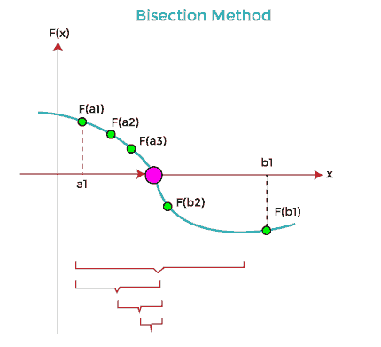

# C 语言中的平分法

> 原文：<https://www.javatpoint.com/bisection-method-in-c>

本节将讨论 C 编程语言中的平分方法。二分法是一种简单而又收敛的方法，用于求解非线性方程的实根。二等分法重复地将区间二等分或分开，并选择一个子区间，在该子区间中找到给定方程的根。

意思是函数 f(x)在闭区间[a，b]中是连续的，f(a)和 f(b)是两个符号相反的实数，其中至少包含 f(x) = 0 的一个实数根，在 a 和 b 之间。这种方法也称为波尔扎诺或半区间或二分搜索法方法。



### 二等分法算法:

下面是 c 语言中平分法的算法

1.  启动程序。
2.  输入两个初始猜测 x1 和 x2。“e”是获得所需精确度的绝对误差。
3.  计算函数值:f1 = f(x1)和 f2 = f(x2)
4.  现在比较 f1 和 f2 与 0 的乘积，如下所示

如果(f1 * f2) > 0，则显示初始猜测错误，并将控制转移到步骤 11。

5.  得到中间值:x = (x1 + x2) / 2
6.  如果([ (x1 - x2) / x] < e)，则打印值 x 并跳转到(11)。
7.  否则，它显示:f = f(x)
8.  如果((f * f1) > 0)，则指定 x1 = x，f1 = f。
9.  否则，分配 x2 = x 和 f2 = f。
10.  跳到 5。循环以新的值继续。
11.  终止程序。

**例 1:利用等分法**编程求给定方程的根

让我们考虑一个例子，用二分法和 C 编程语言中的 for 循环得到一个方程的近似根。

```

/* program to demonstrate the usage of the bisection method in C. */
#include // funciton definition 
void bisect (float *mid_pt, float int_st, float int_end, int *iter_cnt);
double get_fun (double res);

int main ()
{
	// declaration of the variables
	int iter_cnt, mx_iter_cnt;
	float mid_pt, int_st, int_end, err_all, root;

	printf (" \n Enter the first starting point: ");
	scanf (" %f", &int_st);
	printf (" \n Enter the second ending point: ");
	scanf (" %f", &int_end);

	// declare no. of iteration to be allowed
	printf (" \n Enter the maximum iteration to be allowed: ");
	scanf (" %d", &mx_iter_cnt);

	// allow no. of error point
	printf (" Input the no. of allowed error point: ");
	scanf (" %f", &err_all);

	// call bisect() function
	bisect (&mid_pt, int_st, int_end, &iter_cnt);

	// use for loop to print the max iteration
	for (iter_cnt = 0; iter_cnt < mx_iter_cnt; mid_pt = root)
	{

		// chcck initial num * mid_pt is less than 0
		if ( get_fun (int_st) * get_fun (mid_pt) < 0)
		{
			int_end = mid_pt; // assign the mid_pt to int_end
		}
		else
		{
			int_st = mid_pt; // else it assign the mid_pt to int_st
		}

		bisect ( &root, int_st, int_end, &iter_cnt); // get the address
		if ( fabs (root - mid_pt) < err_all)
		{
			printf (" \n The approximation root is: %f \n", root);
			return 0;
		}
	}

	// print insufficient
	printf (" The iterations are insufficient: ");
	return 0;
}

// function definition
void bisect (float *mid_pt, float int_st, float int_end, int *iter_cnt)
{
	*mid_pt = (int_st + int_end) / 2; // get the middle value
	++(*iter_cnt); // increment the iteration value
	printf ( " Iteration \t %d: \t %f \n", *iter_cnt, *mid_pt);
}

double get_fun (double res)
{
	return (res * res * res - 4 * res - 9);
} 
```

**输出:**

```
Enter the first starting point: 5
Enter the second ending point: 9
Enter the maximum iteration to be allowed: 8
Input the no. of allowed error point: 0.02
Iteration	1:	7.000000
Iteration	1: 	8.000000
Iteration	2: 	8.500000
Iteration	3: 	8.750000
Iteration	4: 	8.875000
Iteration	5: 	8.937500
Iteration	6: 	8.968750
Iteration	7: 	8.984375

The approximation root is: 8.984375

```

**例 2:用二等分法**编程求(x <sup>3</sup> + 3x - 5 = 0)方程的实根

让我们考虑一个使用 C 编程语言中的二等分方法打印实根的例子。

```

#include #include <conio.h>// create a function
double bisect ( double num)
{
	// it returns the value of the function
	return ( pow (num, 3) + 3 * num - 5);
}

int main ()
{
	printf ( " \n Display the real roots of the given equation using the Bisection method: ");
	printf ( " \n x ^ 3 + 3 * x - 5 = 0 \n ");
	double x0, x1;

	printf ( " \n Enter the first approximation of the root: ");
	scanf (" %lf", &x0);

	printf ( " \n Enter the second approximation of the root: ");
	scanf (" %lf", &x1);

	int iterate;
	printf (" \n Input the number of iteration you want to perform: ");
	scanf (" %d", &iterate);

	int count = 1;
	double l1 = x0;
	double l2 = x1;
	double r, f1, f2, f3;

	// now check whether the initial approximation are the real root
	if (bisect (l1) == 0) // it is a root
	{
		r = l1;
	}
	else if ( bisect (l2) == 0)
	{
		r = l2;
	}

	// if the above two values are not the root of the given equation
	else
	{
		while (count <= iterate) // here count is initialized with 1
		{
			f1 = bisect (l1);
			r = (l1 + l2) / 2.0; // get the mid value of the interval l1 and l2
			f2 = bisect (r);
			f3 = bisect (l2);

			// check f2 is equal to 0
			if (f2 == 0)
			{
				r = f2;
				break; // break the execution from the while loop statement
			}

			printf (" \n The root after %d iterations is %lf. \n", count, r);

			// check multiplication of f1 * f2 not less than 0
			if ( f1 * f2 < 0)
			{
				l2 = r;
			}
			else if (f2 * f3 < 0)
			{
				l1 = r;
			}
			count++;
		}
	}	
	// return final value after mentioned the iteration
	printf (" \n The approximation of the root is: %lf \n ", r);	
	return 0;
}</conio.h> 
```

**输出:**

```
Display the real roots of the given equation using the Bisection method:
X ^ 3 + 3 * x - 5 = 0
Enter the first approximation of the root: 1
Enter the second approximation of the root: 5
Input the number of iteration you want to perform: 7
The root after 1 iterations is 3.000000
The root after 2 iterations is 2.000000.
The root after 3 iterations is 1.500000.
The root after 4 iterations is 1.250000.
The root after 5 iterations is 1.125000.
The root after 6 iterations is 1.187500.
The root after 7 iterations is 1.156250.
The approximation root is 1.156250

```

**例 3:用等分法求非代数函数逼近根的程序**

让我们创建一个简单的程序，使用二等分法计算近似根，并用 C 编程语言进行 while 循环。

```

/* program to get the roots of the given equation using the do while loop in C. */
#include #include <conio.h>#include <stdlib.h>#include <math.h>// define function whose root to be determined
double f (double a)
{
	return 3 * a + sin (a) - exp (a); 
}

int main ()
{
	// declare double data type variable
	double x, y, z, eps;
	int count; // integer data type

	x:printf (" \n Input the initial approximation for x: \n ");
	scanf (" %lf", &x);

	printf (" Input the initial approximation for y: \n ");
	scanf (" %lf", &y);

	printf (" Define the input accuracy: \n ");
	scanf (" %lf", &eps);

	printf (" Input the maximum number of iteration: \n ");
	scanf (" %d", &count);

	// use if statement to check the product of f(a) and f(b) is not less than 0
	if (f(x) * f(y) <= 0)
	{
		int iter = 1; // initialize iter to 1
		// execution of the bisection method starts here

		printf (" Iteration \t x \t \ty \t\tz \t\tf(z) \t |x - y| \n ");

		// use do while loop
		do {
			z = (x + y) / 2; // get the mid value for z
			printf (" %d \t %lf \t %lf \t %lf \t %lf \t %lf \n", iter, x, y, z, f(z), fabs(x - y));
			if (f(x) * f(z) > 0)
			{
				x = z; // assign the value of z to x
			}
			else if (f(x) * f(z) < 0)
			{
				y = z; // assign the value of z to y
			}
			iter++; // increment counter by 1
		}
		while (fabs (x - y) >= eps && iter <= count);
		printf (" \nThe root of the given equation is: %lf", z);
	}
	else
	{
		printf (" \n The root doesn't exist in the given interval. ");
		goto x;
	}

}</math.h></stdlib.h></conio.h> 
```

**输出:**

```
 Input the initial approximation for x: 
 1
 Input the initial approximation for y: 
 3
 Define the input accuracy: 
 .002
 Input the maximum number of iteration: 
 10
 Iteration 	 x 	 	y 		z 		f(z) 	 |x - y| 
  1 	 1.000000 	 3.000000 	 2.000000 	 -0.479759 	 2.000000 
 2 	 1.000000 	 2.000000 	 1.500000 	 1.015806 	 1.000000 
 3 	 1.500000 	 2.000000 	 1.750000 	 0.479383 	 0.500000 
 4 	 1.750000 	 2.000000 	 1.875000 	 0.058267 	 0.250000 
 5 	 1.875000 	 2.000000 	 1.937500 	 -0.195362 	 0.125000 
 6 	 1.875000 	 1.937500 	 1.906250 	 -0.064801 	 0.062500 
 7 	 1.875000 	 1.906250 	 1.890625 	 -0.002343 	 0.031250 
 8 	 1.875000 	 1.890625 	 1.882812 	 0.028192 	 0.015625 
 9 	 1.882812 	 1.890625 	 1.886719 	 0.012982 	 0.007812 
 10 	 1.886719 	 1.890625 	 1.888672 	 0.005334 	 0.003906 

The root of the given equation is: 1.888672

```

### 等分法的优点:

1.  二分法保证了实根的收敛性。
2.  它减少了非线性方程出错的机会。
3.  它在每次迭代中计算一个函数。
4.  它通常以线性方式收敛。
5.  我们可以通过增加在等分法中返回更精确根的迭代次数来控制误差。
6.  它不涉及复杂的计算来得到根。
7.  在多根的情况下，二等分法更快。

### 二等分法的缺点

1.  与其他迭代方法相比，二分法的收敛速度非常慢。
2.  二等分法的近似收敛速度为 0.5。
3.  这是一个线性收敛速度。
4.  它无法获得复杂的根。
5.  如果在猜测间隔中出现任何不连续，则不能应用它。
6.  有些方程找不到根。例如，f(x) = x <sup>2</sup> ，因为没有包围或等分值。
7.  当函数采用相同的符号值时，它不能在一段时间内使用。

* * *