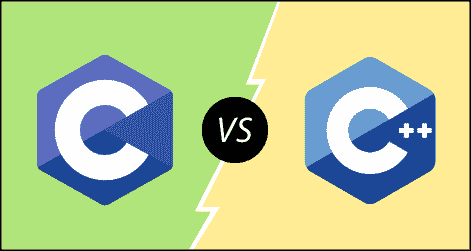

# C 与 C++

> 原文：<https://www.javatpoint.com/c-vs-cpp>

## 什么是 C？

c 是一种面向结构或过程的编程语言，它独立于机器，广泛用于各种应用程序。

c 是一种基本的编程语言，可以用来从操作系统(比如 Windows)开发到复杂的程序，比如 Oracle 数据库、Git、Python 解释器等等。c 编程语言可以被称为上帝的编程语言，因为它构成了其他编程语言的基础。如果我们知道 C 语言，那么我们就可以很容易地学习其他编程语言。c 语言是由贝尔实验室的伟大计算机科学家丹尼斯·里奇开发的。它包含一些额外的特性，使它不同于其他编程语言。

## 什么是 C++？

C++ 是大约在 1980 年由贝尔实验室的**比雅尼·斯特劳斯特鲁普**开发的一种专用编程语言。C++ 语言与 C 语言非常相似，它与 C 的兼容性很强，虽然 C++ 是一种面向对象的编程语言，但它可以运行 99%的 C 程序，而无需更改任何代码源，因此它比 C 更安全，结构更好。

**我们来了解一下 C 和 C++ 的区别。**

**以下是 C 和 C++ 的区别:**

*   **定义**
    C 是结构化编程语言，不支持类和对象，而 C++ 是支持类和对象概念的面向对象编程语言。
*   **编程语言类型**
    C 支持结构性编程语言，代码逐行检查，而 C++ 是支持类和对象概念的面向对象编程语言。
*   **语言开发者**
    丹尼斯·里奇在贝尔实验室开发了 C 语言，而比雅尼·斯特劳斯特鲁普大约在 1980 年在贝尔实验室开发了 C++ 语言。
*   **子集**
    C++ 是 C 编程语言的超集。C++ 可以运行 99%的 C 代码，但是 C 语言不能运行 C++ 代码。
*   **方法类型**
    C 遵循自上而下的方法，而 C++ 遵循自下而上的方法。自上而下的方法将主要模块分解成任务；这些任务被分成子任务，依此类推。自下而上的方法首先开发较低级别的模块，然后开发下一级模块。
*   **安全性**
    在 C 语言中，由于不支持封装和信息隐藏，数据很容易被外人操纵，而 C++ 是一种非常安全的语言，即没有外人可以操纵其数据，因为它同时支持封装和数据隐藏。在 C 语言中，函数和数据是自由的实体，而在 C++ 语言中，所有的函数和数据都是以对象的形式封装的。
*   **函数重载**
    函数重载是一个允许你有多个同名但参数不同的函数的特性。C 不支持函数重载，而 C++ 支持函数重载。
*   **函数覆盖**
    函数覆盖是一个为函数提供特定实现的特性，它已经在基类中定义了。C 不支持函数重写，而 C++ 支持函数重写。
*   **引用变量**
    C 不支持引用变量，而 C++ 支持引用变量。
*   **关键词**
    C 包含 32 个关键词，C++ 支持 52 个关键词。
*   **命名空间特性**
    命名空间是一种将类、对象和函数等实体分组到某个特定名称下的特性。C 不包含命名空间功能，而 C++ 支持避免名称冲突的命名空间功能。
*   **异常处理**
    C 不对异常处理提供直接支持；它需要使用支持异常处理的函数。C++ 通过使用 try-catch 块直接支持异常处理。
*   **输入/输出函数**
    在 C 语言中，scanf 和 printf 函数分别用于输入和输出操作，而在 C++ 中，cin 和 cout 分别用于输入和输出操作。
*   **内存分配和解除分配**
    C 支持 calloc()和 malloc()函数进行内存分配，free()函数进行内存解除分配。C++ 支持内存分配的新运算符和内存取消分配的删除运算符。
*   **继承**
    继承是一个允许子类重用父类属性的特性。C 语言不支持继承，而 C++ 支持继承。
*   **头文件**
    C 程序使用 **< stdio.h >** 头文件，而 C++ 程序使用 **< iostream.h >** 头文件。

**我们用表格的形式总结一下上面的区别。**

| 号码 | C | C++ |
| 1) | c 遵循**程序风格编程。** | C++ 是多范式的。它支持**程序性和面向对象。** |
| 2) | c 语言中的数据不太安全。 | 在 C++ 中，可以为类成员使用修饰符，使外部用户无法访问它。 |
| 3) | c 遵循**自上而下的方法。** | C++ 遵循**自下而上的方法。** |
| 4) | c 不支持函数重载。 | C++ 支持函数重载。 |
| 5) | 在 C 语言中，不能在结构中使用函数。 | 在 C++ 中，可以在结构中使用函数。 |
| 6) | c 不支持引用变量。 | C++ 支持引用变量。 |
| 7) | 在 C 语言中， **scanf()和 printf()** 主要用于输入输出。 | C++ 主要使用流 **cin 和 cout** 进行输入输出操作。 |
| 8) | 运算符重载在 c 语言中是不可能的。 | 运算符重载在 C++ 中是可能的。 |
| 9) | c 程序分为**程序和模块** | C++ 程序分为**函数和类。** |
| 10) | c 没有提供命名空间的特性。 | C++ 支持命名空间的特性。 |
| 11) | 异常处理在 c 语言中并不容易。它必须使用其他函数来执行。 | C++ 使用 Try 和 Catch 块提供异常处理。 |
| 12) | c 不支持继承。 | C++ 支持继承。 |

* * *