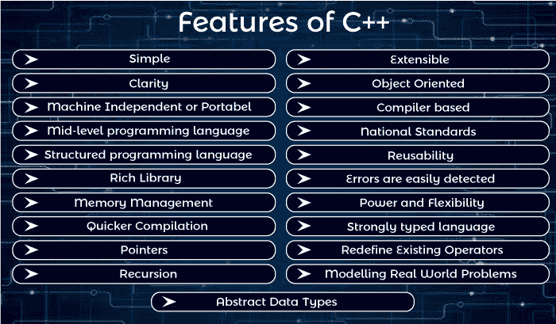

# C++特性

> 原文：<https://www.javatpoint.com/cpp-features>

C++是一种广泛使用的编程语言。

它提供了下面给出的许多特性。

1.  简单的
2.  抽象数据类型
3.  独立于机器还是便携式
4.  中级编程语言
5.  结构化编程语言
6.  丰富的图书馆
7.  内存管理
8.  更快的编译
9.  两颗北极指极星
10.  递归
11.  可扩张的
12.  面向对象的
13.  基于编译器
14.  复用性
15.  国家标准
16.  错误很容易被发现
17.  动力和灵活性
18.  强类型语言
19.  重新定义现有操作员
20.  模拟现实世界的问题
21.  清楚

* * *

### 1)简单

C++是一种简单的语言，因为它提供了一种结构化的方法(将问题分解成多个部分)、一组丰富的库函数、数据类型等。

### 2)抽象数据类型

在 C++中，可以使用类创建称为抽象数据类型(ADT)的复杂数据类型。

### 3)便携

C++是一种可移植的语言，用它编写的程序可以在不同的机器上运行。

### 4)中级/中级编程语言

C++包括低级编程和高级语言，因此被称为中级和中级编程语言。用于开发系统应用，如内核、驱动等。

### 5)结构化编程语言

C++是一种结构化编程语言。在这种情况下，我们可以使用函数将程序分成几个部分。

### 6)丰富的图书馆

C++提供了许多内置函数，使得开发速度很快。以下是 C++编程中使用的库:

*   <iostream></iostream>
*   <cmath></cmath>
*   <cstdlib></cstdlib>
*   <fstream></fstream>

### 7)内存管理

C++提供了非常高效的管理技术。各种内存管理操作符有助于节省内存和提高程序的效率。这些操作符在运行时分配和释放内存。C++中一些常见的内存管理操作符有 new、delete 等。

### 8)更快的编译

C++程序趋向于紧凑和快速运行。因此，C++语言的编译和执行时间很快。

### 9)指针

C++提供了指针的特性。我们可以将指针用于内存、结构、函数、数组等。我们可以使用指针直接与内存交互。

### 10)递归

在 C++中，我们可以在函数内调用函数。它为每个功能提供代码可重用性。

### 11)可扩展

C++程序可以很容易地扩展，因为在现有程序中添加新特性非常容易。

### 12)面向对象

在 C++中，面向对象的概念，如数据隐藏、封装和数据抽象，可以很容易地使用关键字类、私有、公共和受保护的访问说明符来实现。面向对象使得开发和维护更加容易。

### 13)基于编译器

C++是一种基于编译器的编程语言，这意味着没有编译就不能执行任何 C++程序。C++编译器很容易获得，它只需要很少的存储空间。首先，我们需要使用编译器编译我们的程序，然后我们可以执行我们的程序。

### 14)可重用性

利用函数继承，用 C++编写的程序可以在 C++的任何其他程序中重用。只需包含库文件，就可以将程序部件保存到库文件中，并在下一个编程项目中调用它们。新程序可以在更短的时间内开发出来，因为现有的代码可以被重用。也可以定义几个执行不同任务的同名函数。例如:abs()用于计算整数、浮点数和长整数的绝对值。

### 15)国家标准

C++有 ANSI 等国家标准。

### 16)容易发现错误

维护一个 C++程序更容易，因为错误很容易被定位和纠正。它还提供了一个名为异常处理的功能来支持程序中的错误处理。

### 17)动力和灵活性

C++是一种强大而灵活的语言，因为大多数强大而灵活的现代 UNIX 操作系统都是用 C++编写的。许多其他语言的编译器和解释器，如 FORTRAN、PERL、Python、PASCAL、BASIC、LISP 等。，都是用 C++写的。C++程序已经被用于解决物理和工程问题，甚至电影的动画特效。

### 18)强类型语言

编译期间会检查每个函数调用的参数列表。如果实际参数和形式参数之间存在类型不匹配，则尽可能应用隐式转换。如果不可能进行隐式转换，或者参数数量不正确，则会发生编译时。

### 19)重新定义现有操作员

C++允许程序员重新定义现有运算符的含义，如+，-。**例如**可以使用“+”运算符将两个数字相加，并连接两个字符串。

### 20)模拟现实世界的问题

用 C++编写的程序非常适合尽可能接近用户视角的真实世界建模问题。

### 21)清晰度

C++中使用的关键字和库函数类似于常见的英语单词。

* * *