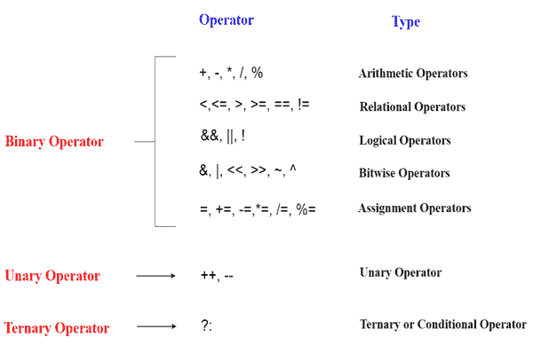

# C++ 运算符

> 原文：<https://www.javatpoint.com/cpp-operators>

运算符只是用于执行操作的符号。可以有许多类型的运算，如算术、逻辑、位等。

在 C 语言中，有以下类型的运算符来执行不同类型的操作。

*   算术运算符
*   关系运算符
*   逻辑运算符
*   按位运算符
*   赋值运算符
*   一元运算符
*   三元或条件运算符
*   杂项操作员



* * *

## C++ 中运算符的优先级

运算符种类的优先级，将首先评估哪个运算符，然后评估哪个运算符。关联性指定要计算的运算符方向，它可以是从左到右或从右到左。

让我们通过下面给出的例子来理解优先级:

```
int data=5+10*10;  

```

“数据”变量将包含 105，因为*(乘法运算符)在+(加法运算符)之前计算。

C++ 运算符的优先级和结合性如下所示:

| 种类 | 操作员 | 结合性 |
| 后缀 | () [] -> .++ - - | 从左到右 |
| 一元的 | + -！~ ++(类型)*(sizeof) | 从右向左 |
| 增加的 | * / % | 从左到右 |
| 添加剂 | + - | 从右向左 |
| 变化 | << >> | 从左到右 |
| 有关系的 | < <= > >= | 从左到右 |
| 平等 | == !=/td > | 从右向左 |
| 按位“与” | & | 从左到右 |
| 按位异或 | ^ | 从左到右 |
| 按位“或” | &#124; | 从右向左 |
| 逻辑“与” | && | 从左到右 |
| 逻辑或 | &#124;&#124; | 从左到右 |
| 有条件的 | ？： | 从右向左 |
| 分配 | = += -= *= /= %=>>= <<= &= ^= &#124;= | 从右向左 |
| 逗号 | , | 从左到右 |

* * *