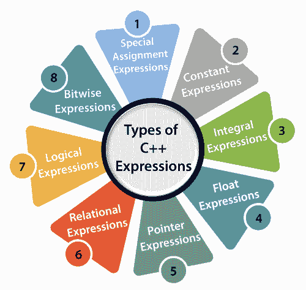
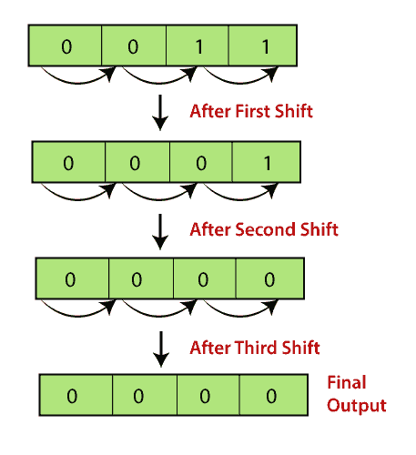

# C++ 表达式

> 原文：<https://www.javatpoint.com/cpp-expression>

C++ 表达式由运算符、常量和变量组成，它们根据语言规则排列。它还可以包含返回值的函数调用。表达式可以包含一个或多个操作数、零个或多个运算符来计算值。每个表达式都会在赋值运算符的帮助下产生一些赋值给变量的值。

**c++ 表达式示例:**

```

(a+b) - c
(x/y) -z
4a2 - 5b +c
(a+b) * (x+y)

```

### 表达式可以是以下类型:

*   常量表达式
*   积分表达式
*   浮点表达式
*   指针表达式
*   关系表达式
*   逻辑表达式
*   按位表达式
*   特殊赋值表达式



如果表达式是上述表达式的组合，这种表达式称为复合表达式。

### 常量表达式

常量表达式是仅由常量值组成的表达式。它是一个表达式，其值在编译时确定，但在运行时计算。它可以由整数、字符、浮点和枚举常数组成。

常量用于以下情况:

*   它在下标声明符中用于描述数组绑定。
*   它用在 switch 语句的 case 关键字之后。
*   它在**枚举**中用作数值
*   它指定了位域宽度。
*   在预处理器 **#if** 中使用

在上述场景中，常量表达式可以有整数、字符和枚举常量。我们可以使用 static 和 extern 关键字以及常量来定义函数范围。

下表显示了包含常数值的表达式:

| 包含常数的表达式 | 不变价值 |
| x = (2/3) * 4 | (2/3) * 4 |
| 外部 int y = 67 | Sixty-seven |
| int z = 43 | Forty-three |
| 静态 int a = 56 | Fifty-six |

让我们看一个包含常量表达式的简单程序:

```

#include <iostream>
using namespace std;
int main()
{
    int x;        // variable declaration.
    x=(3/2) + 2;  // constant expression
    cout<<"Value of x is : "<<x;  // displaying the value of x.
    return 0;
}

```

在上面的代码中，我们首先声明了整数类型的“x”变量。声明之后，我们将简单的常量表达式赋给' x '变量。

**输出**

```
Value of x is : 3  

```

### 积分表达式

整数表达式是在执行所有显式和隐式转换后生成整数值作为输出的表达式。

**以下是积分表达式的例子:**

```

(x * y) -5      
x + int(9.0)
where x and y are the integers.

```

**我们来看一个积分表达式的简单例子:**

```

#include <iostream>
using namespace std;
int main()
{
    int x;  // variable declaration.
    int y;  // variable declaration
    int z;  // variable declaration
    cout<<"Enter the values of x and y";
    cin>>x>>y;
    z=x+y;
    cout<<"\n"<<"Value of z is :"<<z; //  displaying the value of z.
    return 0;
}

```

在上面的代码中，我们已经声明了三个变量，即 x、y 和 z。声明之后，我们接受用户输入的‘x’和‘y’的值。然后，我们添加“x”和“y”的值，并将它们的结果存储在“z”变量中。

**输出**

```
Enter the values of x and y                                                                                                     
8                                                                                                                               
9                                                                                                                               
Value of z is :17     

```

**再来看一个积分表达式的例子。**

```

#include <iostream>
using namespace std;
int main()
{

   int x;   // variable declaration
   int y=9;    // variable initialization
   x=y+int(10.0);    // integral expression
  cout<<"Value of x : "<<x;   // displaying the value of x.
  return 0;
}

```

在上面的代码中，我们声明了两个变量，即 x 和 y。我们将表达式(y+int(10.0))的值存储在一个“x”变量中。

**输出**

```
Value of x : 19       

```

### 浮点表达式

浮点表达式是在执行所有显式和隐式转换后产生浮点值作为输出的表达式。

以下是浮点表达式的示例:

```

x+y
(x/10) + y
34.5
x+float(10)

```

**我们通过一个例子来了解一下。**

```

#include <iostream>
using namespace std;
int main()
{

   float x=8.9;      // variable initialization
   float y=5.6;      // variable initialization
   float z;             // variable declaration
   z=x+y;
   std::cout <<"value of z is :"  << z<<std::endl;  // displaying the value of z.

    return 0;
}

```

**输出**

```
value of z is :14.5       

```

**我们来看另一个 float 表达式的例子。**

```

#include <iostream>
using namespace std;
int main()
{
   float x=6.7;    // variable initialization
   float y;      // variable declaration
   y=x+float(10);   // float expression
   std::cout <<"value of y is :"  << y<<std::endl;  // displaying the value of y
   return 0;
}

```

在上面的代码中，我们已经声明了两个变量，即 x 和 y，声明后，我们将表达式(x+float(10))的值存储在变量‘y’中。

**输出**

```
value of y is :16.7  

```

### 指针表达式

指针表达式是产生地址值作为输出的表达式。

**以下是指针表达式的例子:**

```

&x
ptr
ptr++
ptr-

```

**我们通过一个例子来了解一下。**

```

#include <iostream>
using namespace std;
int main()
{

   int a[]={1,2,3,4,5};  // array initialization
   int *ptr;       // pointer declaration
   ptr=a;    // assigning base address of array to the pointer ptr
   ptr=ptr+1;   // incrementing the value of pointer
   std::cout <<"value of second element of an array : "  << *ptr<<std::endl;
   return 0;
}

```

在上面的代码中，我们声明了数组和指针 ptr。我们将基址分配给变量“ptr”。分配地址后，我们增加指针“ptr”的值。当指针递增时,“ptr”将指向数组的第二个元素。

**输出**

```
value of second element of an array : 2

```

### 关系表达式

关系表达式是产生 bool 类型值的表达式，该值可以是真或假。它也被称为布尔表达式。当算术表达式用于关系运算符的两端时，首先计算算术表达式，然后比较它们的结果。

**以下是关系表达式的示例:**

```

a>b
a-b >= x-y
a+b>80

```

**我们通过一个例子来了解一下**

```

#include <iostream>
using namespace std;
int main()
{
    int a=45;    // variable declaration
    int b=78;    // variable declaration
    bool y= a>b;   // relational expression
    cout<<"Value of y is :"<<y;  // displaying the value of y.
    return 0;
}

```

在上面的代码中，我们已经声明了两个变量，即‘a’和‘b’。声明之后，我们在变量之间应用了关系运算符来检查“a”是否大于“b”。

**输出**

```
Value of y is :0 

```

**我们再看一个例子。**

```

#include <iostream>
using namespace std;
int main()
{
 int a=4;     // variable declaration
 int b=5;     // variable declaration
 int x=3;     // variable declaration
 int y=6;    // variable declaration
 cout<<((a+b)>=(x+y));   // relational expression 
 return 0;
}

```

在上面的代码中，我们已经声明了四个变量，即‘a’、‘b’、‘x’和‘y’。然后，我们在这些变量之间应用关系运算符(> =)。

**输出**

```
1

```

### 逻辑表达式

逻辑表达式是组合两个或多个关系表达式并产生 bool 类型值的表达式。逻辑运算符是“&&”和“||”，它们组合了两个或多个关系表达式。

以下是逻辑表达式的一些示例:

```

a>b && x>y
a>10 || b==5

```

**我们来看一个逻辑表达的简单例子。**

```

#include <iostream>
using namespace std;
int main()
{
 int a=2;
 int b=7;
 int c=4;
cout<<((a>b)||(a>c));
return 0;
}

```

**输出**

```
0

```

### 按位表达式

按位表达式是用于在位级别操作数据的表达式。它们基本上是用来移位的。

例如:

x=3

x>>3 //此语句意味着我们将三位位置向右移动。

在上面的例子中，“x”的值是 3，它的二进制值是 0011。我们将“x”的值向右移动三位。让我们通过图示来理解。



**我们来看一个简单的例子。**

```

#include <iostream>
using namespace std;
int main()
{
 int x=5;   // variable declaration
std::cout << (x>>1) << std::endl;
return 0;
}

```

在上面的代码中，我们已经声明了一个变量‘x’。声明之后，我们应用了按位运算符，即右移运算符，将一位位置向右移动。

**输出**

```
2

```

**我们再来看一个例子。**

```

#include <iostream>
using namespace std;
int main()
{
 int x=7;   // variable declaration
std::cout << (x<<3) << std::endl;
return 0;
}

```

在上面的代码中，我们已经声明了一个变量‘x’。声明之后，我们对变量' x '应用了左移位运算符，将三位位置向左移位。

**输出**

```
56

```

### 特殊赋值表达式

特殊赋值表达式是可以根据赋值给变量的值进一步分类的表达式。

*   **链式分配**

链式赋值表达式是一种使用单个语句将同一值赋给多个变量的表达式。

**例如:**

```

a=b=20 
 or 
(a=b) = 20

```

**我们通过一个例子来了解一下。**

```

#include <iostream>
using namespace std;
int main()

 int a;   // variable declaration
 int b;   // variable declaration
 a=b=80;  // chained assignment
 std::cout <<"Values of 'a' and 'b' are : " <<a<<","<<b<< std::endl;
 return 0;
}

```

在上面的代码中，我们已经声明了两个变量，即‘a’和‘b’。然后，我们使用链式赋值表达式为两个变量赋值。

**输出**

```
Values of 'a' and 'b' are : 80,80  

```

#### 注意:使用链式赋值表达式，不能在声明时将值赋给变量。例如，int a=b=c=90 是无效语句。

*   **嵌入式赋值表达式**

嵌入式赋值表达式是一种赋值表达式，其中赋值表达式包含在另一个赋值表达式中。

**我们通过一个例子来了解一下。**

```

#include <iostream>
using namespace std;
int main()
{
 int a;  // variable declaration
 int b;  // variable declaration
 a=10+(b=90);  // embedded assignment expression
 std::cout <<"Values of 'a' is " <<a<< std::endl;
 return 0;
}

```

在上面的代码中，我们已经声明了两个变量，即‘a’和‘b’。然后，我们应用嵌入式赋值表达式(a=10+(b=90))。

**输出**

```
Values of 'a' is 100  

```

*   **复合赋值**

复合赋值表达式是赋值运算符和二元运算符的组合表达式。

**例如**

```

a+=10; 

```

在上面的语句中，“a”是变量，“+=”是复合语句。

**我们通过一个例子来了解一下。**

```

#include <iostream>
using namespace std;
int main()
{
  int a=10;   // variable declaration
  a+=10;    // compound assignment
  std::cout << "Value of a is :" <<a<< std::endl; // displaying the value of a.
  return 0;
}

```

在上面的代码中，我们声明了一个变量‘a’，并为这个变量赋值 10。然后，我们将复合赋值运算符(+=)应用于“a”变量，即等于(a=a+10)的 a+=10。此语句将“a”的值增加 10。

**输出**

```
Value of a is :20  

```

* * *