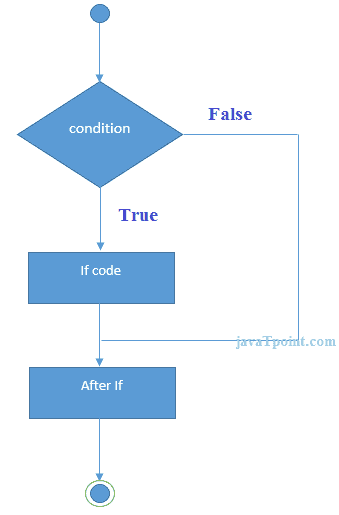
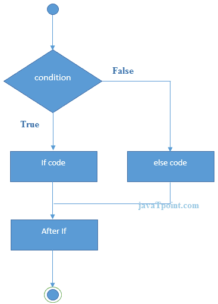
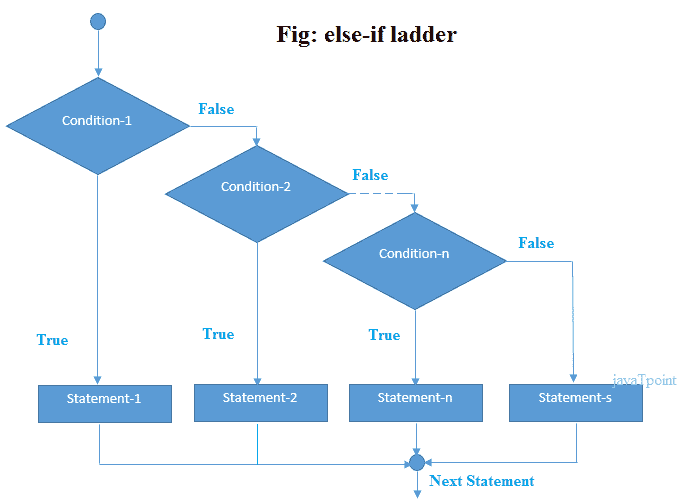

# C++ if-else

> 原文：<https://www.javatpoint.com/cpp-if-else>

在 C++ 编程中，if 语句用于测试条件。C++ 中有各种类型的 if 语句。

*   如果语句
*   if-else 语句
*   嵌套 if 语句
*   如果-否则-如果梯子

* * *

## C++ IF 语句

C++ if 语句测试条件。如果条件为真，则执行。

```
if(condition){  
//code to be executed  
}

```



* * *

## C++ If 示例

```
#include <iostream>
using namespace std;

int main () {
   int num = 10;  
            if (num % 2 == 0)  
            {  
                cout<<"It is even number";  
            } 
   return 0;
}

```

输出:/p >

```
It is even number

```

* * *

## C++ IF-else 语句

C++ if-else 语句也测试条件。如果条件为真，则执行“如果块”，否则执行“否则块”。

```
if(condition){  
//code if condition is true  
}else{  
//code if condition is false  
}  

```



* * *

## C++ If-else 示例

```
#include <iostream>
using namespace std;
int main () {
   int num = 11;  
            if (num % 2 == 0)  
            {  
                cout<<"It is even number";  
            } 
            else
            {  
                cout<<"It is odd number";  
            }
   return 0;
}

```

**输出:**

```
It is odd number

```

* * *

## C++ If-else 示例:用户输入

```
#include using namespace std;
int main () {
    int num;
    cout<<"Enter a Number: ";
    cin>>num;
            if (num % 2 == 0)  
            {  
                cout<<"It is even number"<<endl;  
            } 
            else
            {  
                cout<<"It is odd number"<<endl;  
            }
   return 0;
} 
```

**输出:**

```
Enter a number:11
It is odd number

```

**输出:**

```
Enter a number:12
It is even number

```

* * *

## C++ IF-else-if 阶梯语句

C++ if-else-if 梯形语句执行多个语句中的一个条件。

```
if(condition1){  
//code to be executed if condition1 is true  
}else if(condition2){  
//code to be executed if condition2 is true  
}  
else if(condition3){  
//code to be executed if condition3 is true  
}  
...  
else{  
//code to be executed if all the conditions are false  
}  

```



* * *

## C++ If else-if 示例

```
#include <iostream>
using namespace std;
int main () {
       int num;
       cout<<"Enter a number to check grade:";  
       cin>>num;
            if (num <0 || num >100)  
            {  
                cout<<"wrong number";  
            }  
            else if(num >= 0 && num < 50){  
                cout<<"Fail";  
            }  
            else if (num >= 50 && num < 60)  
            {  
                cout<<"D Grade";  
            }  
            else if (num >= 60 && num < 70)  
            {  
                cout<<"C Grade";  
            }  
            else if (num >= 70 && num < 80)  
            {  
                cout<<"B Grade";  
            }  
            else if (num >= 80 && num < 90)  
            {  
                cout<<"A Grade";  
            }  
            else if (num >= 90 && num <= 100)  
            {  
                cout<<"A+ Grade";
            }  
    }  

```

**输出:**

```
Enter a number to check grade:66
C Grade

```

**输出:**

```
Enter a number to check grade:-2
wrong number

```

* * *