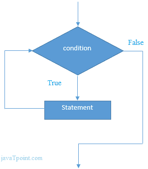

# C++ While 循环

> 原文：<https://www.javatpoint.com/cpp-while-loop>

在 C++ 中，while 循环用于多次迭代程序的一部分。如果迭代次数不固定，建议使用 while 循环而不是 for 循环。

```
while(condition){  
//code to be executed  
}  

```

**流程图:**



* * *

## C++ While 循环示例

让我们看一个 while 循环打印表 1 的简单例子。

```
#include <iostream>
using namespace std;
int main() {       
 int i=1;    
         while(i<=10) 
       {    
            cout<<i <<"\n";  
            i++;
          }     
    }

```

输出:

```
1
2
3
4
5
6
7
8
9
10

```

* * *

## C++ 嵌套 While 循环示例

在 C++ 中，我们可以在另一个 while 循环内部使用 while 循环，它被称为嵌套 while 循环。当外部循环执行一次时，嵌套的 while 循环将完全执行。

让我们看一个 C++ 编程语言中嵌套 while 循环的简单例子。

```
#include <iostream>
using namespace std;
int main () {
        int i=1;    
          while(i<=3)   
          {  
              int j = 1;  
              while (j <= 3)  
{    
            cout<<i<<" "<<j<<"\n";    
            j++;
          }   
           i++;
        }
    }  

```

输出:

```
1 1
1 2
1 3
2 1
2 2 
2 3
3 1
3 2
3 3

```

* * *

## C++ 无限循环示例:

我们还可以通过传递 true 作为测试条件来创建无限 while 循环。

```
#include <iostream>
using namespace std;
int main () {
        while(true)
          {  
                  cout<<"Infinitive While Loop";  
          }  
    }  

```

输出:

```
Infinitive While Loop 
Infinitive While Loop
Infinitive While Loop
Infinitive While Loop
Infinitive While Loop
ctrl+c

```