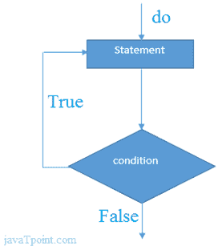

# C++边做边循环

> 原文：<https://www.javatpoint.com/cpp-do-while-loop>

C++边做边循环用于多次迭代程序的一部分。如果迭代次数不固定，并且必须至少执行一次循环，建议使用 do-while 循环。

C++ do-while 循环至少执行一次，因为在循环体之后检查条件。

```
do{  
//code to be executed  
}while(condition);

```

**流程图:**



* * *

## C++边做边循环示例

让我们看一个 C++ do-while 循环打印表 1 的简单例子。

```
#include <iostream>
using namespace std;
int main() {
     int i = 1;  
          do{  
              cout<<i<<"\n";  
              i++;  
          } while (i <= 10) ;  
}

```

输出:

```
1
2
3
4
5
6
7
8
9
10

```

* * *

## C++嵌套边做边循环

在 C++中，如果在另一个 do-while 循环中使用 do-while 循环，则称为嵌套 do-while 循环。嵌套的 do-while 循环对每个外部 do-while 循环完全执行。

让我们看一个 C++中嵌套 do-while 循环的简单例子。

```
#include <iostream>
using namespace std;
int main() {
     int i = 1;  
         do{  
              int j = 1;        
              do{  
                cout<<i<<"\n";      
                  j++;  
              } while (j <= 3) ;  
              i++;  
          } while (i <= 3) ;   
}

```

输出:

```
1 1
1 2
1 3
2 1
2 2 
2 3
3 1
3 2
3 3

```

* * *

## C++不定式边做边循环

在 C++中，如果在 do-while 循环中传递 **true** ，将是不定式 do-while 循环。

```
do{  
//code to be executed  
}while(true);

```

* * *

## C++不定式边做边循环示例

```
#include <iostream>
using namespace std;
int main() {
      do{  
              cout<<"Infinitive do-while Loop";  
          } while(true);   
}

```

输出:

```
Infinitive do-while Loop 
Infinitive do-while Loop
Infinitive do-while Loop
Infinitive do-while Loop
Infinitive do-while Loop
ctrl+c

```