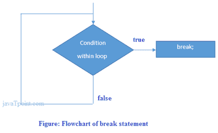

# C++中断语句

> 原文：<https://www.javatpoint.com/cpp-break-statement>

C++ break 用于中断循环或开关语句。它在给定的条件下中断程序的当前流程。在内环的情况下，它只断开内环。

```
jump-statement;    
break;

```

**流程图:**



* * *

## C++中断语句示例

让我们看一个在循环中使用的 C++ break 语句的简单例子。

```
#include <iostream>
using namespace std;
int main() {
      for (int i = 1; i <= 10; i++)  
          {  
              if (i == 5)  
              {  
                  break;  
              }  
        cout<<i<<"\n";  
          }  
}

```

输出:

```
1
2
3
4

```

* * *

## 带内部循环的 C++中断语句

只有在内部循环中使用 break 语句时，C++ break 语句才会中断内部循环。

让我们看看示例代码:

```

#include <iostream>
using namespace std;
int main()
{
    for(int i=1;i<=3;i++){      
            for(int j=1;j<=3;j++){      
                if(i==2&&j==2){      
                    break;      
                        }      
                    cout<<i<<" "<<j<<"\n";           
                    }      
          }  
}

```

输出:

```
1 1
1 2
1 3
2 1
3 1
3 2
3 3

```