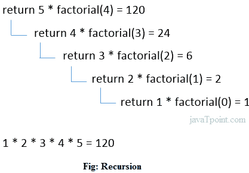

# C++递归

> 原文：<https://www.javatpoint.com/cpp-recursion>

当在同一个函数内调用函数时，在 C++中称为递归。调用相同函数的函数称为递归函数。

调用自身的函数，在函数调用后不执行任何任务，称为尾部递归。在尾部递归中，我们一般用 return 语句调用同一个函数。

让我们看一个递归的简单例子。

```
recursionfunction(){  
recursionfunction(); //calling self function  
}  

```

* * *

## C++递归示例

让我们看一个用 C++语言递归打印阶乘数的例子。

```
#include<iostream>
using namespace std;  
int main()
{
int factorial(int);
int fact,value;
cout<<"Enter any number: ";
cin>>value;
fact=factorial(value);
cout<<"Factorial of a number is: "<<fact<<endl;
return 0;
}
int factorial(int n)
{
if(n<0)
return(-1); /*Wrong value*/  
if(n==0)
return(1);  /*Terminating condition*/
else
{
return(n*factorial(n-1));    
}
}

```

输出:

```
Enter any number: 5
Factorial of a number is: 120

```

我们可以通过下图来理解上述程序的递归方法调用:

