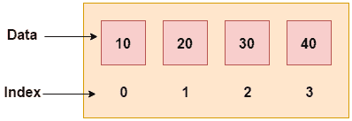

# C++ 数组

> 原文：<https://www.javatpoint.com/cpp-arrays>

像其他编程语言一样，C++ 中的数组是一组具有连续内存位置的类似类型的元素。

在 C++ 中 **std::array** 是封装固定大小数组的容器。在 C++ 中，数组索引从 0 开始。我们只能在 C++ 数组中存储固定的元素集。



* * *

## C++ 数组的优点

*   代码优化(更少的代码)
*   随机存取
*   易于遍历的数据
*   易于操作的数据
*   易于分类的数据等。

* * *

## C++ 数组的缺点

*   固定尺寸

* * *

## C++ 数组类型

C++ 编程中有两种类型的数组:

1.  一维数组
2.  多维数组

* * *

## C++ 一维数组

让我们看一个 C++ 数组的简单例子，在这里我们将创建、初始化和遍历数组。

```
#include <iostream>
using namespace std;
int main()
{
 int arr[5]={10, 0, 20, 0, 30};  //creating and initializing array  
        //traversing array  
        for (int i = 0; i < 5; i++)  
        {  
            cout<<arr[i]<<"\n";  
        }  
}

```

输出:/p >

```
10
0
20
0
30

```

* * *

## C++ 数组示例:使用 foreach 循环的遍历

我们也可以使用 foreach 循环遍历数组元素。它逐个返回数组元素。

```
#include <iostream>
using namespace std;
int main()
{
 int arr[5]={10, 0, 20, 0, 30}; //creating and initializing array  
        //traversing array  
       for (int i: arr)   
        {  
            cout<<i<<"\n";  
        }  
}

```

输出:

```
10
20
30
40
50

```