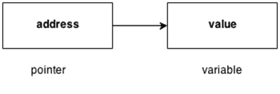

# C++指针

> 原文：<https://www.javatpoint.com/cpp-pointers>

C++语言中的指针是一个变量，它也称为定位符或指示符，指向一个值的地址。



**指针优势**

1)指针减少了代码，提高了性能，用于检索字符串、树等。和函数一起使用。

2)我们可以使用指针从函数中返回多个值。

3)它使您能够访问计算机内存中的任何内存位置。

**指针的使用**

指针在 C++语言中有很多用法。

**1)动态内存分配**

在 c 语言中，我们可以在使用指针的地方使用 malloc()和 calloc()函数动态分配内存。

**2)阵列、功能和结构**

c 语言中的指针广泛应用于数组、函数和结构中。它减少了代码并提高了性能。

* * *

## 指针中使用的符号

| 标志 | 名字 | 描述 |
| &(和符号) | 地址算符 | 确定变量的地址。 |
| ∑(星号) | 间接运算符 | 访问地址的值。 |

## 声明指针

C++语言中的指针可以用∫(星号)来声明。

```
int ∗	a; //pointer to int  
char ∗	c; //pointer to char  

```

## 指针示例

让我们看看使用指针打印地址和值的简单例子。

```
#include <iostream>
using namespace std;
int main()
{
int number=30;  
int ∗	p;    
p=&number;//stores the address of number variable  
cout<<"Address of number variable is:"<<&number<<endl;  
cout<<"Address of p variable is:"<<p<<endl;  
cout<<"Value of p variable is:"<<*p<<endl;  
   return 0;
}

```

**输出:**

```
Address of number variable is:0x7ffccc8724c4
Address of p variable is:0x7ffccc8724c4
Value of p variable is:30  

```

* * *

## 指针程序，不使用第三个变量交换两个数字

```
#include <iostream>
using namespace std;
int main()
{
int a=20,b=10,∗p1=&a,∗p2=&b;  
cout<<"Before swap: ∗p1="<<∗p1<<" ∗p2="<<∗p2<<endl;  
∗p1=∗p1+∗p2;  
∗p2=∗p1-∗p2;  
∗p1=∗p1-∗p2;  
cout<<"After swap: ∗p1="<<∗p1<<" ∗p2="<<∗p2<<endl;  
   return 0;
}

```

**输出:**

```
Before swap: ∗p1=20 ∗p2=10
After swap: ∗p1=10 ∗p2=20

```

* * *