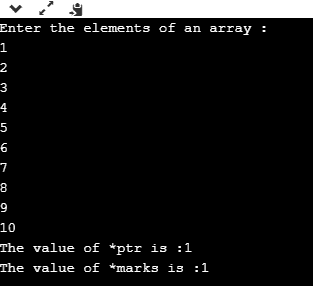
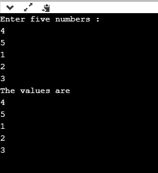
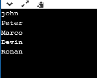

# C++指针数组

> 原文：<https://www.javatpoint.com/cpp-array-of-pointers>

数组和指针是密切相关的。在 C++中，数组的名称被视为指针，即数组的名称包含元素的地址。C++将数组名视为第一个元素的地址。例如，如果我们创建一个数组，即保存整数类型的 20 个值的标记，那么标记将包含第一个元素的地址，即标记[0]。因此，我们可以说数组名(标记)是一个指针，它保存着数组第一个元素的地址。

**我们通过一个例子来理解这个场景。**

```

#include <iostream>
using namespace std;
int main()
{
    int *ptr;  // integer pointer declaration
    int marks[10]; // marks array declaration
    std::cout << "Enter the elements of an array :" << std::endl;
    for(int i=0;i<10;i++)
    {
        cin>>marks[i];
    }
    ptr=marks; // both marks and ptr pointing to the same element..
    std::cout << "The value of *ptr is :" <<*ptr<< std::endl;
    std::cout << "The value of *marks is :" <<*marks<<std::endl;
}

```

在上述代码中，我们声明了一个整数指针和一个整数类型的数组。我们通过使用语句 ptr=marks 将标记的地址分配给 ptr；这意味着变量“marks”和“ptr”都指向同一个元素，即 marks[0]。当我们试图打印*ptr 和*marks 的值时，结果是相同的。因此，证明了数组名存储数组第一个元素的地址。

**输出**



### 指针数组

指针数组是由指针类型的变量组成的数组，这意味着该变量是指向其他元素的指针。假设我们创建一个包含 5 个整数指针的指针数组；那么它的声明看起来像:

```

int *ptr[5];         // array of 5 integer pointer. 

```

在上面的声明中，我们声明了一个名为 ptr 的指针数组，它在内存中分配了 5 个整数指针。

指针数组的元素也可以通过分配其他元素的地址来初始化。让我们通过一个例子来观察这个案例。

```

int a; // variable declaration.
ptr[2] = &a;  

```

在上面的代码中，我们将“a”变量的地址分配给数组“ptr”的第三个元素。

我们还可以通过取消指针引用来检索“a”的值。

```

*ptr[2];

```

**我们通过一个例子来了解一下。**

```

#include <iostream>
using namespace std;
int main()
{
    int ptr1[5]; // integer array declaration
    int *ptr2[5]; // integer array of pointer declaration
    std::cout << "Enter five numbers :" << std::endl;
    for(int i=0;i<5;i++)
    {
        std::cin >> ptr1[i];
    }
    for(int i=0;i<5;i++)
    {
        ptr2[i]=&ptr1[i]; 
    }
    // printing the values of ptr1 array
    std::cout << "The values are" << std::endl;
    for(int i=0;i<5;i++)
    {
        std::cout << *ptr2[i] << std::endl;
    }
    }

```

在上面的代码中，我们声明了一个整型数组和一个整型指针数组。我们定义了“for”循环，它遍历数组“ptr1”的元素，每次迭代时，索引“I”处的 ptr1 元素的地址都会存储在索引“I”处的 ptr2 中。

**输出**



到目前为止，我们已经学习了指向整数的指针数组。现在，我们将看到如何创建指向字符串的指针数组。

### 指向字符串的指针数组

指向字符串的指针数组是一个字符指针数组，它保存字符串第一个字符的地址，或者我们可以说是字符串的基址。

以下是指向字符串的指针数组和二维字符数组之间的区别:

*   在内存消耗的情况下，指向字符串的指针数组比二维字符数组更有效，因为指向字符串的指针数组比二维字符数组消耗更少的内存来存储字符串。
*   在指针数组中，字符串的操作相对比 2d 数组更容易。我们还可以通过使用指针轻松地改变字符串的位置。

让我们看看如何声明指向 string 的指针数组。

首先，我们声明指向字符串的指针数组:

```

char *names[5] = {"john",
                  "Peter",
                  "Marco",
                  "Devin",
                  "Ronan"};

```

在上面的代码中，我们将指针名称的数组声明为大小为 5 的“名称”。在上面的例子中，我们已经在声明时完成了初始化，所以我们不需要提到指针数组的大小。上述代码可以重写为:

```

char *names[ ] = {"john",
                  "Peter",
                  "Marco",
                  "Devin",
                  "Ronan"};

```

在上面的例子中,“names”数组的每个元素都是一个字符串，每个字符串都包含字符串第一个字符的基址。例如，names[0]包含“john”的基址，names[1]包含“Peter”的基址，以此类推。不能保证所有字符串都存储在连续的内存位置，但是字符串的字符存储在连续的内存位置。

**我们来创建一个简单的例子。**

```

#include <iostream>
using namespace std;
int main()
{
  char *names[5] = {"john",
                    "Peter",
                    "Marco",
                    "Devin",
                    "Ronan"};
for(int i=0;i<5;i++)
    {
        std::cout << names[i] << std::endl;
    }
    return 0;
}

```

在上面的代码中，我们已经声明了一个包含 5 个字符串文字的 char 指针数组，每个字符串的第一个字符包含字符串的基址。

**输出**



* * *