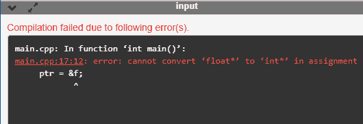
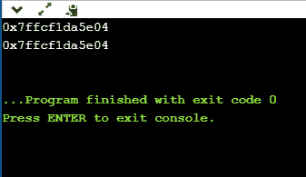
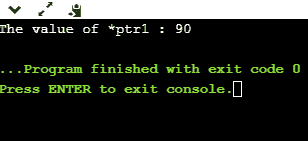
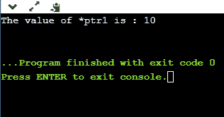

# C++ 空指针

> 原文：<https://www.javatpoint.com/cpp-void-pointer>

void 指针是一种通用指针，可以保存任何数据类型的地址，但它与任何数据类型都没有关联。

### void 指针的语法

```

void *ptr;

```

在 C++ 中，我们不能将变量的地址分配给不同数据类型的变量。考虑以下示例:

```

int *ptr;  // integer pointer declaration
float a=10.2; // floating variable initialization
ptr= &a;  // This statement throws an error.

```

在上面的例子中，我们声明了一个整数类型的指针，即 ptr 和一个浮点变量，即“a”。声明后，我们尝试在“ptr”中存储“a”变量的地址，但这在 C++ 中是不可能的，因为该变量不能保存不同数据类型的地址。

**我们通过一个简单的例子来理解。**

```

#include <iostream.h>
using namespace std;
int main()
{
    int *ptr;
    float f=10.3;
    ptr = &f; // error
    std::cout << "The value of *ptr is : " <<*ptr<< std::endl;
    return 0;
}

```

在上面的程序中，我们声明了整数类型的指针和浮点类型的变量。整数指针变量不能指向浮点变量，但它只能指向整数变量。

**输出**



C++ 通过使用 C++ void 指针克服了上述问题，因为 void 指针可以保存任何数据类型的地址。

**我们来看一个简单的 void 指针的例子。**

```

#include <iostream>
using namespace std;
int main()
{
  void *ptr;   // void pointer declaration
  int a=9;   // integer variable initialization
  ptr=&a;   // storing the address of 'a' variable in a void pointer variable.
  std::cout << &a << std::endl;
  std::cout << ptr << std::endl;
  return 0;
}

```

在上面的程序中，我们声明了一个 void 指针变量和一个整数变量，其中 void 指针包含一个整数变量的地址。

**输出**



### C 和 C++ 中 void 指针的区别

在 C 中，我们可以将 void 指针分配给任何其他指针类型，而无需任何类型转换，而在 C++ 中，当我们将 void 指针类型分配给任何其他指针类型时，我们需要进行类型转换。

**我们通过一个简单的例子来理解。**

**在 C 中，**

```

#include <stdio.h>
int main()
{
   void *ptr; // void pointer declaration
   int *ptr1;  // integer pointer declaration
   int a =90;  // integer variable initialization
   ptr=&a; // storing the address of 'a' in ptr
   ptr1=ptr; // assigning void pointer to integer pointer type.
   printf("The value of *ptr1 : %d",*ptr1);
   return 0;
}

```

在上面的程序中，我们分别声明了 void 和 integer 类型的两个指针“ptr”和“ptr1”。我们还声明了整数类型变量，即“a”。声明之后，我们将“a”变量的地址分配给指针“ptr”。然后，我们将 void 指针分配给整数指针，即没有任何类型转换的 ptr1，因为在 C 语言中，我们不需要在将 void 指针分配给任何其他类型的指针时进行类型转换。

**输出**



**在 C++ 中，**

```

#include <iostream>
using namespace std;
int main()
{
  void *ptr; // void pointer declaration
  int *ptr1; // integer pointer declaration
  int data=10; // integer variable initialization
  ptr=&data;  // storing the address of data variable in void pointer variable
  ptr1=(int *)ptr; // assigning void pointer to integer pointer
  std::cout << "The value of *ptr1 is : " <<*ptr1<< std::endl;
  return 0;
}

```

在上面的程序中，我们分别声明了 void 类型和 int 类型的两个指针变量。我们还创建了另一个整数类型变量，即“数据”。声明后，我们将变量“data”的地址存储在一个 void 指针变量中，即 ptr。现在，我们要将 void 指针赋给 integer 指针，为此，我们需要对 void 指针变量应用 cast 运算符，即(int *)。这个强制转换操作符告诉编译器 void 指针持有哪种类型的值。对于强制转换，我们必须在像(char *)或(int *)这样的括号中键入数据类型和*。

**输出**



* * *