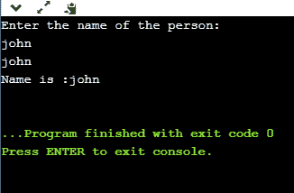

# C++ 中的函数指针

> 原文：<https://www.javatpoint.com/function-pointer-in-cpp>

我们知道指针是用来指向一些变量的；类似地，函数指针是用于指向函数的指针。它基本上用于存储函数的地址。我们可以使用函数指针来调用函数，也可以将指针作为参数传递给另一个函数。

它们主要用于事件驱动的应用程序、回调，甚至用于将函数存储在数组中。

### 函数的地址是什么？


计算机只理解低级语言，即二进制形式。我们用 C++ 写的程序总是用高级语言，所以要把程序转换成二进制形式，我们用编译器。编译器是将源代码转换成可执行文件的程序。这个可执行文件存储在内存中。CPU 从 main()方法开始执行，读取的是 RAM 中的副本，而不是原始文件。

所有功能和机器代码指令都是数据。这些数据是一堆字节，所有这些字节在内存中都有一些地址。函数指针包含函数第一条指令的内存地址。

### 声明的语法

以下是函数指针声明的语法:

```

int (*FuncPtr) (int,int);

```

上面的语法是函数声明。因为函数不像变量那么简单，但是 C++ 是类型安全的，所以函数指针有返回类型和参数列表。在上面的语法中，我们首先提供返回类型，然后提供指针的名称，即 FuncPtr，它由括号包围，前面是指针符号，即(*)。之后，我们提供了参数列表(int，int)。上面的函数指针可以指向任何接受两个整型参数并返回整型值的函数。

### 函数的地址

我们可以很容易地得到一个函数的地址。我们只需要提到函数的名字，不需要调用函数。

**我们通过一个例子来说明。**

```

#include <iostream>
using namespace std;
int main()
{
  std::cout << "Address of a main() function is : " <<&main<< std::endl;
  return 0;
}

```

在上面的程序中，我们显示了 main()函数的地址。要打印 main()函数的地址，我们刚刚提到了函数的名称，没有括号没有参数。因此，没有任何括号或参数的函数名本身意味着函数的地址。

我们可以用替代的方式打印一个函数的地址，即&main。

### 间接调用函数

我们可以在函数指针的帮助下，通过简单地使用函数指针的名称来调用函数。通过函数指针调用函数的语法与我们正常调用函数的语法相似。

**我们通过一个例子来理解这个场景。**

```

#include <iostream>
using namespace std;
int add(int a , int b)
{
    return a+b;
}
int main()
{
 int (*funcptr)(int,int);  // function pointer declaration
 funcptr=add; // funcptr is pointing to the add function
 int sum=funcptr(5,5);
 std::cout << "value of sum is :" <<sum<< std::endl;
  return 0;
}

```

在上面的程序中，我们声明了函数指针，即 int (*funcptr)(int，int)，然后我们将 add()函数的地址存储在 funcptr 中。这意味着 funcptr 包含 add()函数的地址。现在，我们可以使用 funcptr 调用 add()函数。语句 funcptr(5，5)调用 add()函数，add()函数的结果存储在 sum 变量中。

**输出:**


**我们再来看看函数指针的另一个例子。**

```

#include <iostream>
using namespace std;
void printname(char *name)
{
    std::cout << "Name is :" <<name<< std::endl;
}

int main()
{
    char s[20];  // array declaration
    void (*ptr)(char*);  // function pointer declaration
    ptr=printname;  // storing the address of printname in ptr.
    std::cout << "Enter the name of the person: " << std::endl;
    cin>>s;
    cout<<s;
    ptr(s);  // calling printname() function
   return 0;
}

```

在上面的程序中，我们定义了函数 printname()，它包含 char 指针作为参数。我们声明函数指针，即 void (*ptr)(char*)。语句 ptr=printname 意味着我们正在将 printname()函数的地址分配给 ptr。现在，我们可以使用语句 ptr 调用 printname()函数。

**输出:**



### 将函数指针作为参数传递

函数指针可以作为参数传递给另一个函数。

**我们通过一个例子来了解一下。**

```

#include <iostream>
using namespace std;
void func1()
{
    cout<<"func1 is called";
}
void func2(void (*funcptr)())
{
    funcptr();
}
int main()
{
  func2(func1);
  return 0;
}

```

在上面的代码中，func2()函数将函数指针作为参数。main()方法调用传递 func1()地址的 func2()函数。这样，func2()函数就在间接调用 func1()。

**输出:**


* * *