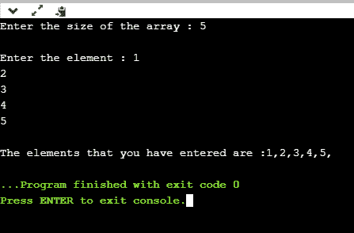

# 什么是内存管理？

> 原文：<https://www.javatpoint.com/cpp-memory-management>

内存管理是管理计算机内存的过程，将内存空间分配给程序，以提高整体系统性能。

## 为什么需要内存管理？

正如我们所知，数组存储同类数据，所以大多数情况下，内存是在声明时分配给数组的。有时会出现这种情况，直到运行时才确定确切的内存。为了避免这种情况，我们声明了一个具有最大大小的数组，但是一些内存将不会被使用。为了避免浪费内存，我们使用新的操作符在运行时动态分配内存。

## 内存管理操作符

在 [C 语言](https://www.javatpoint.com/c-programming-language-tutorial)中，我们使用 **malloc()** 或 **calloc()** 函数在运行时动态分配内存，free()函数用于释放动态分配的内存。 [C++](https://www.javatpoint.com/cpp-tutorial) 也支持这些功能，但 C++ 也定义了**新增**和**删除**等一元运算符来执行相同的任务，即分配和释放内存。

### 新操作员

一个**新的**操作符用于创建对象，而一个**删除**操作符用于删除对象。当使用新运算符创建对象时，该对象将一直存在，直到我们显式使用 delete 运算符删除该对象。因此，我们可以说对象的生存期与程序的块结构无关。

**语法**

```

pointer_variable = new data-type

```

上面的语法用于使用新运算符创建对象。在上面的语法中，**‘pointer _ variable’**是指针变量的名称，**‘new’**是运算符，**‘data-type’**定义了数据的类型。

**例 1:**

```

int *p;
p = new int;

```

在上例中，“p”是一个 int 类型的指针。

**例 2:**

```

float *q; 
q = new float;

```

在上面的例子中，“q”是 float 类型的指针。

在上面的例子中，指针的声明和它们的赋值是分开进行的。我们也可以将这两种说法合并如下:

```

int *p = new int;
float *q =   new float;

```

### 为新创建的对象赋值

**给新创建的对象赋值的两种方式:**

*   我们可以通过简单地使用赋值操作符为新创建的对象赋值。在上面的例子中，我们分别创建了两个 int 和 float 类型的指针“p”和“q”。现在，我们将这些值分配如下:

```

*p = 45;
*q = 9.8;

```

我们给新创建的 int 对象分配 45，给新创建的 float 对象分配 9.8。

*   我们还可以通过使用新的运算符来赋值，如下所示:

```

pointer_variable = new data-type(value);

```

**我们来看一些例子。**

```

int *p = new int(45);
float *p = new float(9.8);

```

### 如何创建一维数组

我们知道，新运算符用于为任何数据类型甚至用户定义的数据类型(如数组、结构、联合等)创建内存空间。，因此创建一维数组的语法如下所示:

```

pointer-variable = new data-type[size];

```

### 示例:

```

int *a1 = new int[8];

```

在上面的语句中，我们创建了一个 int 类型的数组，其大小等于 8，其中 p[0]指第一个元素，p[1]指第一个元素，依此类推。

### 删除运算符

当不再需要内存时，就需要释放内存，以便可以将内存用于其他目的。这可以通过使用删除操作符来实现，如下所示:

```

delete pointer_variable; 

```

在上面的语句中，**‘delete’**是用于删除现有对象的运算符，**‘pointer _ variable’**是指针变量的名称。

在前面的例子中，我们已经使用新的运算符创建了两个指针“p”和“q ”,并且可以使用以下语句删除它们:

```

delete p;
delete q;

```

还可以使用以下语法从内存空间中删除动态分配的数组:

```

delete [size] pointer_variable; 

```

在上面的语句中，我们需要指定定义需要释放的元素数量的大小。这种语法的缺点是我们需要记住数组的大小。但是，在最近的 C++ 版本中，我们不需要提到如下的大小:

```

delete [ ] pointer_variable; 

```

**我们通过一个简单的例子来理解:**

```

#include <iostream>
using namespace std
int main()
{
int size;  // variable declaration
int *arr = new int[size];   // creating an array 
cout<<"Enter the size of the array : ";   
std::cin >> size;    // 
cout<<"\nEnter the element : ";
for(int i=0;i<size;i++)   // for loop
{
cin>>arr[i];
}
cout<<"\nThe elements that you have entered are :";
for(int i=0;i<size;i++)    // for loop
{
cout<<arr[i]<<",";
}
delete arr;  // deleting an existing array.
return 0;
}

```

在上面的代码中，我们使用新的运算符创建了一个数组。上面的程序将在运行时接受用户对数组大小的输入。当程序完成所有操作后，使用语句 **delete arr** 删除对象。

**输出**



### 新运营商的优势

**以下是新运算符相对于 malloc()函数的优势:**

*   它不使用 sizeof()运算符，因为它会自动计算数据对象的大小。
*   它会自动返回正确的数据类型指针，因此不需要使用类型转换。
*   像其他运算符一样，new 和 delete 运算符也可以重载。
*   它还允许您在为对象创建内存空间时初始化数据对象。

* * *