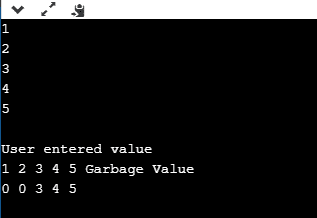
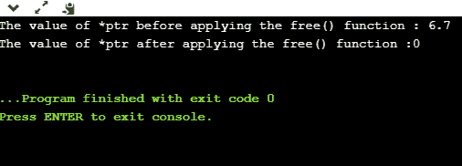
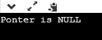
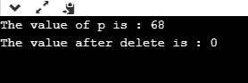
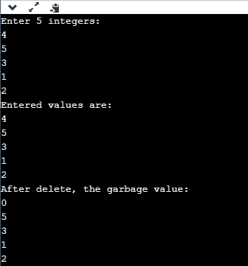

# C++中的自由与删除

> 原文：<https://www.javatpoint.com/free-vs-delete-in-cpp>

在本主题中，我们将学习 C++中的 **free()** 函数和 **delete** 运算符。

### free()函数

C++中使用 free()函数来动态取消内存分配。基本上是 C++中使用的库函数，在 **stdlib.h** 头文件中定义。当指针指向使用 malloc()函数分配的内存或 Null 指针时，使用此库函数。

### free()函数的语法

假设我们已经声明了一个指针“ptr”，现在，我们想要取消分配它的内存:

```

free(ptr);

```

上述语法将取消指针变量“ptr”的内存分配。

### 自由()参数

在上面的语法中，ptr 是 free()函数中的一个参数。ptr 是一个指针，指向使用 malloc()、calloc()或 realloc 函数分配的内存块。该指针也可以为空，或者是使用 malloc 分配的指针，但不指向任何其他内存块。

*   如果指针为空，那么 free()函数将不会做任何事情。
*   如果使用 malloc、calloc 或 realloc 分配指针，但不指向任何内存块，则此函数将导致未定义的行为。

### 自由()返回值

free()函数不返回值。它的主要功能是释放内存。

**我们通过一个例子来了解一下。**

```

#include <iostream>
#include <cstdlib>
using namespace std;

int main()
{
	int *ptr;
	ptr = (int*) malloc(5*sizeof(int));
	cout << "Enter 5 integer" << endl;

	for (int i=0; i<5; i++)
	{
	// *(ptr+i) can be replaced by ptr[i]
		cin >>ptr[i];
	}
	cout << endl << "User entered value"<< endl;

	for (int i=0; i<5; i++)
	{
		cout <<*(ptr+i)  << " ";
	}
	free(ptr);

	/* prints a garbage value after ptr is free */
	cout << "Garbage Value" << endl;

	for (int i=0; i<5; i++)
	{
		cout << *(ptr+i)<< " ";
	}
	return 0;
}

```

上面的代码展示了 free()函数如何与 malloc()一起工作。首先，我们声明整数指针*ptr，然后使用 malloc()函数将内存分配给这个指针变量。现在，ptr 指向未初始化的 5 个整数的内存块。分配内存后，我们使用 free()函数销毁分配的内存。当我们试图打印 ptr 指向的值时，我们得到一个垃圾值，这意味着内存被取消分配。

**输出**



**让我们看看 free()函数如何与胼胝体一起工作。**

```

#include <iostream>
#include <cstdlib>
using namespace std;
int main()
{
 float *ptr; // float pointer declaration
 ptr=(float*)calloc(1,sizeof(float));
 *ptr=6.7;
 std::cout << "The value of *ptr before applying the free() function : " <<*ptr<< std::endl;
 free(ptr);
 std::cout << "The value of *ptr after applying the free() function :" <<*ptr<< std::endl;
	return 0;
}

```

在上面的例子中，我们可以观察到 free()函数与 calloc()一起工作。我们使用 calloc()函数将内存块分配给浮点指针 ptr。我们给 ptr 分配了一个内存块，它可以有一个浮点类型的值。

**输出:**



**我们再来看一个例子。**

```

#include <iostream>
#include <cstdlib>
using namespace std;
int main()
{
 int *ptr1=NULL;
 int *ptr2;
 int x=9;
ptr2=&x;
 if(ptr1)
 {
     std::cout << "Pointer is not Null" << std::endl;
 }
 else
 {
     cout<<"Ponter is NULL";
 }
 free(ptr1);
 //free(ptr2); // If this statement is executed, then it gives a runtime error.
 return 0;
}

```

上面的代码展示了 free()函数如何使用空指针。我们已经声明了两个指针，即 ptr1 和 ptr2。我们给指针 ptr1 分配一个空值，给指针 ptr2 分配 x 变量的地址。当我们将 free(ptr1)函数应用于 ptr1 时，分配给 ptr 的内存块将被成功释放。free 语句(ptr2)显示运行时错误，因为分配给 ptr2 的内存块不是使用 malloc 或 calloc 函数分配的。

**输出**



### 删除运算符

是 [C++编程语言](https://www.javatpoint.com/cpp-tutorial)中使用的运算符，用于动态解除内存分配。该运算符主要用于使用新运算符分配的指针或空指针。

### 句法

```

delete pointer_name

```

例如，如果我们使用新的运算符将内存分配给指针，现在我们想要删除它。要删除指针，我们使用以下语句:

```

delete p;

```

要删除数组，我们使用如下语句:

```

delete [] p;

```

**与删除运算符相关的一些要点有:**

*   它用于删除通过使用 new 关键字分配的数组或非数组对象。
*   要删除数组或非数组对象，我们分别使用 delete[]和 delete 运算符。
*   new 关键字在堆中分配内存；因此，我们可以说 delete 操作符总是从堆中取消分配内存
*   它不会破坏指针，但会破坏指针所指向的值或内存块。

**我们来看一个删除操作符的简单例子。**

```

#include <iostream>
#include <cstdlib>
using namespace std;

int main()
{
 int *ptr;
 ptr=new int;
 *ptr=68;
 std::cout << "The value of p is : " <<*ptr<< std::endl;
 delete ptr;
 std::cout <<"The value after delete is : "  <<*ptr<< std::endl;
 return 0;
}

```

在上面的代码中，我们使用新的操作符来分配内存，因此我们使用 delete ptr 操作符来销毁内存块，该内存块由指针 ptr 指向。

**输出**



**让我们看看 delete 如何处理对象数组。**

```

#include <iostream>
using namespace std;
int main()
{
    int *ptr=new int[5];  // memory allocation using new operator.
    std::cout << "Enter 5 integers:" << std::endl;
    for(int i=1;i<=5;i++)
    {
        cin>>ptr[i];
    }
    std::cout << "Entered values are:" << std::endl;
        for(int i=1;i<=5;i++)
    {
        cout<<*(ptr+i)<<endl;
    }
    delete[] ptr; // deleting the memory block pointed by the ptr.
    std::cout << "After delete, the garbage value:" << std::endl;
        for(int i=1;i<=5;i++)
    {
        cout<<*(ptr+i)<<endl;
    }
 return 0;
}

```

**输出**



### 删除和释放的区别()

以下是 C++中 delete 和 free()的区别:

*   delete 是一个动态取消分配内存的运算符，而 free()是一个在运行时破坏内存的函数。
*   delete 运算符用于删除指针，该指针是使用新运算符或空指针分配的，而 free()函数用于删除使用 malloc()、calloc()或 realloc()函数或空指针分配的指针。
*   当 delete 运算符破坏分配的内存时，那么它在 C++中调用类的析构函数，而 free()函数不调用析构函数；它只从堆中释放内存。
*   delete()运算符比 free()函数更快。

* * *