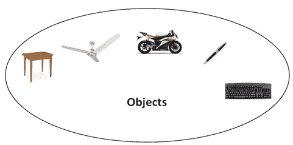

# C++ OOPs 概念

> 原文：<https://www.javatpoint.com/cpp-oops-concepts>

C++ 编程的主要目的是将面向对象的概念引入到 C 编程语言中。

面向对象编程是一种范式，它提供了许多概念，如**继承、数据绑定、多态性等。**

将一切都表示为对象的编程范式被称为真正的面向对象编程语言。 **Smalltalk** 被认为是第一个真正面向对象的编程语言。

* * *

## 面向对象编程系统

**对象**是指笔、椅子、桌子等真实的文字实体。**面向对象编程**是一种使用类和对象设计程序的方法或范例。它通过提供一些概念简化了软件开发和维护:

*   目标
*   班级
*   遗产
*   多态性
*   抽象
*   包装

### 目标

任何具有状态和行为的实体都被称为对象。例如:椅子、笔、桌子、键盘、自行车等。它可以是物理的，也可以是逻辑的。

### 班级

**对象的集合**称为类。它是一个逻辑实体。

### 遗产

**当一个对象获得父对象的所有属性和行为**时，即被称为继承。它提供了代码可重用性。它用于实现运行时多态性。

### 多态性

当**一个任务以不同的方式**执行时，即所谓的多态性。例如:以不同的方式说服顾客，画一些东西，如形状或矩形等。

在 C++ 中，我们使用函数重载和函数重写来实现多态性。

### 抽象

**隐藏内部细节和展示功能**被称为抽象。比如:电话，我们不知道内部处理。

在 C++ 中，我们使用抽象类和接口来实现抽象。

### 包装

**将代码和数据绑定(或包装)到一个单元中称为封装。**比如:胶囊，里面包着不同的药。

* * *

## OOPs 相对于面向过程编程语言的优势

1.  OOPs 使得开发和维护变得更加容易，因为在面向过程的编程语言中，如果代码随着项目规模的增长而增长，就不容易管理。
2.  OOPs 提供数据隐藏，而在面向过程的编程语言中，可以从任何地方访问全局数据。
3.  OOPs 提供了更有效地模拟真实世界事件能力。如果我们使用面向对象编程语言，我们可以提供真题的解决方案。

* * *