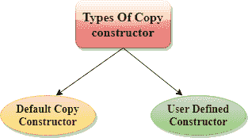
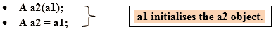
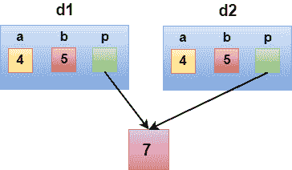
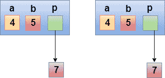

# C++ 复制构造函数

> 原文：<https://www.javatpoint.com/cpp-copy-constructor>

复制构造函数是一个**重载的**构造函数，用于从另一个对象声明和初始化一个对象。

## 复制构造函数有两种类型:

*   **默认复制构造函数:**编译器定义默认复制构造函数。如果用户没有定义复制构造函数，编译器会提供它的构造函数。
*   **用户自定义构造函数:**程序员定义用户自定义构造函数。



## 用户定义的复制构造函数的语法:

```
Class_name(const class_name &old_object);

```

考虑以下情况:

```
class A
{
    A(A &x) //  copy constructor.
   {
       // copyconstructor.
   }
} 

```

在上述情况下，可以通过以下方式调用**复制构造函数:**



让我们看一个简单的复制构造函数的例子。

**//复制构造器的程序。**

```
#include <iostream>
using namespace std;
class A
{
   public:
    int x;
    A(int a)                // parameterized constructor.
    {
      x=a;
    }
    A(A &i)               // copy constructor
    {
        x = i.x;
    }
};
int main()
{
  A a1(20);               // Calling the parameterized constructor.
 A a2(a1);                //  Calling the copy constructor.
 cout<<a2.x;
  return 0;
}

```

**输出:**

```
20

```

## 当调用复制构造函数时

在以下情况下调用复制构造函数:

*   当我们用相同类类型的另一个现有对象初始化对象时。例如，学生 s1 = s2，其中学生是班级。
*   当相同类类型的对象作为参数通过值传递时。
*   当函数按值返回同一类类型的对象时。

## 构造函数生成两种类型的副本:

*   浅拷贝
*   深度复制

## 浅拷贝

*   默认的复制构造函数只能生成浅层副本。
*   浅拷贝被定义为通过原样拷贝所有成员变量的数据来创建对象拷贝的过程。

让我们通过一个简单的例子来理解这一点:

```
#include <iostream>

using namespace std;

class Demo
{
    int a;
    int b;
    int *p;
    public:
    Demo()
    {
        p=new int;
    }
    void setdata(int x,int y,int z)
    {
        a=x;
        b=y;
        *p=z;
    }
    void showdata()
    {
        std::cout << "value of a is : " <<a<< std::endl;
        std::cout << "value of b is : " <<b<< std::endl;
        std::cout << "value of *p is : " <<*p<< std::endl;
    }
};
int main()
{
  Demo d1;
  d1.setdata(4,5,7);
  Demo d2 = d1;
  d2.showdata();
    return 0;
}

```

**输出:**

```
value of a is : 4   
value of b is : 5  
value of *p is : 7 

```



在上述情况下，程序员没有定义任何构造函数，因此，语句**Demo D2 = D1；**调用编译器定义的默认构造函数。默认构造函数创建现有对象的精确副本或浅副本。因此，两个对象的指针 p 指向相同的存储位置。因此，当一个字段的内存被释放时，另一个字段的内存也会被自动释放，因为两个字段都指向同一个内存位置。这个问题由**自定义构造器**解决，创建**深度副本**。

## 深度复制

深度拷贝动态地为拷贝分配内存，然后拷贝实际值，源和拷贝都有不同的内存位置。这样，源和副本是不同的，不会共享相同的内存位置。深度复制需要我们编写用户定义的构造函数。

让我们通过一个简单的例子来理解这一点。

```
#include <iostream>
using namespace std;
class Demo
{
    public:
    int a;
    int b;
    int *p;

    Demo()
    {
        p=new int;
    }
    Demo(Demo &d)
    {
        a = d.a;
        b = d.b;
        p = new int;
        *p = *(d.p);
    }
    void setdata(int x,int y,int z)
    {
        a=x;
        b=y;
        *p=z;
    }
    void showdata()
    {
        std::cout << "value of a is : " <<a<< std::endl;
        std::cout << "value of b is : " <<b<< std::endl;
        std::cout << "value of *p is : " <<*p<< std::endl;
    }
};
int main()
{
  Demo d1;
  d1.setdata(4,5,7);
  Demo d2 = d1;
  d2.showdata();
  return 0;
}

```

**输出:**

```
value of a is : 4   
value of b is : 5   
value of *p is : 7   

```



在上述情况下，一个程序员定义了自己的构造函数，因此语句**Demo D2 = D1；**调用用户定义的复制构造函数。它创建值类型数据和指针指向的对象的精确副本。深度副本不创建引用类型变量的副本。

## 复制构造函数和赋值运算符的区别(=)

| 复制构造函数 | 赋值运算符 |
| 它是一个重载的构造函数。 | 它是按位运算符。 |
| 它用现有对象初始化新对象。 | 它将一个对象的值赋给另一个对象。 |
| 复制构造函数语法:
类名(const Class _ name&object _ name)
{
//构造函数体。
} | 赋值运算符的语法:
类名 a，b；
b = a； |
| 

*   **The copy constructor** is called when initializing a new object with an existing object.
*   Object is passed to the function as a parameter.
*   Returns the object.

 | 当我们将现有对象分配给新对象时，调用**分配操作符**。 |
| 现有对象和新对象共享不同的内存位置。 | 现有对象和新对象共享相同的内存位置。 |
| 如果程序员没有定义复制构造函数，编译器将自动生成隐式默认复制构造函数。 | 如果我们不重载“=”运算符，将会发生按位复制。 |

* * *