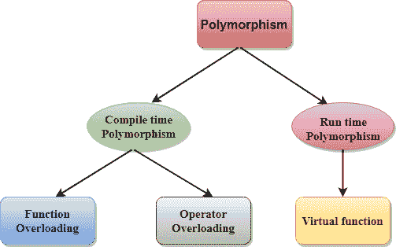

# C++ 多态性

> 原文：<https://www.javatpoint.com/cpp-polymorphism>

术语“多态性”是“多”+“变体”的组合，这意味着许多形式。这是一个希腊单词。在面向对象编程中，我们使用 3 个主要概念:继承、封装和多态。

## 多态的真实例子

让我们考虑一个多态的现实例子。一位女士的行为就像教室里的老师，家里的母亲或女儿，市场上的顾客。在这里，一个人的行为会因情况而异。

**c++ 中有两种类型的多态性:**



*   **编译时多态性**:通过匹配参数的类型和数量来调用重载函数。该信息在编译时可用，因此编译器在编译时选择适当的函数。它是通过函数重载和操作符重载实现的，也称为静态绑定或早期绑定。现在，让我们考虑函数名和原型相同的情况。

```
   class A                                  //  base class declaration.
  {
       int a;
       public:
       void display()
       { 
             cout<< "Class A ";
        }
  };
class B : public A                       //  derived class declaration.
{
    int b;
    public:
   void display()
  {
        cout<<"Class B";
  }
};

```

在上述情况下，display()函数的原型在**基类和派生类**中都是相同的。因此，不能应用静态绑定。如果在运行时选择了合适的函数，那就太好了。这就是所谓的**运行时多态性**。

*   **运行时多态性**:当在运行时而不是编译时调用对象的方法时，就实现了运行时多态性。这是通过方法重写实现的，也称为动态绑定或后期绑定。

## 编译时和运行时多态性的区别。

| 编译时多态性 | 运行时多态性 |
| 要调用的函数在编译时是已知的。 | 要调用的函数在运行时是已知的。 |
| 也称为重载、早期绑定和静态绑定。 | 它也被称为重写、动态绑定和后期绑定。 |
| 重载是一种编译时多态性，其中多个方法具有相同的名称，但具有不同的参数数量或参数类型。 | 重写是一种运行时多态性，其中多个方法具有相同的名称、参数数量和参数类型。 |
| 它是通过函数重载和运算符重载实现的。 | 它是通过虚函数和指针实现的。 |
| 它提供了编译时已知的快速执行。 | 它提供了运行时已知的缓慢执行。 |
| 它不太灵活，因为主要所有的事情都是在编译时执行的。 | 它更灵活，因为所有的事情都是在运行时执行的。 |

## C++ 运行时多态性示例

让我们看一个 C++ 中运行时多态性的简单例子。

//没有 virtual 关键字的示例。

```
#include <iostream>  
using namespace std;  
class Animal {  
    public:  
void eat(){    
cout<<"Eating...";    
    }      
};   
class Dog: public Animal    
{    
 public:  
 void eat()    
    {           cout<<"Eating bread...";    
    }    
};  
int main(void) {  
   Dog d = Dog();    
   d.eat();  
   return 0;  
}  

```

**输出:**

```
Eating bread...

```

## C++ 运行时多态性示例:通过使用两个派生类

让我们看看 C++ 中运行时多态性的另一个例子，其中我们有两个派生类。

//带有 virtual 关键字的示例。

```
#include <iostream>  
using namespace std;  
class Shape {                                        //  base class
    public:  
virtual void draw(){                             // virtual function
cout<<"drawing..."<<endl;    
    }      
};   
class Rectangle: public Shape                  //  inheriting Shape class.
{    
 public:  
 void draw()    
   {    
       cout<<"drawing rectangle..."<<endl;    
    }    
};  
class Circle: public Shape                        //  inheriting Shape class.

{    
 public:  
 void draw()    
   {    
      cout<<"drawing circle..."<<endl;    
   }    
};  
int main(void) {  
    Shape *s;                               //  base class pointer.
    Shape sh;                               // base class object.
       Rectangle rec;  
        Circle cir;  
      s=&sh;  
     s->draw();   
        s=&rec;  
     s->draw();    
    s=?  
    s->draw();   
}  

```

**输出:**

```
drawing...
drawing rectangle...
drawing circle...

```

## 数据成员的运行时多态性

C++ 中的数据成员可以实现运行时多态性。让我们看一个例子，在这个例子中，我们通过引用变量来访问字段，这个变量引用了派生类的实例。

```
#include <iostream>  
using namespace std;  
class Animal {                                          //  base class declaration.
    public:  
    string color = "Black";    
};   
class Dog: public Animal                       // inheriting Animal class.
{    
 public:  
    string color = "Grey";    
};  
int main(void) {  
     Animal d= Dog();    
    cout<<d.color;   
}  

```

**输出:**

```
Black

```