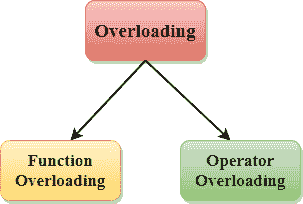
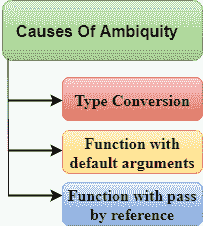

# C++ 重载(函数和运算符)

> 原文：<https://www.javatpoint.com/cpp-overloading>

如果我们创建两个或多个具有相同名称但在参数数量或类型上不同的成员，这被称为 C++ 重载。在 C++ 中，我们可以重载:

*   方法，
*   构造函数，以及
*   索引属性

因为这些成员只有参数。

## C++ 中重载的类型有:

*   函数重载
*   操作员超载



## C++ 函数重载

函数重载定义为两个或多个函数同名，但参数不同的过程，在 C++ 中称为函数重载。在函数重载中，通过使用不同类型的参数或不同数量的参数来重新定义函数。只有通过这些差异编译器才能区分这些功能。

函数重载的**优势**是增加了程序的可读性，因为你不需要对同一个动作使用不同的名字。

## C++ 函数重载示例

让我们看看函数重载的简单例子，在这个例子中，我们改变了 add()方法的参数数量。

//当参数数量变化时函数重载的程序。

```
#include <iostream>  
using namespace std;  
class Cal {  
    public:  
static int add(int a,int b){    
        return a + b;    
    }    
static int add(int a, int b, int c)    
    {    
        return a + b + c;    
    }    
};   
int main(void) {  
    Cal C;                                                    //     class object declaration. 
    cout<<C.add(10, 20)<<endl;    
    cout<<C.add(12, 20, 23);   
   return 0;  
}  

```

**输出:**

```
30
55

```

让我们看看参数类型变化时的简单例子。

//不同类型参数的函数重载程序。

```
#include<iostream>
using namespace std;
int mul(int,int);
float mul(float,int);

int mul(int a,int b)
{
    return a*b;
}
float mul(double x, int y)
{
    return x*y;
}
int main()
{
    int r1 = mul(6,7);
    float r2 = mul(0.2,3); 
    std::cout << "r1 is : " <<r1<< std::endl;
    std::cout <<"r2 is : "  <<r2<< std::endl;
    return 0;
}

```

**输出:**

```
r1 is : 42
r2 is : 0.6  

```

## 函数重载和歧义

当编译器无法决定重载函数中调用哪个函数时，这种情况称为**函数重载**。

当编译器显示模糊错误时，编译器不运行程序。

**功能过载原因:**

*   类型转换。
*   带有默认参数的函数。
*   带按引用传递的函数。



*   类型转换:

**我们来看一个简单的例子。**

```
#include<iostream>
using namespace std;
void fun(int);
void fun(float);
void fun(int i)
{
    std::cout << "Value of i is : " <<i<< std::endl;
}
void fun(float j)
{
    std::cout << "Value of j is : " <<j<< std::endl;
}
int main()
{
    fun(12);
    fun(1.2);
    return 0;
}

```

上面的例子显示了一个错误“**调用重载的‘fun(double)’是模棱两可的**”。fun(10)将调用第一个函数。fun(1.2)根据我们的预测调用第二个函数。但是，这并不像在 C++ 中那样引用任何函数，所有的浮点常数都被视为双精度而不是浮点。如果我们将 float 替换为 double，程序就可以工作了。因此，这是从浮点到双精度的类型转换。

*   带有默认参数的函数

**我们来看一个简单的例子。**

```
#include<iostream>
using namespace std;
void fun(int);
void fun(int,int);
void fun(int i)
{
    std::cout << "Value of i is : " <<i<< std::endl;
}
void fun(int a,int b=9)
{
    std::cout << "Value of a is : " <<a<< std::endl;
    std::cout << "Value of b is : " <<b<< std::endl;
}
int main()
{
    fun(12);

    return 0;
}

```

上面的例子显示了一个错误“重载‘fun(int)’的调用是不明确的”。fun(int a，int b=9)可以通过两种方式调用:第一种是用一个参数调用函数，即 fun(12)，另一种方式是用两个参数调用函数，即 fun(4，5)。fun(int i)函数用一个参数调用。因此，编译器无法在 fun(int i)和 fun(int a，int b=9)之间进行选择。

*   带引用传递的函数

让我们看一个简单的例子。

```
#include <iostream>
using namespace std;
void fun(int);
void fun(int &); 
int main()
{
int a=10;
fun(a); // error, which f()?
return 0;
}
void fun(int x)
{
std::cout << "Value of x is : " <<x<< std::endl;
}
void fun(int &b)
{
std::cout << "Value of b is : " <<b<< std::endl;
}

```

上面的例子显示了一个错误“**调用的重载‘fun(int&)’是模棱两可的**”。第一个函数采用一个整数参数，第二个函数采用一个引用参数作为参数。在这种情况下，编译器不知道用户需要哪个函数，因为 fun(int)和 fun(int &)在语法上没有区别。

## C++ 运算符重载

运算符重载是一种编译时多态性，其中运算符被重载以向用户定义的数据类型提供特殊含义。运算符重载用于重载或重新定义 C++ 中可用的大多数运算符。它用于对用户定义的数据类型执行操作。例如，C++ 提供了添加应用于内置数据类型的用户定义数据类型的变量的能力。

运算符重载的优点是对同一操作数执行不同的操作。

**不能过载的操作员如下:**

*   范围运算符(::)
*   西泽夫
*   成员选择器(。)
*   成员指针选择器(*)
*   三元运算符(？:)

## 运算符重载的语法

```
return_type class_name  : : operator op(argument_list)
{
     // body of the function.
}

```

其中**返回类型**是函数返回的值的类型。

**类 _ 名称**是类的名称。

**运算符 op** 是一个运算符函数，其中 op 是被重载的运算符，运算符是关键字。

## 运算符重载的规则

*   现有运算符只能重载，但新运算符不能重载。
*   重载运算符至少包含一个用户定义数据类型的操作数。
*   我们不能使用 friend 函数来重载某些运算符。但是，成员函数可以用来重载这些运算符。
*   当一元运算符通过成员函数重载时，不采用显式参数，但是，如果它们被友元函数重载，则采用一个参数。
*   当二进制运算符通过成员函数重载时，需要一个显式参数，如果它们通过友元函数重载，则需要两个显式参数。

## C++ 运算符重载示例

让我们看看 C++ 中运算符重载的简单例子。在本例中，定义了 void 运算符++()运算符函数(在 Test 类内部)。

//编程霸王一元运算符++。

```
#include <iostream>  
using namespace std;  
class Test  
{  
   private:  
      int num;  
   public:  
       Test(): num(8){}  
       void operator ++()         {   
          num = num+2;   
       }  
       void Print() {   
           cout<<"The Count is: "<<num;   
       }  
};  
int main()  
{  
    Test tt;  
    ++tt;  // calling of a function "void operator ++()"  
    tt.Print();  
    return 0;  
}  

```

**输出:**

```
The Count is: 10

```

让我们看一个重载二进制运算符的简单例子。

//程序霸王二进制运算符。

```
#include <iostream>
using namespace std;
class A
{

    int x;
      public:
      A(){}
    A(int i)
    {
       x=i;
    }
    void operator+(A);
    void display();
};

void A :: operator+(A a)
{

    int m = x+a.x;
    cout<<"The result of the addition of two objects is : "<<m;

}
int main()
{
    A a1(5);
    A a2(4);
    a1+a2;
    return 0;
}

```

**输出:**

```
The result of the addition of two objects is : 9 

```