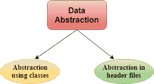

# C++ 中的数据抽象

> 原文：<https://www.javatpoint.com/data-abstraction-in-cpp>

*   数据抽象是一个只向外界提供本质细节，隐藏内部细节的过程，即只表示程序中的本质细节。
*   数据抽象是一种编程技术，它依赖于程序的接口和实现细节的分离。
*   我们来举一个现实生活中的交流例子，它可以打开或关闭，改变温度，改变模式，以及其他外部组件，如风扇，秋千。但是，我们不知道空调的内部细节，即它在内部是如何工作的。因此，我们可以说 AC 将实现细节与外部接口分开。
*   C++ 提供了很高的抽象层次。例如，pow()函数用于计算一个数的幂，而不知道该函数遵循的算法。

在 C++ 程序中，如果我们用私有和公共成员实现类，那么它就是数据抽象的一个例子。

**数据抽象可以通过两种方式实现:**

*   使用类的抽象
*   头文件中的抽象。



**使用类的抽象:**使用类可以实现抽象。类用于通过使用访问说明符将所有数据成员和成员函数分组到一个单元中。类有责任确定哪个数据成员在外部可见，哪个不可见。

**头文件中的抽象:**另一种类型的抽象是头文件。例如，可用的 pow()函数用于计算一个数的幂，而实际上不知道哪个算法函数用于计算幂。因此，我们可以说头文件对用户隐藏了所有的实现细节。

**访问说明符实现抽象:**

*   **公共说明符:**当成员声明为公共时，可以从程序的任何地方访问成员。
*   **私有说明符:**当成员声明为私有时，成员只能由类的成员函数访问。

让我们看一个简单的头文件抽象的例子。

**//程序计算一个数的幂。**

```

#include <iostream>
#include<math.h>
using namespace std;
int main()
{  
 int n = 4;
   int power = 3;
   int result = pow(n,power);         // pow(n,power) is the  power function
   std::cout << "Cube of n is : " <<result<< std::endl;
   return 0;
}

```

**输出:**

```
Cube of n is : 64

```

在上面的例子中，pow()函数用于计算 4 的 3 次方。pow()函数存在于 math.h 头文件中，其中隐藏了 pow()函数的所有实现细节。

**我们来看一个使用类进行数据抽象的简单例子。**

```

#include <iostream>  
using namespace std;  
 class Sum  
{  
private: int x, y, z; // private variables
public:  
void add()  
{  
cout<<"Enter two numbers: ";  
cin>>x>>y;  
z= x+y;  
cout<<"Sum of two number is: "<<z<<endl;  
}  
};  
int main()  
{  
Sum sm;  
sm.add();  
return 0;  
}  

```

**输出:**

```
Enter two numbers:
3
6
Sum of two number is: 9

```

在上面的例子中，抽象是使用类实现的。类“Sum”包含私有成员 x、y 和 z，只能由该类的成员函数访问。

## 抽象的优势:

*   该类的实现细节受到保护，不会出现意外的用户级错误。
*   程序员不需要编写低级代码。
*   数据抽象避免了代码重复，即程序员不必每次都经历相同的任务来执行相似的操作。
*   数据抽象的主要目的是重用代码和跨类的代码的正确划分。
*   可以在不影响用户级代码的情况下更改内部实现。

* * *