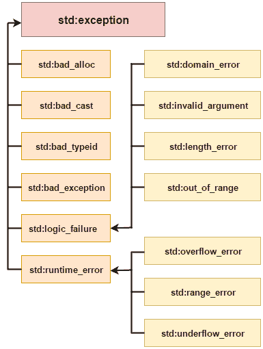

# C++ 异常处理

> 原文：<https://www.javatpoint.com/cpp-exception-handling>

C++ 中的异常处理是一个处理运行时错误的过程。我们执行异常处理，以便即使在运行时出错后也能保持应用程序的正常流程。

在 C++ 中，异常是运行时引发的事件或对象。所有异常都是从 std::exception 类派生的。这是一个可以处理的运行时错误。如果我们不处理异常，它会打印异常消息并终止程序。

* * *

## 优势

它维护应用程序的正常流程。在这种情况下，即使在异常之后，代码的其余部分也会被执行。

* * *

## C++ 异常类

在 C++ 中，标准异常是在<exception>类中定义的，我们可以在程序中使用。父子类层次结构的排列如下所示:</exception>

* * *

C++ 中的所有异常类都是从 std::exception 类派生的。让我们看看 C++ 常见异常类的列表。

| 例外 | 描述 |
| 标准::异常 | 它是所有标准 C++ 异常的一个异常和父类。 |
| 标准::逻辑 _ 失败 | 这是一个可以通过读取代码检测到的异常。 |
| 标准::运行时 _ 错误 | 这是一个无法通过读取代码检测到的异常。 |
| 标准::错误 _ 异常 | 它用于处理 c++ 程序中的意外异常。 |
| std::bad_cast | 这个异常一般由 **dynamic_cast 抛出。** |
| std::bad_typeid | 这个异常一般由 **typeid 抛出。** |
| std::bad_alloc 函数 | 这个异常一般是由 **new 抛出的。** |

* * *

## C++ 异常处理关键字

在 C++ 中，我们使用 3 个关键字来执行异常处理:

*   尝试
*   抓住，然后
*   扔

此外，我们可以创建用户定义的异常，这将在下一章中学习。