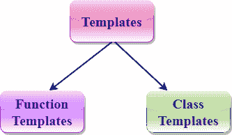

# C++ 模板

> 原文：<https://www.javatpoint.com/cpp-templates>

C++ 模板是添加到 C++ 中的强大功能。它允许您定义泛型类和泛型函数，从而为泛型编程提供支持。泛型编程是一种技术，其中泛型类型用作算法中的参数，以便它们可以适用于各种数据类型。

**模板有两种表示方式:**

*   功能模板
*   类模板



**功能模板:**

我们可以为一个函数定义一个模板。例如，如果我们有一个 add()函数，我们可以创建 add 函数的版本来添加 int、float 或 double 类型的值。

**类模板:**

我们可以为一个类定义一个模板。例如，可以为数组类创建一个类模板，该类可以接受各种类型的数组，如 int 数组、float 数组或 double 数组。

* * *

## 功能模板

*   通用函数使用函数模板的概念。通用函数定义了一组可应用于各种类型数据的操作。
*   函数将操作的数据类型取决于作为参数传递的数据类型。
*   例如，快速排序算法是使用泛型函数实现的，它可以实现为整数数组或浮点数组。
*   通用函数是使用关键字模板创建的。模板定义了函数的作用。

### 函数模板的语法

```

template < class Ttype> ret_type func_name(parameter_list)
{
    // body of function.
}

```

其中 **Ttype** :是函数使用的数据类型的占位符名称。它在函数定义中使用。它只是一个占位符，编译器会用实际的数据类型自动替换这个占位符。

**类**:类关键字用于在模板声明中指定泛型类型。

**我们来看一个简单的函数模板示例:**

```

 #include <iostream>
using namespace std;
template<class T> T add(T &a,T &b)
{
    T result = a+b;
    return result;

}
int main()
{
  int i =2;
  int j =3;
  float m = 2.3;
  float n = 1.2;
  cout<<"Addition of i and j is :"<<add(i,j);
  cout<<'\n';
  cout<<"Addition of m and n is :"<<add(m,n);
  return 0;
}

```

**输出:**

```
Addition of i and j is :5
Addition of m and n is :3.5

```

在上面的例子中，我们创建了一个函数模板，它可以对任何类型执行加法操作，可以是整数、浮点或双精度。

### 多参数函数模板

通过使用逗号分隔列表，我们可以在模板函数中使用多个泛型类型。

## 句法

```

 template<class T1, class T2,.....>
return_type function_name (arguments of type T1, T2....)
{
    // body of function.
}

```

在上面的语法中，我们已经看到模板函数可以接受任意数量的不同类型的参数。

**我们来看一个简单的例子:**

```

#include <iostream>
using namespace std;
template<class X,class Y> void fun(X a,Y b)
{
    std::cout << "Value of a is : " <<a<< std::endl;
    std::cout << "Value of b is : " <<b<< std::endl;
}

int main()
{
   fun(15,12.3);

   return 0;
}

```

**输出:**

```
Value of a is : 15
Value of b is : 12.3

```

在上例中，我们在模板函数中使用了两个泛型类型，即 X 和 y。

### 重载函数模板

我们可以重载泛型函数，这意味着重载的模板函数在参数列表中可以不同。

**我们通过一个简单的例子来了解一下:**

```

#include <iostream>
using namespace std;
template<class X> void fun(X a)
{
    std::cout << "Value of a is : " <<a<< std::endl;
}
template<class X,class Y> void fun(X b ,Y c)
{
    std::cout << "Value of b is : " <<b<< std::endl;
    std::cout << "Value of c is : " <<c<< std::endl;
}
int main()
{
   fun(10);
   fun(20,30.5);
   return 0;
}

```

**输出:**

```
Value of a is : 10
Value of b is : 20
Value of c is : 30.5

```

在上面的例子中，fun()函数的模板被重载。

### 泛型函数的限制

除了数据类型不同之外，泛型函数对函数的所有版本执行相同的操作。让我们看一个重载函数的简单例子，它不能被泛型函数代替，因为这两个函数有不同的功能。

**我们通过一个简单的例子来了解一下:**

```

#include <iostream>
using namespace std;
void fun(double a)
{
    cout<<"value of a is : "<<a<<'\n';
}

void fun(int b)
{
    if(b%2==0)
    {
        cout<<"Number is even";
    }
    else
    {
        cout<<"Number is odd";
    }

}

int main()
{
   fun(4.6);
   fun(6);
   return 0;
}

```

**输出:**

```
value of a is : 4.6
Number is even

```

在上面的例子中，我们重载了普通函数。我们不能重载通用函数，因为这两个函数具有不同的功能。第一个是显示数值，第二个决定数字是否为偶数。

* * *

## 班级模板

**类模板**也可以类似于功能模板进行定义。当一个类使用模板的概念时，这个类被称为泛型类。

## 句法

```

template<class Ttype>
class class_name
{
  .
  .
}

```

**Ttype** 是一个占位符名称，将在类实例化时确定。我们可以使用逗号分隔的列表定义多个通用数据类型。Ttype 可以在类体中使用。

现在，我们创建一个类的实例

```

class_name<type> ob;

```

**其中 class_name** :是类的名称。

**类型**:是类正在操作的数据的类型。

**ob** :是物体的名称。

**我们来看一个简单的例子:**

```

#include <iostream>
using namespace std;
template<class T>
class A 
{
    public:
    T num1 = 5;
    T num2 = 6;
    void add()
    {
        std::cout << "Addition of num1 and num2 : " << num1+num2<<std::endl;
    }

};

int main()
{
    A<int> d;
    d.add();
    return 0;
}

```

**输出:**

```
Addition of num1 and num2 : 11

```

在上面的例子中，我们为类 A 创建了一个模板。在 main()方法中，我们创建了名为“d”的类 A 的实例。

### 多参数类模板

我们可以在一个类模板中使用多个泛型数据类型，每个泛型数据类型都用逗号分隔。

## 句法

```

template<class T1, class T2, ......> 
class class_name
{
   // Body of the class.
}

```

**我们来看一个简单的例子，当类模板包含两个泛型数据类型时。**

```

#include <iostream>
     using namespace std;
     template<class T1, class T2>
    class A 
    {
         T1 a;
         T2 b;
         public:
        A(T1 x,T2 y)
       {
           a = x;
           b = y;
        }
           void display()
          {
                 std::cout << "Values of a and b are : " << a<<" ,"<<b<<std::endl;
           }
      };

      int main()
     {
           A<int,float> d(5,6.5);
           d.display();
           return 0;
     }

```

**输出:**

```
Values of a and b are : 5,6.5

```

### 非类型模板参数

模板可以包含多个参数，我们也可以使用非类型参数除了类型 T 参数，我们还可以使用其他类型的参数，如字符串、函数名、常量表达式和内置类型。**我们来看看下面的例子:**

```

template<class T, int size>
class array
{
    	T arr[size];           // automatic array initialization.
};

```

在上面的例子中，非类型模板参数是 size，因此，模板提供数组的大小作为参数。

创建类的对象时会指定参数:

```

array<int, 15> t1;                        // array of 15 integers.
array<float, 10> t2;                    // array of 10 floats. 
array<char, 4> t3;                      // array of 4 chars.              

```

让我们看一个非类型模板参数的简单例子。

```

#include <iostream>
using namespace std;
template<class T, int size>
class A 
{
    public:
    T arr[size];
    void insert()
    {
        int i =1;
        for (int j=0;j<size;j++)
        {
            arr[j] = i;
            i++;
        }
    }

    void display()
    {
        for(int i=0;i<size;i++)
        {
            std::cout << arr[i] << " ";
        }
    }
};
int main()
{
    A<int,10> t1;
    t1.insert();
    t1.display();
    return 0;
}

```

**输出:**

```
1 2 3 4 5 6 7 8 9 10

```

在上面的示例中，创建了包含非类型模板参数(即大小)的类模板。它是在创建类“A”的对象时指定的。

**需要记住的点**

*   C++ 支持被称为模板的强大功能来实现泛型编程的概念。
*   模板允许我们创建一系列类或函数来处理不同的数据类型。
*   模板类和函数消除了不同数据类型的代码重复，从而使开发更加容易和快速。
*   类和函数模板中都可以使用多个参数。
*   模板函数也可以重载。
*   我们也可以使用非类型参数，如内置或派生数据类型作为模板参数。