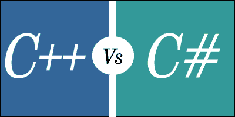

# C++ vs C#

> 原文：<https://www.javatpoint.com/cpp-vs-csharp>

以下是 C++ 和 C#的区别:

*   **语言类型**
    C++ 是低级语言，C#是高级语言。
*   **轻量级语言**
    与 C#语言相比，C++ 是一种轻量级语言，因为 C#语言的库需要在编译前包含，这是由于 C#语言的二进制文件比 C++ 语言大。
*   **性能**
    C++ 代码比 C#代码运行得更快，为那些需要更高性能的应用程序提供了更好的解决方案。
*   **垃圾回收**
    C#提供自动垃圾回收，C++ 不提供自动垃圾回收，即手工分配或解除分配对象。
*   **平台依赖**
    C#语言是标准化语言，所以只在 Windows 操作系统上工作，而 C++ 支持 Windows、Unix、Linux、Mac 等所有平台。
*   **项目类型**
    C++ 语言主要适用于与硬件直接通信的应用，而 C#语言主要用于移动、网络、桌面或游戏应用。
*   **编译器警告**
    C++ 允许你在语法正确的情况下做任何事情，但有时会对操作系统造成真正的损害。C#语言是一种受到很好保护的语言，因为编译器会给出错误和警告，而不会造成严重的损害。
*   **编译**
    C++ 代码编译为机器码 C#代码编译为 CLR(公共语言运行时)，由 JIT(Just In Time)编译器进行解释。
*   **多重继承**
    C++ 语言支持多重继承，而 C#语言不支持多重继承。
*   **难度等级**
    C++ 语言包含比 C#语言更复杂的特性，而 C#语言是一个简单的层次结构，相当容易理解。
*   **默认访问说明符**
    在 C++ 中，默认访问说明符是公共的，而在 C#中，默认访问说明符是私有的。
*   **面向对象**
    C++ 语言不是完全的面向对象语言，而 C#语言是纯粹的面向对象编程语言。
*   **绑定检查**
    C++ 语言不支持数组的绑定检查，而 C#语言支持数组的绑定检查。
*   **对于每个循环**
    C++ 语言不支持每个循环的，而 C#语言支持每个循环的。
*   **指针的使用**
    在 C++ 中，我们可以在程序的任何地方使用指针，而在 C#语言中，指针用在不安全的区域。
*   **switch 语句**
    在 C++ 中，字符串变量不能在 Switch 语句中传递，但是在 C#语言中，字符串变量可以在 Switch 语句中传递。
*   **独立应用**
    C++ 语言可以用来开发独立应用，但是 C#语言不能用来开发独立应用。