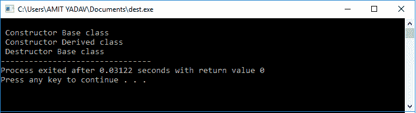
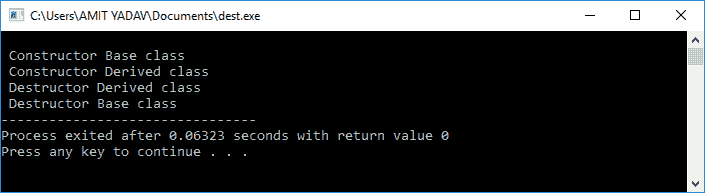

# C++中的虚拟析构函数

> 原文：<https://www.javatpoint.com/virtual-destructor-in-cpp>

C++中的**析构函数**是一个类的成员函数，用于释放被超出范围的类的对象占用的空间或删除该对象。析构函数的名称与类中构造函数的名称相同，但析构函数在其函数名称前使用了一个波浪号 **(~)** 。

## 虚拟析构函数

虚拟析构函数用于释放派生类对象或实例分配的内存空间，同时使用基类指针对象删除派生类的实例。基类或父类析构函数使用 **virtual** 关键字，确保基类和派生类析构函数都将在运行时被调用，但它首先调用派生类，然后调用基类来释放两个析构函数占用的空间。

### 为什么我们在 C++中使用虚拟析构函数？

当类中的对象超出范围或者 main()函数的执行即将结束时，析构函数会被自动调用到程序中，以释放类的析构函数所占用的空间。当基类的指向派生类的指针对象被删除时，由于编译器的早期绑定，只调用父类析构函数。这样，它会跳过对派生类析构函数的调用，从而导致程序内存泄漏问题。当我们在基类中使用前面带有析构函数 tilde (~)符号的 virtual 关键字时，它保证首先调用派生类的析构函数。然后调用基类的析构函数来释放继承类中两个析构函数占用的空间。

### 编写一个程序来显示类析构函数的未定义行为，而不使用 C ++中的虚拟析构函数。

```

#include<iostream>
using namespace std;
class Base
{                            
	public: /* A public access specifier defines Constructor and Destructor function to call by any object in the class. */
	Base() // Constructor function.	
{
	cout<< "\n Constructor Base class";
}
 ~Base() // Destructor function 
{
	cout<< "\n Destructor Base class";
}
};

class Derived: public Base
{
	public: /* A public access specifier defines Constructor and Destructor function to call by any object in the class. */
	Derived() // Constructor function 
{
	cout << "\n Constructor Derived class" ;
}
 ~Derived() // Destructor function 
{
	cout << "\n Destructor Derived class" ; /* Destructor function is not called to release its space. */
}		
};
int main()
{
	Base *bptr = new Derived; // Create a base class pointer object 
       delete bptr; /* Here pointer object is called to delete the space occupied by the destructor.*/
}  

```

**输出:**



正如我们在上面的输出中看到的，当编译器编译代码时，它会调用主函数中引用基类的指针对象。因此，它执行基类的构造函数()函数，然后移动到派生类的构造函数()函数。之后，它删除基类析构函数和派生类析构函数占用的指针对象。基类指针只移除基类的析构函数，而不在程序中调用派生类的析构函数。因此，它会泄漏程序中的内存。

#### 注意:如果基类析构函数不使用虚拟关键字，那么只有基类析构函数会被调用或删除其占用的空间，因为指针对象指向基类。因此，它不会调用派生类析构函数来释放派生类使用的内存，这将导致派生类的内存泄漏。

### 编写一个程序，在 C ++中使用虚拟析构函数显示类析构函数的行为。

```

#include<iostream>
using namespace std;
class Base
{
	public:
	Base() // Constructor member function.	
{
	cout << "\n Constructor Base class";  // It prints first.
}
 virtual ~Base() // Define the virtual destructor function to call the Destructor Derived function.
{
	cout << "\n Destructor Base class";  /
}
};
// Inheritance concept
class Derived: public Base 
{
	public:
	Derived() // Constructor function.
{
	cout << "\n Constructor Derived class" ; /* After print the Constructor Base, now it will prints. */
}
 ~Derived() // Destructor function 
{
	cout << "\n Destructor Derived class"; /* The virtual Base Class? Destructor calls it before calling the Base Class Destructor. */
}		
};
int main()
{
	Base *bptr = new Derived; // A pointer object reference the Base class.
	delete bptr; // Delete the pointer object.
}

```

**输出:**



在上面的程序中，我们在基类内部使用了一个虚拟析构函数，在调用基类析构函数之前调用派生类的析构函数，并释放空间或解决程序中的内存泄漏问题。

* * *