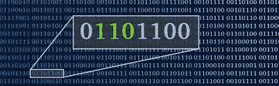
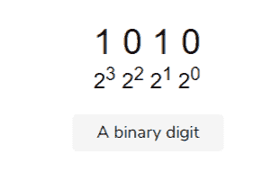
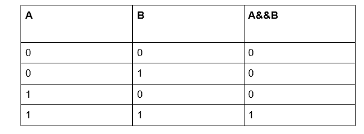
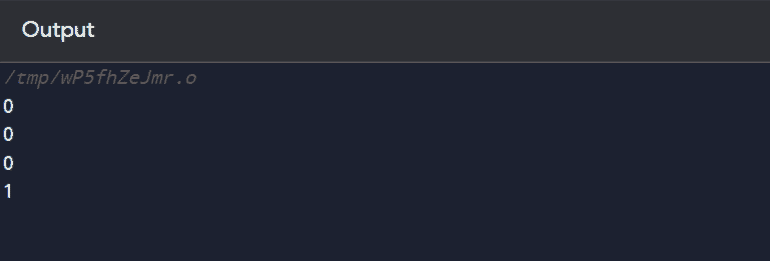
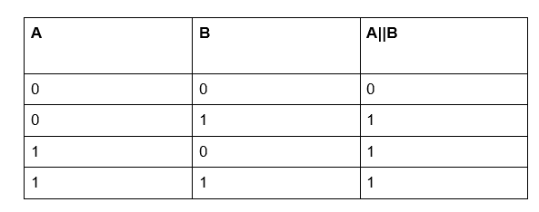
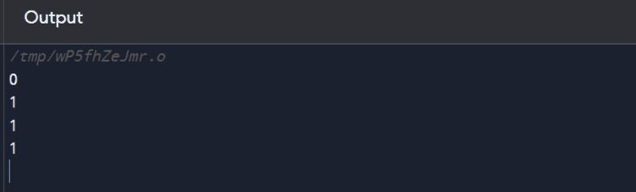
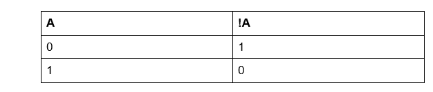
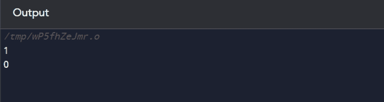
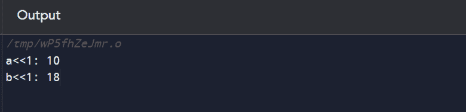
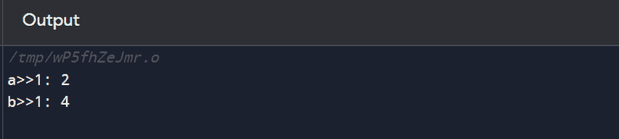

# 位操作 C++

> 原文：<https://www.javatpoint.com/bit-manipulation-cpp>

计算机不理解我们交流的高级语言。由于这些原因，有一种标准的方法，通过这种方法可以理解给计算机的任何指令。在初级阶段，每条指令都被发送到一些称为位的数字信息中。这一系列的位表明它是一个特定的指令。



## 少量

位被定义为以数字符号存储数据的基本单位。

两个值表示如下-

**1 -** 表示信号存在或为真

**0 -** 表示信号不存在或为假

位代表任何指令的逻辑状态。该系列位的基数为 2。因此，如果我们说如果我们有一系列二进制数字，它是从左向右读的，2 的幂增加。



所以在了解了 bit 的基础之后，让我们来了解一下它在 C++中的操作。

## 位操作

位操作被定义为在 n 位数的位级上执行一些基本操作。这是一个快速和原始的方法，因为它直接在机器端工作。

有了这些，让我们进入 C++中位操作的基础。

*   **逻辑与**

逻辑“与”接受两个操作数，如果两个操作数都为真，则返回真。标志是&&。

让我们看看 AND 运算符的真值表。



在最后一行，A 和 B 为高电平，导致高输出。

**C++程序**

```

#include using namespace std;

int main() {
    	int a = 5;
    	int b = 9;

    	// false && false = false
    	cout << ((a == 0) && (a > b)) << endl;

    	// false && true = false
    	cout << ((a == 0) && (a < b)) << endl;

    	// true && false = false
  	 cout << ((a == 5) && (a > b)) << endl;

    	// true && true = true
    	cout << ((a == 5) && (a < b)) << endl;

  	  return 0;
} 
```

**输出:**



*   **逻辑或**

如果两个操作数的任何一个输入为高，逻辑“或”会给出高输出。符号是||

让我们看看 OR 运算符的真值表。



这里我们可以看到第一排。输入 A 和 B 都为低电平，这导致 0(低电平输出)。

**C++程序**

```

#include using namespace std;

int main() {
    int a = 5;
    int b = 9;

    // false && false = false
    cout << ((a == 0) || (a > b)) << endl;

    // false && true = true
    cout << ((a == 0) || (a < b)) << endl;

    // true && false = true
    cout << ((a == 5) || (a > b)) << endl;

    // true && true = true
    cout << ((a == 5) || (a < b)) << endl;

    return 0;
} 
```

**输出:**



*   **逻辑非**

逻辑“非”只取一个操作数并将其转换。如果操作数为低，则使其为高，反之亦然。符号是！。

让我们看看非运算符的真值表。



**C++程序**

```

#include using namespace std;

int main() {
   	 int a = 5;

   	 // !false = true
   	 cout << !(a == 0) << endl;

   	 // !true = false
   	 cout << !(a == 5) << endl;

   	 return 0;
} 
```

**输出:**



*   **左移操作员**

左移位运算符接受一个操作数，左操作数的值向左移动右操作数指定的位数。

它由<

**C++程序**

```

#include using namespace std;
int main()
{
	// a = 5(00000101), b = 9(00001001)
	unsigned char a = 5, b = 9;

	// The result is 00001010
	cout << "a<<1: "<<  (a<<1) << "\n";

	// The result is 00010010
	cout << "b<<1: " <<  (b<<1);
	return 0;
} 
```

**输出:**



*   **右移操作员**

右移位运算符接受一个操作数，右操作数的值向右移动右操作数指定的位数。

它由>>表示。

**C++程序**

```

#include using namespace std;
int main()
{
	// a = 5(00000101), b = 9(00001001)
	unsigned char a = 5, b = 9;

	// The result is 00000010

	cout<< "a>>1: " <<  (a >> 1) << "\n";

	// The result is 00000100
	cout<< "b>>1: " <<  (b >> 1);
	return 0;
} 
```

**输出:**



* * *