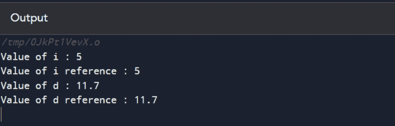

# 什么是参考变量？

> 原文：<https://www.javatpoint.com/what-is-a-reference-variable>

引用被定义为另一个变量的别名。简而言之，这就像给一个预先存在的变量起一个不同的名字。一旦对变量的引用被初始化，我们就可以使用引用名或变量来引用该变量。

## 在 C++中创建引用

创建引用的基本语法是-

数据类型 **&** 新变量=上一个变量

新创建的变量现在将引用前一个变量。

例如-

int i = 17 //变量 I 声明为 17

创造我的参照物将会是-

int& x = i //这里 x 将作为初始化为 r 的整数变量被调用

### C++代码

```

#include using namespace std;

int main () {
   int    i; // Declare variable I as int
   double d; // Declare variable d as double type

   // declare reference variables for I and d
   int&    r = i;// r is reference to i
   double& s = d;// s is reference to d 

   i = 5;
   cout << "Value of i : " << i << endl;
   cout << "Value of i reference : " << r  << endl;

   d = 11.7;
   cout << "Value of d : " << d << endl;
   cout << "Value of d reference : " << s  << endl;

   return 0;
} 
```

**输出**



## 引用和指针的区别

| 参考 | 两颗北极指极星 |
| 我们不能有空引用。 | 允许空指针的概念。 |
| 不能更改分配给特定对象的引用。 | 另一方面，指针可以随时指向不同的对象。 |
| 引用也在创建时初始化。 | 指针可以随时初始化。 |

* * *