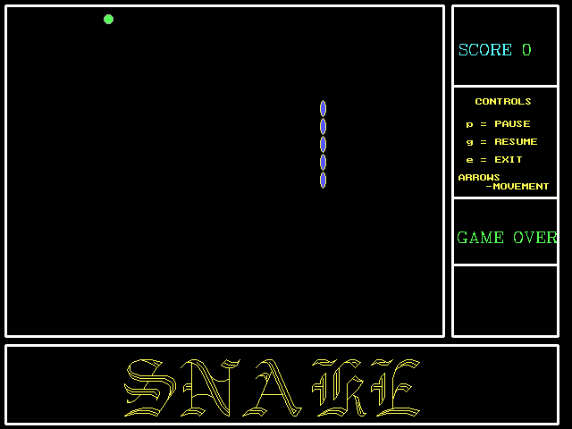

# C++中的蛇代码

> 原文：<https://www.javatpoint.com/snake-code-in-cpp>

在本文中，我们将借助 C++和图形函数创建一个蛇游戏。在此，我们将使用 c++类和计算机图形函数的概念。

### 你说的蛇游戏是什么意思？

Snake game 是所有类型设备上最著名的游戏之一，适用于所有操作系统。在这个游戏中，蛇可以向各个方向移动，例如，左、右、上、下；进食后，蛇的长度会增加。蛇的食物会在给定的时间间隔内产生。

### C++是什么意思？

[C++](https://www.javatpoint.com/cpp-tutorial) 是一种[面向对象编程语言](https://en.wikipedia.org/wiki/General-purpose_programming_language)。它也叫 c++带类。它是一种跨平台语言，可用于创建高级应用程序。它给予程序员对系统资源和内存的高度控制。

### 你说的计算机图形学是什么意思？

术语“计算机图形”是以图表、图形、图片和符号形式显示在视觉显示单元或计算机打印输出上的信息。

### C++中的图形原语

图形图元是计算机图形系统中用于输入或输出的不可分割的基本图形元素。我们需要一个名为<graphics.h>的头文件来绘制和创建屏幕上的任何图形。它也可以被定义为计算机如何以图像方式显示和操作数据。除了绘制各种形状的图形，所有的动画和多媒体主要在图形平台上工作。</graphics.h>

**以下功能用于在蛇游戏中创建图形:**

**初始化图（）：**

要初始化图形函数，我们必须使用 initgraph()函数。

**语法:**

void integraph(int *图形驱动程序，int *图形模式，char *路径)；

**Initgraph 函数使用三参数:**

*   **gd:** 用于图形驱动。
*   **gm:** 用于图形模式。
*   **路径:**指定图形文件所在的路径。

**closegraph():**

用于关闭图形功能。

**语法:**

void close graph()；

**输出文本:**

在 C 语言图形中，可以使用函数 outtext()和 outtextxy()输出文本。

**外文():**

它用于显示当前位置的文本。

**语法:**

请参阅 outtext(char * str)；

**外文 xy():**

它用于在指定位置显示文本。

**语法:**

void outextxy(int x，int y，char * str)；

**我们以 C++中的蛇游戏为例。**

### 例 1:

```

#include #include <conio.h>#include <graphics.h>#include <dos.h>#include <stdlib.h>#include <stdio.h>#include <time.h>#include <string.h>class Snake
{
 int p1,p2,v1,v2,v3,e1,e2,prev,now,n,colr,dsp,cnt,dly,m;
 int stp, egGen;
 int xr, yr;
 void caught();
 public:
  long scr;
 int strtX,strtY,endX,endY;
 int pos[100][2];
 void show();
 void init();
 void egg();
 void transpose();
 void gnrtCond();
 void gnrtUnCond();
 void check();
 void checkEgg();
 void move();
 void chngDir();
 void sndEt();
 void sndCgt();
 int test();
 void score();
 Snake();
 Snake(Snake*);
 ~Snake();
 };
Snake::Snake()
 {
 }
Snake::~Snake()
{
}
void Snake::checkEgg()
{
 if((e1 == p1) && (e2 == p2))
 { sndEt();
  egg();
  dly--;
  score();
  n++;
  }
}
void Snake::sndEt()
{ nosound();
 sound(2500);
 delay(2);
 nosound();
}
void Snake::sndCgt()
{ nosound();
 for(int x=1000;x>0;x--)
 { sound(x);
  delay(1);
  }
 nosound();
}
void Snake::score()
{ char *p;
  ltoa(scr,p,10);
  settextstyle(8,0,1);
  setcolor(0);
  outtextxy(585,40,p);
  if(egGen != 1){
  scr = scr + dly / 10;
  }
  ltoa(scr,p,10);
  setcolor(10);
  outtextxy(585,40,p);
}
void Snake::gnrtCond()
{ if(n < 367)
 { if(now == 8 && (prev != 8 && prev != 2))
  { pos[0][0] = p1;
   pos[0][1] = p2 - dsp;
   prev = now;
   }
  if(now == 4 && (prev != 4 && prev != 1))
  { pos[0][0] = p1 + dsp;
   pos[0][1] = p2;
   prev = now;
   }
  if(now == 2 && (prev != 8 && prev != 2))
  { pos[0][0] = p1;
   pos[0][1] = p2 + dsp;
   prev = now;
   }
  if(now == 1 && (prev != 1 && prev != 4))
  {pos[0][0] = p1 - dsp;
   pos[0][1] = p2;
   prev = now;
   }
}
}
void Snake::gnrtUnCond()
{
  if( prev == 8 )
  { pos[0][0] = p1;
   pos[0][1] = p2 - dsp;
   }
 if( prev == 4 )
  {pos[0][0] = p1 + dsp;
   pos[0][1] = p2;
   }
 if( prev == 2 )
  { pos[0][0] = p1;
   pos[0][1] = p2 + dsp;
   }
 if( prev == 1 )
  {pos[0][0] = p1 - dsp;
   pos[0][1] = p2;
   }
 p1 = pos[0][0];
 p2 = pos[0][1];
}
void Snake::check()
{
 if(p1 > endX)
  {p1 = strtX;}
 else if(p1 < strtX)
  { p1 = endX;}
 if(p2 > endY)
  { p2 = strtY;}
 else if(p2 < strtY)
  { p2 = endY;}
 pos[0][0] = p1;
 pos[0][1] = p2;
for(int i = 1;i < n;i++)
  { if(p1 == pos[i][0] && p2 == pos[i][1])
  { caught();
   break;
  }
 }
}
void Snake::show()
{
  int x = getcolor();
  if(egGen != 1)
  {
  setcolor(getbkcolor());
  setfillstyle(1,getbkcolor());
  fillellipse(v1,v2,yr,yr);
   }
  else
   egGen = 0;
  if(egGen == 2)
   egGen--;
  setcolor(colr);
  setfillstyle(1,9);
  if(now == 8 || now == 2)
   fillellipse(pos[0][0],pos[0][1],xr,yr);
  else if(now == 4 || now == 1)
   fillellipse(pos[0][0],pos[0][1],yr,xr);
  setcolor(x);
}
void Snake::transpose()
{ int i,j,x,y;
   p1 = pos[0][0];
   p2 = pos[0][1];
   if(!egGen){
   v1 = pos[n-1][0];
   v2 = pos[n-1][1];
   }
   else
    egGen = 0;
   for(i = n-1;i >= 1;i--)
   {pos[i][0] = pos[i-1][0];
    pos[i][1] = pos[i-1][1];
   }
}
void Snake::move()
{ int st = 0;
  do{
   if(!kbhit())
   { checkEgg();
    if(!st)
     show();
    else
     st = 0;
    delay(dly/4);
    transpose();
    delay(dly/4);
    gnrtUnCond();
    delay(dly/4);
    check();
   delay(dly/4);
    }
   else if(stp){
   chngDir();
   gnrtCond();
   check();
   show();
   st = 1;
   }
   } while(stp);
}
void Snake::init()
{time_t tm;
 srand(time(&tm));
 dsp = 20;
 n = 5;
 prev = 4;
 for(int i = 4;i >= 0;i--)
 { pos[i][0] = 201 + (n - i - 1) * dsp;
  pos[i][1] = 301;
  }
  strtX = 21;
  strtY = 21;
  endX = 481;
  endY = 361;
  colr = 14;
  now = prev;
  dsp = 20;
  stp = 111;
  cnt = -1;
  scr = 0;
  dly = 150;
   xr = 3;
   yr = 9;
  egg();
  egGen = 1;
  score();
  int x = getcolor();
  setlinestyle(0,1,3);
  setcolor(15);
  rectangle(strtX-15,strtY-15,endX+15,endY+15);
  rectangle(endX+25,strtY-15,getmaxx()-15,endY+15);
  rectangle(strtX-15,endY+25,getmaxx()-15,getmaxy()-5);
  line(endX+25,strtY+75,getmaxx()-15,strtY+75);
  line(endX+25,strtY+200,getmaxx()-15,strtY+200);
  line(endX+25,strtY+275,getmaxx()-15,strtY+275);
  setlinestyle(0,1,1);
  settextstyle(8,0,1);
  setcolor(11);
  outtextxy(514,40,"SCORE");
  setcolor(14);
  settextstyle(11,0,5);
  outtextxy(524,110," CONTROLS ");
  outtextxy(522,135,"p = PAUSE");
  outtextxy(522,155,"g = RESUME");
  outtextxy(522,175,"e = EXIT");
  outtextxy(513,195,"ARROWS");
  outtextxy(512,205,"    -MOVEMENT");
  setcolor(14);
  settextstyle(4,0,9);
  outtextxy(getmaxx()-500,getmaxy()-110,"SNAKE");
  settextstyle(8,0,1);
  setcolor(x);
}
void Snake::caught()
{
 stp = 0;
 sndCgt();
for(int i=0;i<=7;i++)
 { if(i%2)
  { setcolor(10);
   outtextxy(512,250,"GAME OVER");
   delay(900);
   }
  else
  {setcolor(0);
   outtextxy(512,250,"GAME OVER");
   delay(500);
  }
  }
sleep(1);
}
void Snake::chngDir()
 { int clr;
 fillsettingstype *p;
 char x = getch();
 if(x == 72)
  now = 8;
 else if(x == 77)
  now = 4;
 else if(x == 80)
  now = 2;
 else if(x == 75)
  now = 1;
 else if(x == 'e')
  caught();
 else if(x == 'p')
 { //int y = getcolor();
  int twnkl = 1;
  settextstyle(11,0,9);
  while(1)
  {if(kbhit())
   { int c = getch();
    if(c == 'g')
    { clr = getcolor();
     setcolor(0);
     rectangle(endX+40,endY-10,getmaxx()-35,getmaxy()-160);
     outtextxy(endX+60,endY-29,"PAUSE");
     break;
     }
    }
   else
   { if(twnkl%2)
    { clr = getcolor();
     setcolor(10);
     rectangle(endX+40,endY-10,getmaxx()-35,getmaxy()-160);
     outtextxy(endX+60,endY-29,"PAUSE");
     setcolor(clr);
      delay(1000);
     }
    else
    {
     clr = getcolor();
     setcolor(0);
     rectangle(endX+40,endY-10,getmaxx()-35,getmaxy()-160);
     outtextxy(endX+60,endY-29,"PAUSE");
     delay(1000);
    }
   }
   twnkl++;
  }
    settextstyle(8,0,1);
 }
}
Snake::Snake(Snake *p)
{
 *p=NULL;
}
void Snake::egg()
{ do
  { e1 = (rand() % 100) * dsp + strtX;
   e2 = (rand() % 100) * dsp + strtY;
   } while(test());
  int x = getcolor();
  setcolor(7);
  setfillstyle(1,random(15)+1);
  fillellipse(e1,e2,xr+2,xr+2);
  setcolor(x);
  egGen = 2;
}
int Snake::test()
{ 
for(int i=0;i<n if="" pos="" e2="=" break="" e1="" v2="=">= endX+1) || (e2 >= endY+1))
    break;
   }
 if(i != n)
  return 1;
 else
  return 0;
}
void main()
{
Snake snk;
 int gd=DETECT,gm,i,j,k,x,y;
 clrscr();
 initgraph(&gd,&gm,"C:\\Turboc3\\bgi");
 snk.init();
 snk.move();
 closegraph();
 restorecrtmode();
 }</n></string.h></time.h></stdio.h></stdlib.h></dos.h></graphics.h></conio.h> 
```

**说明:**

在上面的例子中，我们已经实现了一个基本的[蛇游戏](https://www.geeksforgeeks.org/design-snake-game/)。在本文中，我们使用了类的概念和一些计算机图形函数。

**这个游戏的基本功能如下。**

*   蛇是在图形功能的帮助下创建的。
*   蛇的果实是由计算机图形学的 rand()函数生成的。
*   借助键盘(**右、上、下**键)，蛇可以向任何方向移动。
*   当蛇吃了一个水果，分数会增加 14 分。
*   **在这个游戏中，我们可以创建基本控件:**
    *   **p** 控制用于暂停游戏。我们可以从关键词中点击一个 **p** 人物来暂停游戏。
    *   **g** 控制用于恢复游戏。我们可以从关键字中点击一个 **g** 字符来恢复游戏。
    *   **e** 控制用于退出游戏。我们可以从关键词中点击一个 **e** 角色退出游戏。

**输出:**

以下是该示例的输出:



* * *