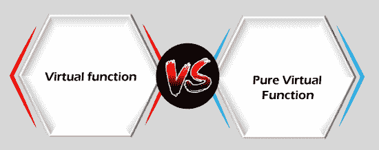

# C++中虚函数与纯虚函数的比较

> 原文：<https://www.javatpoint.com/virtual-function-vs-pure-virtual-function-in-cpp>

在理解 C++中虚函数和纯虚函数的区别之前，我们应该先了解一下 C++中的虚函数和纯虚函数。

## 什么是虚函数？

[虚函数](https://www.javatpoint.com/cpp-virtual-function)是在基类内声明的成员函数，可以由派生类重新定义。

**我们通过一个例子来了解一下。**

```

#include using namespace std;
class base
{
    public:
    void show()
    {
        std::cout << "Base class" << std::endl;
    }
};
class derived1 : public base
{
    public:
    void show()
    {
        std::cout << "Derived class 1" << std::endl;
    }
};
class derived2 : public base
{
    public:
    void show()
    {
        std::cout << "Derived class 2" << std::endl;
    }
};
int main()
{
    base *b;
    derived1 d1;
    derived2 d2;
    b=&d1;
    b->show();
    b=&d2;
    b->show();
    return 0;
} 
```

在上面的代码中，我们没有使用虚拟方法。我们已经创建了一个包含 show()函数的基类。这两个类也被创建为名为“ **derived1** ”和“ **derived2** 的类，它们继承了基类的属性。“derived1”和“derived2”类都重新定义了 show()函数。在 main()方法中，声明了基类的指针变量“b”。衍生 1 类和衍生 2 类的对象分别是 d1 和 d2。虽然“b”包含 d1 和 d2 的地址，但是在调用 show()方法时；它总是调用基类的 show()方法，而不是调用 derived1 和 derived2 类的函数。

为了克服上述问题，我们需要使方法在基类中成为虚拟的。这里的虚，是指方法存在于表象而不存在于现实。我们可以通过简单地在函数前面添加 virtual 关键字来使方法虚拟化。在上面的程序中，我们需要将前面的虚拟关键字添加到基类中的 show()函数中，如下所示:

```

    virtual void show()
    {
        std::cout << "Base class" << std::endl;
    }

```

完成上述更改后，输出将是:

**要点:**

*   这是一个运行时多态性。
*   基类和派生类具有相同的函数名，并且基类被分配了派生类对象的地址，那么指针也将执行基类函数。
*   如果函数是虚拟的，那么编译器将根据分配给基类指针的地址来确定在运行时执行哪个函数。

## 什么是纯虚函数？

纯虚函数是类中没有定义的虚函数。让我们通过一个例子来理解纯虚函数的概念。

在上面的图形表示中，形状是基类，而矩形、正方形和圆形是派生类。既然我们没有给虚函数提供任何定义，那么它就会自动转换成一个纯虚函数。

**纯虚函数的特征**

*   纯虚函数是一个“什么也不做”的函数。这里的“什么都不做”是指只提供模板，派生类实现函数。
*   它可以被认为是一个空函数，这意味着纯虚函数相对于基类没有任何定义。
*   程序员需要在派生类中重新定义纯虚函数，因为它在基类中没有定义。
*   具有纯虚函数的类不能用来创建自己的直接对象。这意味着该类包含任何纯虚函数，那么我们不能创建该类的对象。这种类型的类被称为抽象类。

**语法**

创建虚拟函数有两种方法:

```

virtual void display() = 0;

```

或者

```

virtual void display() {}

```

**我们通过一个例子来了解一下。**

```

#include 
using namespace std;
// Abstract class
class Shape
{
    public:
    virtual float calculateArea() = 0; // pure virtual function.
};
class Square : public Shape
{
    float a;
    public:
    Square(float l)
    {
        a = l;
    }
    float calculateArea()
    {
        return a*a;
    }
};
class Circle : public Shape
{
    float r;
    public:

    Circle(float x)
    {
        r = x;
    }
    float calculateArea()
    {
        return 3.14*r*r ;
    }
};
class Rectangle : public Shape
{
    float l;
    float b;
    public:
    Rectangle(float x, float y)
    {
       l=x;
       b=y;
    }
    float calculateArea()
    {
        return l*b;
    }
};
int main()
{

    Shape *shape;
    Square s(3.4);
    Rectangle r(5,6);
    Circle c(7.8);
    shape =&s;
    int a1 =shape->calculateArea();
    shape = &r;
    int a2 = shape->calculateArea();
    shape = &c;
    int a3 = shape->calculateArea();
    std::cout << "Area of the square is " <
```

### 虚函数与纯虚函数的区别



| 虚拟功能 | 纯虚函数 |
| 虚函数是基类中的成员函数，可以在派生类中重新定义。 | 纯虚函数是基类中的成员函数，其声明在基类中提供，并在派生类中实现。 |
| 包含虚函数的类不是抽象类。 | 包含纯虚函数的类是抽象类。 |
| 在虚函数的情况下，函数的定义在基类中提供。 | 在纯虚函数的情况下，基类中不提供函数的定义。 |
| 包含虚拟函数的基类可以被实例化。 | 包含纯虚函数的基类变成了抽象类，不能实例化。 |
| 如果派生类不会重新定义基类的虚函数，那么对编译就没有影响。 | 如果派生类没有定义纯虚函数；它不会抛出任何错误，但是派生类变成了抽象类。 |
| 所有的派生类可能会也可能不会重新定义虚函数。 | 所有的派生类必须定义纯虚函数。 |

* * *