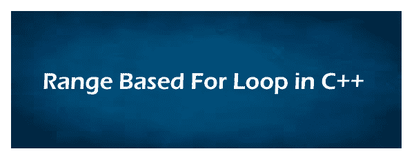

# C++ 中基于范围的 for 循环

> 原文：<https://www.javatpoint.com/range-based-for-loop-in-cpp>

在本主题中，我们将讨论 C++ 编程语言中基于范围的 for 循环。C++ 语言在 C++11 和更高版本中引入了基于范围的 for 循环的新概念，这比常规的 For 循环好得多。基于范围的 for 循环不需要大量编码来实现循环迭代。它是一个顺序迭代器，在一个范围内(从开始到结束)迭代容器的每个元素。



**语法**

```

for (range_declaration : range_expression ) loop statement

```

1.  **range_declaration:** 用于声明一个变量，该变量的类型与 range_expression 或对该类型的引用所表示的集合元素的类型相同。
2.  **range_expression:** 它定义了一个表示合适元素序列的表达式。
3.  **循环语句:**它定义了基于范围的 for 循环的主体，包含一个或多个要重复执行的语句，直到范围表达式结束。

#### 注意:如果我们不知道容器元素的数据类型，我们可以使用 auto 关键字自动识别 range_expression 的数据类型。

### 程序使用基于范围的 for 循环打印数组的每个元素

让我们考虑一个在 C++ 中使用基于范围的 for 循环打印 int 和 double 数组的例子。

**program.cpp**

```

#include using namespace std;
int main ()
{
int arr1 [5] = { 10, 20, 30, 40, 50};
double darr [5] = { 2.4, 4.5, 1.5, 3.5, 4.0 };

// use range based for loop
for ( const auto &var : arr1 )
{
cout << var << " " ;
}
// use auto keyword to automatically specify the data type of darr container. 
for ( const auto &var : darr )
{
cout << var << " " ;
}
return 0;
} 
```

**输出**

```
10 20 30 40 50
2.4 4.5 1.5 3.5 4.0

```

### 演示基于范围的循环向量的程序

让我们编写一个简单的程序来实现基于范围的循环向量。

**Program2.cpp**

```

#include #include <vector>using namespace std;

int main()
{
	int x; // declare integer variable
	// declare vector variable
	vector <int>vect = {5, 10 , 25, 20, 25};

	// display vector elements
	for ( int x : vect)
	{
		cout << x << " ";
	}
	return 0;
}</int></vector> 
```

**输出**

```
5 10 25 20 25

```

### 使用 C++ 中基于范围的循环打印数组的程序，带有引用

让我们考虑一个在 C++ 中使用基于范围的 for 循环打印数组元素的例子。

**Program3.cpp**

```

#include #include <array>#include <cstdlib>using namespace std;

 int main(){
 array <int>data = {1, 3, -2, 4, 6, 7, 9};
 cout << " Before updating the elements: " << endl;
 for (int x : data){
 cout << x << " ";
 }
 // pass the references
 for (int &itemRef : data){
 itemRef *= 3;
 }
 cout << endl << " After modification of the elements: " << endl;
 for (int x : data){
 cout << x << " ";
 }
 cout << endl;
 return 0;
 }</int></cstdlib></array> 
```

**输出**

```
Before updating the elements:
1 3 -2 4 6 7 9
 After modification of the elements:
3 9 -6 12 18 21 27

```

## 基于嵌套范围的 for 循环

当一个循环在另一个循环的主体中定义时，该循环称为嵌套 for 循环。类似地，当我们在另一个基于范围的循环内的循环中定义一个范围时，该技术被称为嵌套的基于范围的 for 循环。

**语法:**

```

for ( int x : range_expression) // outer loop
{
for ( int y : range_expression) // inner loop
{
// statement to be executed
}
// statement to be executed
}

```

在上面的语法中，我们在另一个循环中定义了一个基于范围的循环。在这里，我们在 C++ 中称之为基于内部和外部范围的 for 循环。

### 程序打印 C++ 中基于嵌套范围的 for 循环

考虑一个例子来演示 C++ 编程语言中基于嵌套范围的 for 循环。

**Range.cpp**

```

#include using namespace std;
int main ()
{
int arr1[4]  = { 0, 1, 2, 3 };
int arr2[5] = { 1, 2, 3, 4, 5 };
// use nested range based for loop
for ( int x : arr1 )
{
// declare nested loop
for ( int y : arr2 )
{
cout << " x = " << x << " and j = " << y << endl;
}
}
return 0;
} 
```

**输出**

```
x = 0 and j = 1
 x = 0 and j = 2
 x = 0 and j = 3
 x = 0 and j = 4
 x = 0 and j = 5
 x = 1 and j = 1
 x = 1 and j = 2
 x = 1 and j = 3
 x = 1 and j = 4
 x = 1 and j = 5
 x = 2 and j = 1
 x = 2 and j = 2
 x = 2 and j = 3
 x = 2 and j = 4
 x = 2 and j = 5
 x = 3 and j = 1
 x = 3 and j = 2
 x = 3 and j = 3
 x = 3 and j = 4
 x = 3 and j = 5

```

### 传统 for 循环和基于范围的 for 循环有什么区别？

一个**传统 for 循环**用于重复执行该代码块，直到指定条件为真。传统的 for 循环有三个参数，变量初始化，指定条件，最后一个参数是计数器，如果条件保持为真，计数器将增加 1。

**语法:**

```

for ( variable_initialization; specify_condition; updated_counter)
{
// statement to be executed;
}

```

**基于范围的循环**

另一方面，我们在 C++ 11 和更高版本中有一个新的基于范围的 for 循环。它有两个参数，范围声明和 range_ expression。它还用于在一定范围内重复执行代码块。

**语法**

```

for ( range_declaration : range_ expression )
{
loop _statement;
// statement to be executed;
} 

```

range_declaration 用于声明与 range_expression(容器)相关的变量类型。range_expression:它就像一个容器，以顺序的方式保存相同类型的元素。loop _ 语句定义了在循环内部执行的语句。

### 基于范围的 for 循环的优点

1.  它很容易使用，语法也很简单。
2.  基于范围的 for 循环不需要计算容器中的元素数量
3.  它识别容器的开始和结束元素。
4.  我们可以很容易地修改容器的大小和元素。
5.  它不会创建元素的任何副本。
6.  它比传统的 for 循环快得多。
7.  它通常使用 auto 关键字来识别容器元素的数据类型。

### 基于范围的 for 循环的缺点

1.  它不能遍历列表的一部分。
2.  它不能用于反向遍历
3.  它不能用在指针中。
4.  它不提供当前元素的索引。

* * *