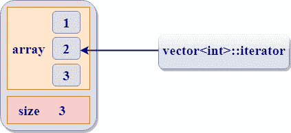

# STL 的组件

> 原文：<https://www.javatpoint.com/cpp-stl-components>

## 容器

容器可以描述为保存相同类型数据的对象。容器用于实现不同的数据结构，例如数组、列表、树等。

下面的容器给出了所有容器的细节，以及头文件和与之相关的迭代器类型:

| 容器 | 描述 | 头文件 | 迭代程序 |
| 矢量 | vector 是一个创建动态数组的类，允许在后面插入和删除。 |  | 随机存取 |
| 目录 | list 是允许从任何地方插入和删除的序列容器。 |  | 双向的 |
| 双端队列 | deque 是允许从两端插入和删除的双端队列。 |  | 随机存取 |
| 设置 | 集合是用于存储唯一集合关联容器。 |  | 双向的 |
| 多组 | 多集是用于存储非唯一集的关联容器。 |  | 双向的 |
| 地图 | 映射是用于存储唯一键值对的关联容器，即每个键只与一个值相关联(一对一映射)。 | <map></map> | 双向的 |
| 多点触控 | multimap 是用于存储键值对关联容器，每个键可以与多个值相关联。 | <map></map> | 双向的 |
| 堆 | 它遵循后进先出法。 | <stack></stack> | 没有迭代器 |
| 长队 | 它遵循先进先出原则。 |  | 没有迭代器 |
| 优先级队列 | 第一个元素总是优先级最高的元素。 |  | 没有迭代器 |

**容器分类:**

*   序列容器
*   关联容器
*   派生容器


#### 注意:每个容器类包含一组可用于操作内容的函数。

## 迭代程序

*   迭代器是类似指针的实体，用于访问容器中的单个元素。
*   迭代器按顺序从一个元素移动到另一个元素。这个过程被称为遍历容器。



*   迭代器主要包含两个函数:

**begin()** :成员函数 begin()返回向量第一个元素的迭代器。

**end()** :成员函数 end()返回一个容器的过去最后一个元素的迭代器。


## 迭代器类别

迭代器主要分为五类:


1.  **输入迭代器:**
    *   输入迭代器是允许程序从容器中读取值的迭代器。
    *   取消对输入迭代器的引用允许我们从容器中读取一个值，但是它不会改变该值。
    *   输入迭代器是单向迭代器。
    *   输入迭代器可以递增，但不能递减。
2.  **输出迭代器:**
    *   输出迭代器类似于输入迭代器，只是它允许程序修改容器的值，但不允许读取它。
    *   它是一个单向迭代器。
    *   这是一个只写迭代器。
3.  **正向迭代器:**
    *   前向迭代器使用++ 运算符在容器中导航。
    *   向前迭代器一次遍历容器的每个元素和一个元素。
4.  **双向迭代器:**
    *   双向迭代器类似于前向迭代器，只是它也向后移动。
    *   这是一个双向迭代器。
    *   它可以递增，也可以递减。
5.  **随机访问迭代器:**
    *   随机访问迭代器可以用来访问容器的随机元素。
    *   随机访问迭代器具有双向迭代器的所有特性，并且它还有一个附加特性，即指针加法。通过使用指针加法操作，我们可以访问容器的随机元素。

**迭代器支持的操作**

| 迭代程序 | 元素访问 | 阅读 | 写 | 增量操作 | 比较 |
| 投入 | -> | v = *p |  | ++ | ==,!= |
| 输出 |  |  | *p = v | ++ |  |
| 向前 | -> | v = *p | *p = v | ++ | ==,!= |
| 双向的 | -> | v = *p | *p = v | ++, - | ==,!= |
| 随机存取 | ->,[ ] | v = *p | *p = v | ++, - ,+,-,+=, - = | ==,!=，，<=,> = |

## 算法

算法是用于处理其内容的各种容器的函数。

**需要记住的要点:**

*   算法提供大约 60 个算法函数来执行复杂的操作。
*   标准算法允许我们同时处理两种不同类型的容器。
*   算法不是容器的成员函数，但它们是独立的模板函数。
*   算法节省了大量的时间和精力。
*   如果我们想访问 STL 算法，我们必须在我们的程序中包含<algorithm>头文件。</algorithm>

**STL 算法可分为:**


*   **不变算法**:不变算法是不改变容器对象的任何值，也不改变元素出现顺序的算法。这些算法可以用于所有容器对象，并且它们利用了前向迭代器。
*   **变异算法**:变异算法是可以用来改变容器值的算法。它们也可以用来改变元素出现的顺序。
*   **排序算法**:排序算法是对容器中的元素进行排序的修改算法。
*   **集合算法**:集合算法也称为排序范围算法。该算法用于在容器上执行一些功能，大大提高了程序的效率。
*   **关系算法**:关系算法是对数值数据进行运算的算法。它们主要用于对容器中的所有元素进行数学运算。

## 功能对象

函数对象是包装在类中的函数，因此它看起来像一个对象。函数对象通过使用面向对象的特性，如泛型编程，扩展了常规函数的特性。因此，我们可以说函数对象是一个智能指针，它比普通函数有很多优势。

**以下是函数对象相对于常规函数的优势:**

*   函数对象可以有成员函数和成员属性。
*   函数对象可以在使用前初始化。
*   只有当签名不同时，常规函数才能有不同的类型。即使签名相同，函数对象也可以有不同的类型。
*   函数对象比常规函数快。

函数对象也被称为“**函子**”。函数对象是包含至少一个**运算符()**函数定义的对象。这意味着，如果我们声明一个定义了**运算符()**函数的类的对象“d”，我们可以将对象“d”用作正则函数。

**假设‘d’是一个类的对象，operator()函数可以调用为:**

```

d();

which is same as:

d.operator() ( );

```

**我们来看一个简单的例子:**

```

      #include <iostream>
      using namespace std;
     class function_object
     {
         public:
        int operator()(int a, int b)            
       {
           return a+b;
       }
    };

     int main()
    {
       function_object f;               
       int result = f(5,5);
      cout<<"Addition of a and b is : "<<result;

    return 0;
}

```

**输出:**

```
Addition of a and b is : 10

```

在上面的例子中，“f”是一个 function_object 类的对象，它包含了 operator()函数的定义。因此，‘f’可以作为普通函数调用 operator()函数。