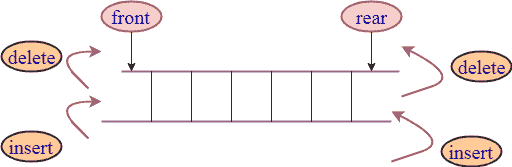

# c++ deque

> 吴奇珍:t0]https://www . javatppoint . com/post/CPP-deque

Deque 代表双头队列。它概括了队列数据结构，即插入和删除可以从前端或后端执行。



## 创建 deque 对象的语法:

```

deque deque_name; 
```

* * *

## C++德格函数

| 方法 | 描述 |
| [分配()](cpp-deque-assign-function) | 它分配新内容并替换旧内容。 |
| [炮位()](cpp-deque-emplace-function) | 它在指定位置添加新元素。 |
| [就位 _ 后退()](cpp-deque-emplace_back-function) | 它在末尾添加了一个新元素。 |
| [炮位 _ 正面()](cpp-deque-emplace_front-function) | 它在一个 deque 的开头添加了一个新元素。 |
| [插入()](cpp-deque-insert-function) | 它在指定位置之前添加一个新元素。 |
| [push_back()](cpp-deque-push_back-function) | 它在容器的末尾添加一个新元素。 |
| [push_front()](cpp-deque-push_front-function) | 它在容器的开头添加一个新元素。 |
| [pop_back()](cpp-deque-pop_back-function) | 它会从 deque 中删除最后一个元素。 |
| [pop_front()](cpp-deque-pop_front-function) | 它会从 deque 中删除第一个元素。 |
| [互换()](cpp-deque-swap-function) | 它交换两个 deq 的内容。 |
| [晴()](cpp-deque-clear-function) | 它会删除所有的内容。 |
| [空()](cpp-deque-empty-function) | 它检查容器是否是空的。 |
| [擦除()](cpp-deque-erase-function) | 它会移除元素。 |
| [max_size()](cpp-deque-max_size-function) | 它决定了 deque 的最大大小。 |
| [调整大小()](cpp-deque-resize-function) | 它改变了德克的大小。 |
| [收缩到合适的程度()](cpp-deque-shrink_to_fit-function) | 它减少了内存以适应解码器的大小。 |
| [尺寸()](cpp-deque-size-function) | 它返回元素的数量。 |
| [at()](cpp-deque-at-function) | 它访问位置位置的元素。 |
| [运算符[]()](cpp-deque-operator[]()-function) | 它访问位置位置的元素。 |
| [运算符=()](cpp-deque-operator=()-function) | 它向容器分配新的内容。 |
| [后退()](cpp-deque-back-function) | 它访问最后一个元素。 |
| [begin()](cpp-deque-begin-function) | 它返回一个迭代器到 deque 的开头。 |
| [cbegin（）](cpp-deque-cbegin-function) | 它返回一个常量迭代器到 deque 的开头。 |
| [end()](cpp-deque-end-function) | 它在最后返回一个迭代器。 |
| [cend()](cpp-deque-cend-function) | 它在最后返回一个常量迭代器。 |
| [rbegin（）](cpp-deque-rbegin-function) | 它从头开始返回一个反向迭代器。 |
| crbegin() | 它在开头返回一个常量反向迭代器。 |
| [rend()](cpp-deque-rend-function) | 它在最后返回一个反向迭代器。 |
| [信徒()](cpp-deque-crend-function) | 它在最后返回一个常量反向迭代器。 |
| 前部() | 它访问最后一个元素。 |