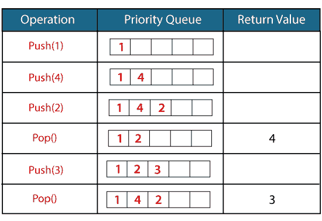

# C++ 中的优先级队列

> 原文：<https://www.javatpoint.com/priority-queue-in-cpp>

C++ 中的优先级队列是 STL 中的派生容器，它只考虑优先级最高的元素。队列遵循先进先出策略，优先级队列根据优先级弹出元素，即优先级最高的元素先弹出。

它在某些方面类似于普通队列，但在以下方面有所不同:

*   在优先级队列中，队列中的每个元素都与某个优先级相关联，但是优先级并不存在于队列数据结构中。
*   优先级队列中优先级最高的元素将首先被删除，而队列遵循**先进先出**策略意味着首先插入的元素将首先被删除。
*   如果存在多个具有相同优先级的元素，则将考虑元素在队列中的顺序。

#### 注意:优先级队列是普通队列的扩展版本，只是优先级最高的元素将首先从优先级队列中删除。

### 优先级队列的语法

```

priority_queue<int> variable_name;

```

**我们通过一个简单的例子来了解优先级队列。**



在上图中，我们使用 push()函数插入了元素，插入操作与普通队列相同。但是当我们使用 pop()函数从队列中删除元素时，具有最高优先级的元素将首先被删除。

## 优先级队列的成员函数

| 功能 | 描述 |
| **推()** | 它在优先级队列中插入一个新元素。 |
| **pop()** | 它从队列中移除优先级最高的顶部元素。 |
| **top()** | 该函数用于处理优先级队列的最顶层元素。 |
| **尺寸()** | 它决定了优先级队列的大小。 |
| **空()** | 它验证队列是否为空。基于验证，它返回状态。 |
| **互换()** | 它用具有相同类型和大小的另一个队列交换优先级队列的元素。 |
| **炮位()** | 它在优先级队列的顶部插入一个新元素。 |

**我们来创建一个优先级队列的简单程序。**

```

#include <iostream>
#include<queue>
using namespace std;
int main()
{
 priority_queue<int> p;  // variable declaration.
 p.push(10); // inserting 10 in a queue, top=10
 p.push(30); // inserting 30 in a queue, top=30
 p.push(20); // inserting 20 in a queue, top=20
 cout<<"Number of elements available in 'p' :"<<p.size()<<endl;
 while(!p.empty())
 {
     std::cout << p.top() << std::endl; 
     p.pop();
 }
 return 0;
}

```

在上面的代码中，我们已经创建了一个优先级队列，其中我们插入了三个元素，即 10、30、20。插入元素后，我们使用 while 循环显示优先级队列的所有元素。

**输出**

```
Number of elements available in 'p' :3
30
20
10 zzzzz/

```

**让我们看看优先级队列的另一个例子。**

```

#include <iostream>
#include<queue>
using namespace std;
int main()
{
   priority_queue<int> p;  // priority queue declaration
   priority_queue<int> q;  // priority queue declaration
   p.push(1); // inserting element '1' in p.
   p.push(2); // inserting element '2' in p.
   p.push(3); // inserting element '3' in p.
   p.push(4); // inserting element '4' in p.
   q.push(5); // inserting element '5' in q.
   q.push(6); // inserting element '6' in q.
   q.push(7); // inserting element '7' in q.
   q.push(8); // inserting element '8' in q.
   p.swap(q);
   std::cout << "Elements of p are : " << std::endl;
   while(!p.empty())
   {
      std::cout << p.top() << std::endl;
       p.pop();
   }
   std::cout << "Elements of q are :" << std::endl;
    while(!q.empty())
   {
      std::cout << q.top() << std::endl;
       q.pop();
   }
    return 0;
}

```

在上面的代码中，我们已经声明了两个优先级队列，即 p 和 q。我们在“p”优先级队列中插入了四个元素，在“q”优先级队列中插入了四个元素。插入元素后，我们使用 swap()函数将“p”队列的元素与“q”队列交换。

**输出**

```
Elements of p are :                                                                                                             
8                                                                                                                               
7                                                                                                                               
6                                                                                                                               
5                                                                                                                               
Elements of q are :                                                                                                             
4                                                                                                                               
3                                                                                                                               
2                                                                                                                               
1   

```

* * *