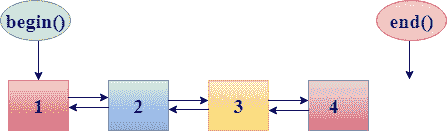
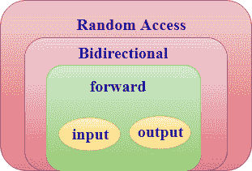
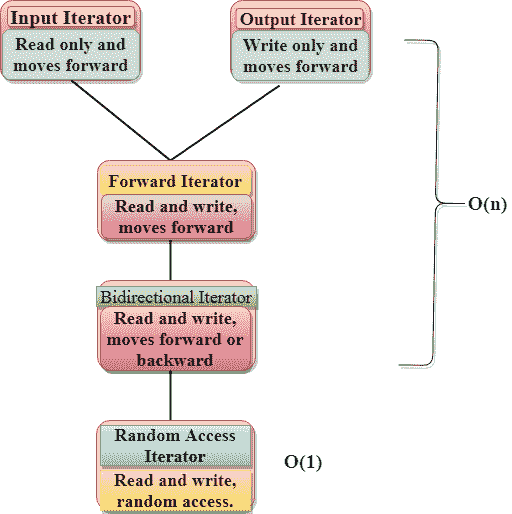

# c++ 迭代器

> 原文：<https://www.javatpoint.com/cpp-iterators>

迭代器就像用来访问容器元素的指针。

## 要点:

*   迭代器用于从一个元素遍历到另一个元素，一个过程被称为**遍历容器**。
*   迭代器的主要优点是为所有容器类型提供一个公共接口。
*   迭代器使**算法独立于所用容器的类型。**
*   迭代器提供了一种通用的方法来浏览容器的元素。

## 句法

```

<ContainerType> :: iterator;
<ContainerType> :: const_iterator;

```

## 对迭代器执行的操作:

*   **运算符(*) :** 运算符“*”返回迭代器指向的当前位置的元素。
*   **运算符(++) :** 运算符将迭代器递增 1。因此，迭代器指向容器的下一个元素。
*   **运算符(==)和运算符(！=) :** 这两个运算符决定了两个迭代器是否指向同一个位置。
*   **运算符(=) :** 运算符“=”指定迭代器。

## 不同的迭代器和指针

迭代器可以是智能指针，允许迭代复杂的数据结构。容器提供它的迭代器类型。因此，我们可以说迭代器具有不同容器类型的公共接口。

容器类提供了两个基本的成员函数，允许迭代或遍历容器的元素:

*   **begin()**:begin()函数返回一个指向容器第一个元素的迭代器。
*   **end()**:end()函数返回一个迭代器，指向容器的最后一个元素。



**我们来看一个简单的例子:**

```

#include <iostream>
#include<iterator>
#include<vector>
using namespace std;
int main()
{
   std::vector<int> v{1,2,3,4,5};
   vector<int>::iterator itr;
   for(itr=v.begin();itr!=v.end();itr++)
   {
       std::cout << *itr <<" ";
   }
    return 0;
}

```

**输出:**

```
1 2 3 4 5

```

## 迭代器类别

迭代器可以按以下方式分类:

*   输入迭代器
*   输出迭代器
*   向前迭代器
*   双向迭代器
*   随机存取迭代器



**输入迭代器:**输入迭代器是用于从容器中访问元素的迭代器，但它不修改容器的值。

**用于输入迭代器的运算符有:**

*   增量运算符(++)
*   相等运算符(==)
*   不等运算符(！=)
*   取消引用运算符(*)

**输出迭代器:**输出迭代器是用于修改容器值的迭代器，但它不从容器中读取值。因此，我们可以说输出迭代器是**只写迭代器**。

**用于输出迭代器的运算符有:**

*   增量运算符(++)
*   赋值运算符(=)

**前向迭代器:**前向迭代器是用于读写容器的迭代器。它是一个多遍迭代器。

**用于前向迭代器的运算符是:**

*   增量运算符(++)
*   赋值运算符(=)
*   相等运算符(=)
*   不等运算符(！=)

**双向迭代器:**双向迭代器是一个支持前向迭代器所有特性的迭代器，加上它又增加了一个特性，即减量运算符(-)。我们可以通过递减迭代器来向后移动。

**双向迭代器使用的运算符是:**

*   增量运算符(++)
*   赋值运算符(=)
*   相等运算符(=)
*   不等运算符(！=)
*   递减运算符(-)

**随机访问迭代器:**随机访问迭代器是在任意位置提供对元素的随机访问的迭代器。它具有双向迭代器的所有特性，此外它还增加了一个特性，即指针加法和指针减法，以提供对元素的随机访问。

## 迭代器的提供者

| 迭代器类别 | 供应者 |
| 输入迭代器 | ifstream(ifstream) |
| 输出迭代器 | ostream |
| 向前迭代器 |  |
| 双向迭代器 | 列表、集合、多集合、映射、多映射 |
| 随机存取迭代器 | 矢量，deque，数组 |

## 迭代器及其特点

| 迭代程序 | 存取方法 | 运动方向 | 输入输出能力 |
| 投入 | 线性的 | 仅转发 | 只读 |
| 输出 | 线性的 | 仅转发 | 只写 |
| 向前 | 线性的 | 仅转发 | 读/写 |
| 双向的 | 线性的 | 向前和向后 | 读/写 |
| 随意 | 随意 | 向前和向后 | 读/写 |

## 迭代器的缺点

*   如果我们想同时从一个数据结构转移到另一个数据结构，迭代器将不起作用。
*   如果我们想更新被迭代的结构，迭代器赢了？不允许我们这样做，因为它存储位置的方式。
*   如果我们想在处理列表时回溯，迭代器在这种情况下将不起作用。

## 迭代器的优点

**迭代器的优势如下:**

*   **编程容易:**使用迭代器比使用下标运算符[]访问容器的元素更方便。如果我们使用下标运算符[]来访问元素，那么我们需要跟踪在运行时添加的元素数量，但是在迭代器的情况下这不会发生。

**我们来看一个简单的例子:**

```

#include <iostream>
#include<vector>
#include<iterator>
using namespace std;
int main()
{
    vector<int> v{1,2,3,4,5};
    vector<int>::iterator itr;
    for(int i=0;i<5;i++)           // Traversal without using an iterator.
    {
        cout<<v[i]<<" ";
    }
    cout<<'\n';
    for(itr=v.begin();itr!=v.end();itr++)  // Traversal by using an iterator.
    {
        cout<<*itr<<" ";
    }
    v.push_back(10);
    cout<<'\n';
     for(int i=0;i<6;i++)
    {
        cout<<v[i]<<" ";
    }
    cout<<'\n';
     for(itr=v.begin();itr!=v.end();itr++)
    {
        cout<<*itr<<" ";
    }
     return 0;
}

```

**输出:**

```
      1 2 3 4 5                                                                                                          
      1 2 3 4 5                                                                                                          
      1 2 3 4 5 10                                                                                                       
      1 2 3 4 5 10 

```

在上面的例子中，我们观察到，如果我们在不使用迭代器的情况下遍历向量的元素，那么我们需要跟踪容器中添加的元素数量。

*   **代码可重用性:**如果我们使用迭代器，代码可以被重用。在上面的例子中，如果我们用列表替换向量，那么下标操作符[]将不能访问元素，因为列表不支持随机访问。然而，我们使用迭代器来访问元素，然后我们也可以访问列表元素。
*   **动态处理:** C++ 迭代器提供了动态添加或删除数据的功能。

**我们来看一个简单的例子:**

```

#include <iostream>
#include<vector>
#include<iterator>
using namespace std;
int main()
{
    vector<int> v{1,2,3,4,5};  // vector declaration
    vector<int>::iterator itr;
    v.insert(v.begin()+1,10);      
    for(itr=v.begin();itr!=v.end();itr++)
    {
        cout<<*itr<<" ";
    }
    return 0;
}

```

**输出:**

```
1 10 2 3 4 5

```

在上面的例子中，我们使用 insert()函数在第二个位置插入了一个新元素，所有其他元素都移动了一个。

## 随机存取迭代器和其他迭代器的区别

随机访问迭代器和其他迭代器最重要的区别是**随机访问迭代器需要‘1’步才能访问一个元素，而其他迭代器需要‘n’步**。

