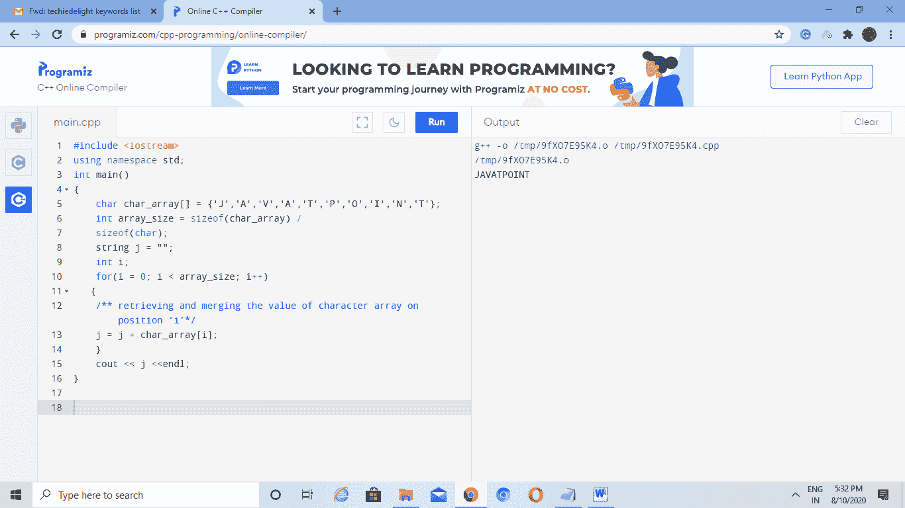
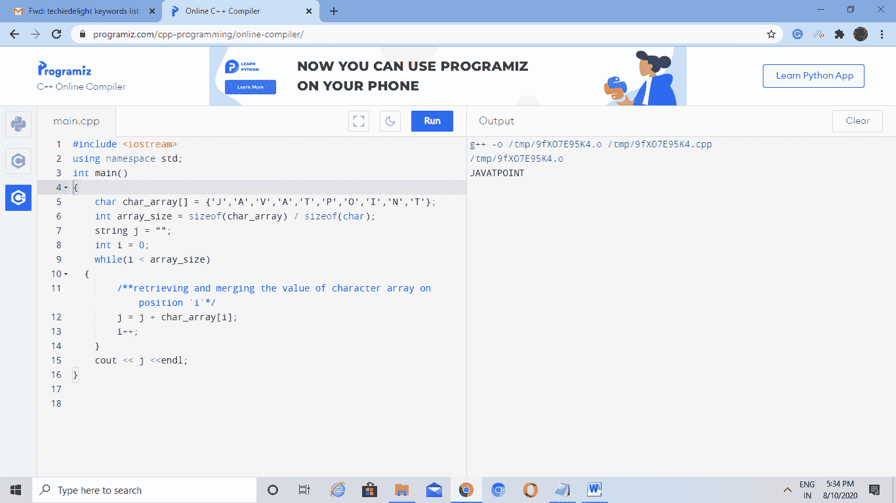
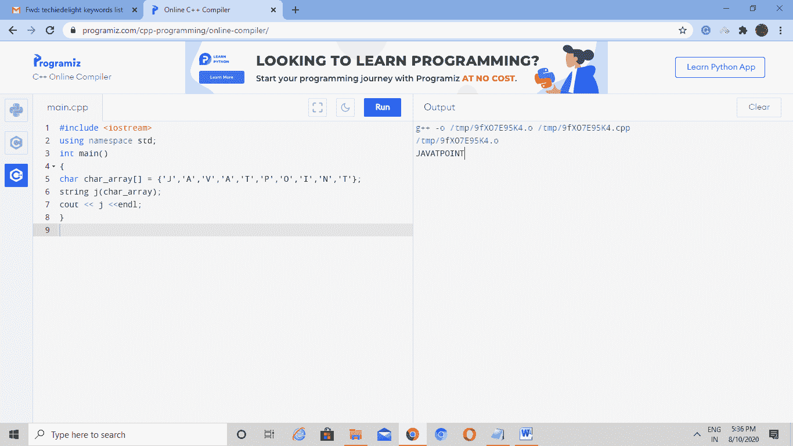
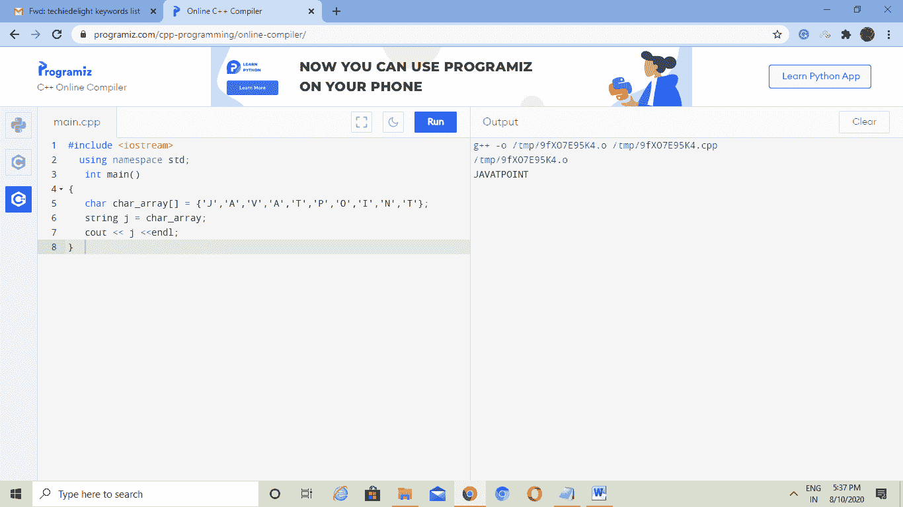
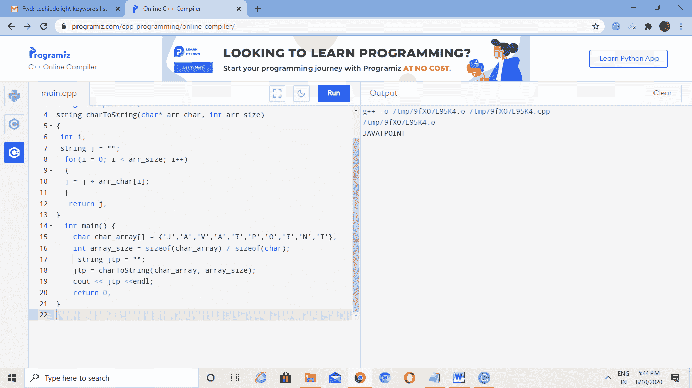
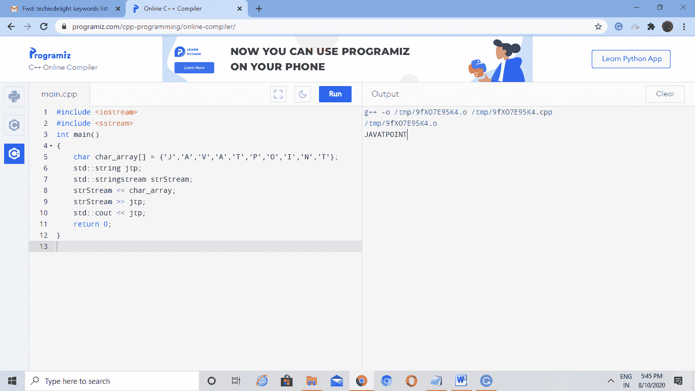

# C++ 中字符串的字符数组

> 原文：<https://www.javatpoint.com/char-array-to-string-in-cpp>

“Char”数据类型或字符数据类型用于存储字母，这与数字和整数不同，后者在布尔值中以整数和浮点或真假值存储。

字符本质上是整数类型，它们的大小是 1 字节，可打印字符是(空格)，！, " , #, $, %, &, ', (, ), *, +, ,, -, ., /, 0, 1, 2, 3, 4, 5, 6, 7, 8, 9, :, ;，，？，@，a，a，b，b，c，c，d，d，e，e，f，f，g，g，h，h，I，I，j，j，k，k，l，l，m，m，n，n，o，o，p，p，q，q，r，r，s，s，t，t，u，u，v，v，w，x，x，y，y，z，z，[，\，]，^，_，`，{，|，}，~

**我们可以使用-** 初始化字符变量

char CH2 { ' a ' }；打印字符“a”。

char ch1 { 97 }；打印代码 97 的值。

char ch { ' 5 ' }；打印数字字符“5”。

C++ 为我们提供了以下将字符数组转换为字符串的技术:

*   使用“c_str()”和“strcpy()”函数
*   使用“for”循环
*   当“循环”时，
*   **'='** 字符串类的运算符
*   使用自定义函数。

**使用‘c _ str()’和‘strcpy()’函数的语法如下:**

```

"string-name.c_str();".

```

其中，c_str()将字符串的内容转换为 C 样式的非终止字符串。它提供对内部字符串缓冲区的直接访问。

**我们可以通过-** 使用“for”循环将字符转换为字符串

首先，声明字符数组，然后分配数组的大小。然后，我们声明两个变量，一个字符串类型，另一个 int 类型。之后，我们可以使用“for”循环，将 0 赋给 int 变量，其中 int 变量的值将小于 array_size，并且我们在每次迭代时将 int 变量的值增加 1。在显示字符串变量之前，我们必须在每次迭代中将值存储在字符串变量中。

### 代码:-

```

#include <iostream>
using namespace std;
int main() 
{
    char char_array[] = {'J','A','V','A','T','P','O','I','N','T'};
    int array_size = sizeof(char_array) /
    sizeof(char);
    string j = "";
    int i;
    for(i = 0; i < array_size; i++)
   {
    /** retrieving and merging the value of character array on position 'i'*/  
    j = j + char_array[i];
    }
    cout << j <<endl;
} 

```

**输出:**



**我们可以使用“while”循环通过-** 将字符转换为字符串

首先声明字符数组，然后分配数组的大小。然后，我们声明两个变量，一个是字符串类型，另一个是值为 0 的 int 类型。我们使用[“while”循环](https://www.javatpoint.com/cpp-while-loop)在每次迭代中检查小于 array_size 的 int 变量，并在显示字符串变量之前将值存储在字符串变量中。

### 代码:-

```

#include <iostream>
using namespace std;
int main() 
{
    char char_array[] = {'J','A','V','A','T','P','O','I','N','T'};
    int array_size = sizeof(char_array) / sizeof(char);
    string j = "";
    int i = 0;
    while(i < array_size)
  {
        /**retrieving and merging the value of character array on position `i`*/
        j = j + char_array[i];
        i++;
    }
    cout << j <<endl;
}

```

**输出:**



要使用 **std::string** 构造函数将字符转换为字符串，我们只需将数组传递给 string 构造函数。

### 代码:-

```

#include <iostream> 
using namespace std;
int main()
{
char char_array[] = {'J','A','V','A','T','P','O','I','N','T'};
string j(char_array);
cout << j <<endl;
}

```

**输出:**



要使用' = '运算符和字符串类将字符数组转换为字符串，我们必须将字符数组传递给字符串变量。

### 代码:-

```

#include <iostream>
  using namespace std;
   int main()
{
   char char_array[] = {'J','A','V','A','T','P','O','I','N','T'};
   string j = char_array;
   cout << j <<endl; 
}  

```

**输出:**



要使用自定义函数将字符转换为字符串，我们必须创建一个带有两个参数的自定义函数。在自定义函数中，我们必须声明两个变量字符串和整数。然后我们使用[代表【循环】](https://www.javatpoint.com/cpp-for-loop)，在这里我们给一个 int 变量赋值 0，int 变量的大小小于 array_size，并且 int 变量的值在每次迭代中增加 1。该函数将返回字符串。对于主函数，我们声明字符数组及其大小，然后将字符数组及其大小传递给自定义函数。最后，我们打印存储自定义函数返回值的字符串变量。

### 代码-

```

#include <iostream>
using namespace std;
string charToString(char* arr_char, int arr_size)
{
 int i;
 string j = "";
  for(i = 0; i < arr_size; i++)
  {
  j = j + arr_char[i];
  }
   return j;
}
  int main() {
    char char_array[] = {'J','A','V','A','T','P','O','I','N','T'};
    int array_size = sizeof(char_array) / sizeof(char);
     string jtp = "";
    jtp = charToString(char_array, array_size);
    cout << jtp <<endl;
    return 0;
}

```

**输出:**



最后一种将字符转换为字符串的方法是通过使用 **std::stringstream** 实现的。我们使用这个函数将输入字符插入缓冲区，然后使用**标准::字符串**将缓冲区中的字符作为字符串。

### 代码-

```

#include <iostream>
#include <sstream>
int main()
{   
    char char_array[] = {'J','A','V','A','T','P','O','I','N','T'};
    std::string jtp;
    std::stringstream strStream;
    strStream << char_array;
    strStream >> jtp;
    std::cout << jtp;
    return 0;
}

```

**输出:**



* * *