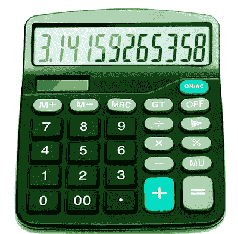
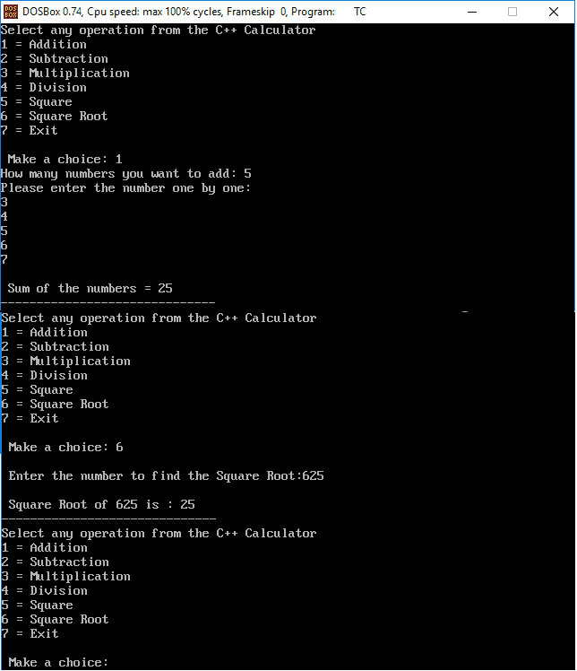
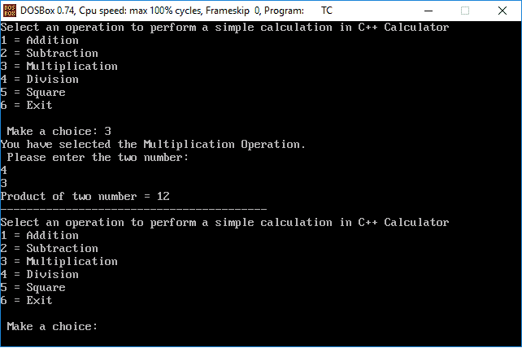

# C++ 中的计算器程序

> 原文：<https://www.javatpoint.com/calculator-program-in-cpp>

计算器是一种便携式设备，有助于在我们的日常生活中进行简单的数学计算，如**加法、减法、除法、乘法**等。一些科学计算器被用来更容易地执行复杂的计算，如平方根、函数、指数运算、对数、三角函数和双曲函数等。在本节中，我们将使用函数和边做边循环用 C++ 创建**计算器程序。**



### 使用函数

让我们使用 **[函数](https://www.javatpoint.com/cpp-functions)** 和 **[开关](https://www.javatpoint.com/cpp-switch)** 语句在 [C++ 中创建一个计算器程序。](https://www.javatpoint.com/cpp-tutorial)

```

#include<iostream.h>
#include<stdio.h>
#include<conio.h>
#include<math.h>
#include<stdlib.h>
void add();
void sub();
void multi();
void division();
void sqr();
void srt();
void exit();
void main()
{
clrscr();
int opr;
// display different operation of the calculator
do
{
cout << "Select any operation from the C++ Calculator"
     "\n1 = Addition"
     "\n2 = Subtraction"
     "\n3 = Multiplication"
     "\n4 = Division"
     "\n5 = Square"
     "\n6 = Square Root"
     "\n7 = Exit"
     "\n \n Make a choice: ";
     cin >> opr;

   switch (opr)
     {
     case 1:
	add();   // call add() function to find the Addition
	break;
	case 2:
	sub();   // call sub() function to find the subtraction
	break;
	case 3:
	multi(); // call multi() function to find the multiplication
	break;
	case 4:
	division(); // call division() function to find the division
	break;
	case 5:
	sqr(); // call sqr() function to find the square of a number
	break;
	case 6:
	srt(); // call srt() function to find the Square Root of the given number
	break;
	case 7:
	exit(0);   // terminate the program
	break;
	default:
	cout <<"Something is wrong..!!";
	break;
	}
	cout <<" \n------------------------------\n";
	}while(opr != 7);
	getch();
	}

void add()
{
int n, sum = 0, i, number;
cout <<"How many numbers you want to add: ";
cin >> n;
cout << "Please enter the number one by one: \n";
for (i = 1; i <= n; i++)
{
cin >> number;
sum = sum + number;
}
cout << "\n Sum of the numbers = "<< sum;
}
void sub()
{
int num1, num2, z;
cout <<" \n Enter the First number = ";
cin >> num1;
cout << "\n Enter the Second number = ";
cin >> num2;
z = num1 - num2;
cout <<"\n Subtraction of the number = " << z;
}
void multi()
{
int num1, num2, mul;
cout <<" \n Enter the First number = ";
cin >> num1;
cout << "\n Enter the Second number = ";
cin >> num2;
mul = num1 * num2;
cout <<"\n Multiplication of two numbers = " << mul;
}
void division()
{
int num1, num2, div = 0;
cout <<" \n Enter the First number = ";
cin >> num1;
cout << "\n Enter the Second number = ";
cin >> num2;
while ( num2 == 0)
     {
     cout << "\n Divisor canot be zero"
	     "\n Please enter the divisor once again: ";
	     cin >> num2;
	     }
div = num1 / num2;
cout <<"\n Division of two numbers = " << div;
}
void sqr()
{
int num1;
float sq;
cout <<" \n Enter a number to find the Square: ";
cin >> num1;
sq = num1 * num1;
cout <<" \n Square of " << num1<< " is : "<< sq;
}
void srt()
{
float q;
int num1;
cout << "\n Enter the number to find the Square Root:";
cin >> num1;
q = sqrt(num1);
cout <<" \n Square Root of " << num1<< " is : "<< q;
}

```

**输出:**



### 使用边做边循环

使用 **[do while](https://www.javatpoint.com/cpp-do-while-loop)** 和 **Switch** 语句在 C++ 中编写一个计算器程序。

```

#include<iostream.h>
#include<stdio.h>
#include<conio.h>
#include<stdlib.h>
void main()
{
clrscr();
int opr;
int num1, num2, x;
// display different operation of the calculator
do
{
cout << "Select an operation to perform a simple calculation in C++ Calculator"
     "\n1 = Addition"
     "\n2 = Subtraction"
     "\n3 = Multiplication"
     "\n4 = Division"
     "\n5 = Square"
     "\n6 = Exit"
     "\n \n Make a choice: ";
     cin >> opr;
   switch (opr)
     {
     // for addition operation in calculator
     case 1:
     cout << "You have selected the Addition Operation.";
     cout << "\n Please enter the two number: \n";
     cin >> num1 >> num2;
     x = num1 + num2;
     cout << "Sum of two number = " << x;
     break;
     // for subtraction operation in calculator
     case 2:
     cout << "You have selected the Subtraction Operation.";
     cout << "\n Please enter the two number: \n";
     cin >> num1 >> num2;
     x = num1 - num2;
     cout << "Subtraction of two number = " << x;
     break;
     // for multiplication operation in calculator
     case 3:
     cout << "You have selected the Multiplication Operation.";
     cout << "\n Please enter the two number: \n";
     cin >> num1 >> num2;
     x = num1 * num2;
     cout << "Product of two number = " << x;
     break;
     // for division operation in calculator
     case 4:
     cout << "You have selected the Division Operation.";
     cout << "\n Please enter the two number; \n";
     cin >> num1 >> num2;
     // while loop checks for divisor whether it is zero
     while ( num2 == 0)
     {
     cout << "\n Divisor cannot be zero"
	     "\n Please enter the divisor once again: ";
	     cin >> num2;
	     }
     x = num1 / num2;
     cout << "\n Quotient = " << x;
     break;
     // to square a number in calculator
     case 5:
     cout << "You have selected the Square Operation.";
      cout << "\n Please enter any number: \n";
     cin >> num1;
     x = num1 * num1;
     cout << "Square is = " << x;
     break;
     case 6: exit(0);  // terminate the program
     break;
     default: cout << "\n Something went wrong..!!";
     break;
     }
     cout << "\n----------------------------------------- \n";
     } while(opr != 6);
     getch();
     }

```

**输出:**



* * *