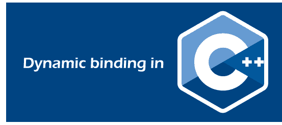

# C++ 中的动态绑定

> 原文：<https://www.javatpoint.com/dynamic-binding-in-cpp>

编译器可以使用运行时解析的绑定称为静态绑定。例如，所有的 final、static 和 private 方法都是在运行时绑定的。所有重载方法都使用静态绑定进行绑定。

动态绑定的概念消除了静态绑定的问题。



**动态绑定**

绑定的一般含义是将某物与某物联系起来。这里完成了对象的链接。在编程的意义上，我们可以把绑定描述为把函数定义和函数调用联系起来。

所以动态绑定这个术语意味着选择一个特定的函数运行直到运行时。根据对象的类型，将调用相应的函数。

由于动态绑定提供了灵活性，它避免了在编译时发生的静态绑定问题，从而将函数调用与函数定义联系起来。

**使用动态绑定**

注意，动态绑定还帮助我们使用单个函数名来处理不同的对象。它还降低了复杂性，并帮助开发人员调试代码和错误。

**如何实现动态绑定？**

动态编程的概念是用虚拟函数实现的。

**虚拟功能**

在基类中声明并在子类中重写(重新定义)的函数称为虚函数。当我们使用指针或对基的引用来引用派生类对象时，我们可以为该对象调用一个虚拟函数，并执行该函数的派生类版本。

**特征**

*   运行时函数解析
*   用于实现运行时多态性
*   所有虚函数都在基类中声明
*   确保为对象调用正确的函数，而不考虑用于函数调用的指针(引用)。
*   虚拟函数不能声明为静态的
*   不存在虚拟构造函数，但可以创建虚拟析构函数。
*   基类和派生类中的虚函数定义应该相同。
*   虚函数可以是另一个类的朋友。
*   定义总是在基类中，重写在派生类中

现在让我们看看下面这个没有虚拟关键词的问题。

**例**

我们拿一个有函数 **final_print()** 的 A 类来说，B 类公开继承 A。b 也有其 **final_print()** 功能。

如果我们做一个 A 的对象并调用 **final_print()** ，它将在基类中运行，而如果我们做一个 B 的对象并调用 final_print()，它将只在基类中运行。

**代码**

```

#include 
using namespace std;
class A {
public:
    void final_print() // function that call display
    {
display();
    }
    void display() // the display function
    {
cout<< "Printing from the base class" <
```

**输出**

```
Printing from the base class
Printing from the base class    

```

现在让我们用虚函数来解决这个问题。

**代码**

```

#include 
using namespace std;
class A {
public:
    void final_print() // function that call display
    {
display();
    }
virtual  void display() // the display function
    {
cout<< "Printing from the base class" <
```

**输出**

```
Printing from the base class
Printing from the derived class   

```

因此，在虚函数的帮助下，动态绑定将函数调用与函数定义联系起来。

* * *