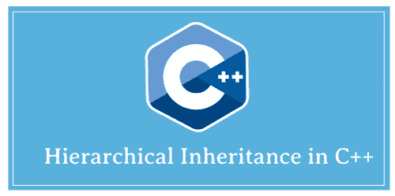
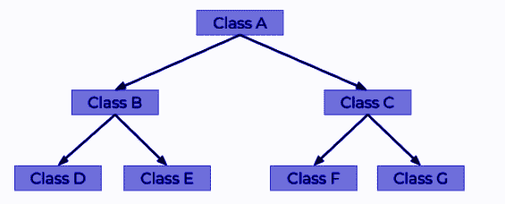
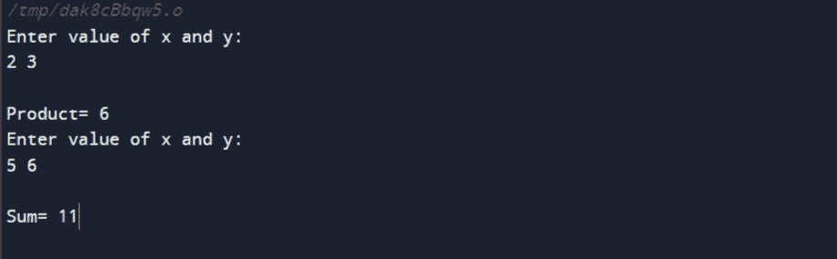

# C++中的层次继承

> 原文：<https://www.javatpoint.com/hierarchical-inheritance-in-cpp>

继承的概念与现实世界非常相似。就像儿子继承父亲的财产(特征和行为)，父亲自己继承儿子祖父的财产一样。在编程规范中，当一个类继承另一个类(基类)的属性时，就会发生继承。

现在让我们理解层次继承的概念。



**定义**

顾名思义，它是类的层次结构。有一个基类和多个派生类。此外，派生类还被其他一些类继承。这样，一个树状结构就形成了等级制度。



这里 A 类是基类。B 类和 C 类是 a 的派生类。

D 类和 E 类是 b 的派生类，F 类和 G 类是 c 的派生类，这样就形成了层次继承的结构。

**分层继承用在哪里？**

它用于以下需要维护层次结构的情况。例如，组织的数据库以分层格式存储。一个组织有不同的部门，如信息技术、计算机科学、土木、机械等。每个组织都有相同的属性，如学生姓名、学号、年份等。归入学生类。因此，所有的部分都继承学生的属性，并遵循层次继承的格式。

**语法**

```

Class Parent
{
	statement(s);
};
Class Derived1: public Parent
{
	statement(s);
};
Class Derived2: public Parent
{
	statement(s);
};
class newderived1: public Derived1
{
	statement(s);
};
class newderived2: public Derived2
{
	statement(s);
};

```

类 Parent 是基类，Derived1 和 Derived2 是继承 Parent 类的类。此外，newderived1 是继承 Dervied1 的类，newderived2 是继承 derived2 类的类。n 个派生类可以继承任意数量的基类。

**代码示例**

```

#include <iostream>
using namespace std;
class A // Base class
    {
public:
int x, y; // data members
voidgetdata() // to input x and y
    {
cout<< "Enter value of x and y:\n";
cin>> x >> y;
    }
};
class B : public A //B is derived from class base
{
public:
void product()
    {
cout<< "\nProduct= " << x * y <<endl; // Perform product
    }
};
class C : public A //C is also derived from class base
{
public:
void sum()
    {
cout<< "\nSum= " << x + y; // Perform sum
    }
};
int main()
{
    B obj1; //object of derived class B
    C obj2; //object of derived class C
obj1.getdata(); // input x and y 
obj1.product();
obj2.getdata();
obj2.sum();
return 0;
}

```

**输出**



**解释**

我们有类 A 作为基类，它有两个数据成员 x 和 y。它还使用函数 getdata()输入数据成员的值。类 B 继承类 A，并使用继承的数据成员 x 和 y 执行产品。

类 C 还调用基类的 getdata()，并使用继承的数据成员执行 x 和 y 的乘积。

* * *