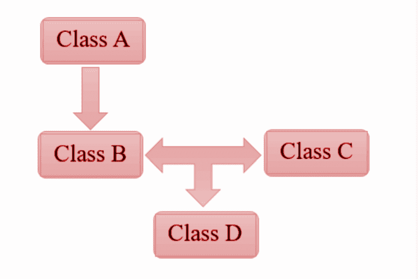
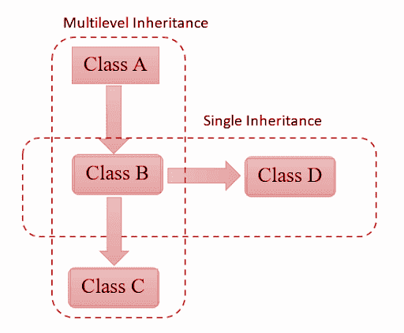
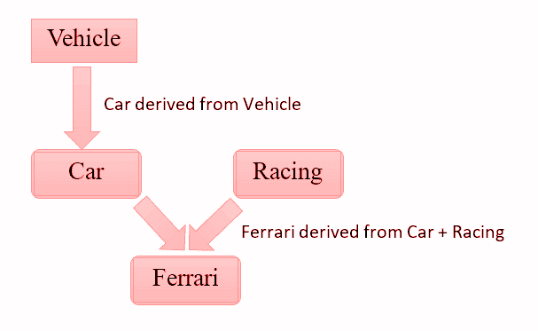

# C++中的混合继承

> 原文：<https://www.javatpoint.com/hybrid-inheritance-in-cpp>

继承被定义为一个类继承另一个类的属性的过程。其属性被继承的类被称为基类或该类的父类。继承基类属性(父类)的类是派生类。

例如，儿子继承父亲的财产。本文将向您简要介绍混合继承及其示例。


## 定义

将多种类型的继承(如多重继承、简单继承和层次继承)结合起来称为混合继承。

在简单继承中，一个类从作为其基础的单个类中派生出来。在多个继承中，一个类从两个类派生，其中一个父类也是派生类。在层次继承中，从单个基类创建多个派生类。

在混合继承中，有一个或多个继承类型的组合。例如，单一继承和层次继承的结合。因此，混合继承也称为多路径继承。

## 例子



该图显示了混合继承，即单一继承和多重继承的组合。

**单一继承-**B 类继承 a 类，由此可见单一继承的一个例子。

**多重继承-**D 类继承自多个类(D 上面显示的 B 和 C)。因此多重继承的一个例子。

**以上示例的语法代码**

```

Class A
{
statement(s)
}:
Class B: public A
{
statement(s);
};
Class C
{
statement(s);
};
Class D: public B, public C
{
statement(s);
};

```



这个例子展示了多级继承和单级继承的结合。

**多级继承-** 从上图可以看出，B 类继承 A 类，C 类继承 B 类，由此可见，是多级继承的一个例子。

**单继承-** 从上图来看，D 类继承了 b 类，因此是单继承的一个例子。

**以上示例的语法代码**

```

Class A 
{
statement(s);
};
Class B: public A 
{
statement(s);
};
Class C: public B 
{
statement(s);
};
Class D: public B
{
statement(s);
};

```

**混合遗传的现实例子**



在现实世界中，我们都驾驶汽车。所以**车**是属于**车**类的一个类。因此是单一继承的一个实例。

如果我们谈论**法拉利，**那是赛车和普通车的结合。所以**级法拉利**是源自于**级轿车**和**级赛车。**

因此，上面的例子是单一和多重继承。它是混合继承(单一+多重)的完美例子。

**代码**

```

#include using namespace std;
class vehicle
{
public:
vehicle()
    {
cout<< "This is a vehicle\n";
    }
};
class Car: public vehicle
{
public:
Car()
    {
cout<< "This is a car\n";
    }
};
class Racing
{
public:
Racing()
    {
cout<< "This is for Racing\n";
    }
};
class Ferrari: public Car, public Racing
{
public:
Ferrari()
    {
cout<< "Ferrari is a Racing Car\n";
    }

};
int main() {
	Ferrari f;
	return 0;
} 
```

**输出**

```
This is a vehicle
This is a car
This is for Racing
Ferrari is a Racing Car    

```

* * *