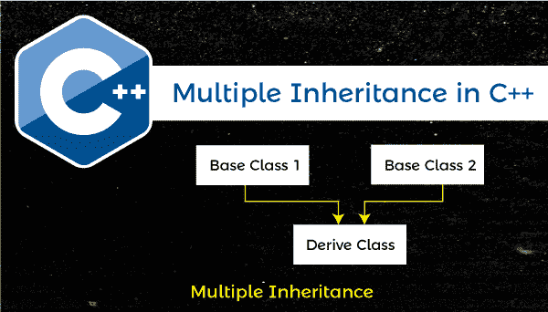
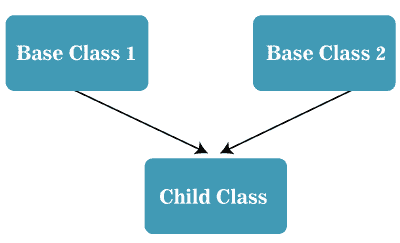

# C++ 中的多重继承

> 原文：<https://www.javatpoint.com/multiple-inheritance-in-cpp>

本节将讨论 C++ 编程语言中的多重继承。当我们将一个类的特性和功能获取到另一个类时，这个过程叫做**继承**。这样，我们可以使用派生类对象重用、扩展或修改父类的所有属性和行为。缩短程序长度是面向对象编程最重要的特征。

从另一个或父类继承所有成员函数和功能的类称为**派生类**。派生类从中获得某些特征的类称为**基类或父类**。



**多重继承**是 C++ 中的继承概念，允许一个子类从多个**基**类继承属性或行为。因此，我们可以说它是使派生类能够从多个基类获取成员函数、属性和特性的过程。

### 多重继承图

以下是 [C++ 编程语言](https://www.javatpoint.com/cpp-tutorial)中的多重继承图。



在上图中，有两个父类:**基类 1** 和**基类 2** ，而只有一个**子类**。子类从基类 1 和基类 2 获取所有特征。因此，我们将继承类型称为多重继承。

### 多重继承的语法

```

class A
{
// code of class A
}
class B
{
// code of class B
}
class C: public A, public B (access modifier class_name)
{
// code of the derived class
}

```

在上面的语法中，类 A 和类 B 是两个基类，类 C 是继承父类一些特性的子类。

让我们编写多重继承的各种程序，使用派生类从多个基类继承成员函数和功能。

### 示例 1:使用多重继承的程序

**Program1.cpp**

```

#include using namespace std;

// create a base class1
class Base_class
{
	// access specifier
	public: 
	// It is a member function
	void display()
	{
		cout << " It is the first function of the Base class " << endl;
	}
};

// create a base class2
class Base_class2
{
	// access specifier
	public: 
	// It is a member function
	void display2()
	{
		cout << " It is the second function of the Base class " << endl;
	}
};

/* create a child_class to inherit features of Base_class and Base_class2 with access specifier. */
class child_class: public Base_class, public Base_class2
{

	// access specifier
	public:
	void display3()	// It is a member function of derive class
	{
		cout << " It is the function of the derived class " << endl;	
	}

};

int main ()
{
	// create an object for derived class
	child_class ch;
	ch.display(); // call member function of Base_class1
	ch.display2(); // call member function of Base_class2
	ch.display3(); // call member function of child_class
} 
```

**输出**

```
It is the first function of the Base class
 It is the second function of the Base class
 It is the function of the derived class

```

在上面的程序中，我们创建了两个基类和一个子类。**子类**在子类对象 ch 的帮助下，从父类**基类**和**基类**调用成员函数 display()和 display2()。

### 示例 2:使用多重继承来执行算术运算

让我们创建一个派生类来继承 C++ 编程中多个基类的成员函数。

**Program2.cpp**

```

#include <iostream>
using namespace std;

// create add class
class add
{
	public:
		int x = 20;
		int y = 30;
		void sum()
		{
			cout << " The sum of " << x << " and " << y << " is " <<x+y << endl;
		}
};

// create Mul class
class Mul
{
	public:
		int a = 20;
		int b = 30;
		void mul()
		{
			cout << " The Multiplication of " << a << " and " << b << " is " <<a*b << endl;
		}
};

// create Subclass
class Sub
{
	public:
		int a = 50;
		int b = 30;
		void sub()
		{
			cout << " The Subtraction of " << a << " and " << b << " is " <<a-b << endl;
		}
};

// create Div class
class Div
{
	// access specifier
	public:
		int a = 150;
		int b = 30;
		void div()
		{
			cout << " The Division of " << a << " and " << b << " is " <<a/b << endl;
		}
};

// create a derived class to derive the member functions of all base classes
class derived: public add, public Div, public Sub, public Mul
{
	// access specifier
	public:
		int p = 12;
		int q = 5;
		void mod()
		{			
			cout << "The Modulus of " << p << " and " <<q << " is " << p % q << endl;
		}
};

int main ()
{
	// create an object of the derived class
	derived dr;
	dr.mod(); // call derive class member function	
	// call all member function of class add, Div, Sub and Mul
	dr.sum();
	dr.mul();
	dr.div();
	dr.sub();
}

```

**输出**

```
The Modulus of 12 and 5 is 2
 The sum of 20 and 30 is 50
 The Multiplication of 20 and 30 is 600
 The Division of 150 and 30 is 5
 The Subtraction of 50 and 30 is 20

```

### 示例 3:使用多重继承获得六个科目的平均分数

让我们创建另一个程序，使用 C++ 编程语言中的多重继承来打印六个科目的平均分数。

**Program3.cpp**

```

#include using namespace std;

// create base class1
class student_detail 
{
	// access specifier 
	protected:
		int rno, sum = 0, i, marks[5];

	// access specifier	
	public:
		void detail()
		{

			cout << " Enter the Roll No: " << endl;
			cin >> rno;

			cout << " Enter the marks of five subjects " << endl;
			// use for loop
			for (i = 0; i < 5; i++)
			{
				cin >> marks[i];
			}

			for ( i = 0; i < 5; i++)
			{
				// store the sum of five subject
			sum = sum + marks[i];
			}
		}

};

// create base class2
class sports_mark 
{
	protected:
		int s_mark; 

	public:

		void get_mark()
		{
			cout << "\n Enter the sports mark: ";
			cin >> s_mark;
			}	
};

/* create a result as the child class to inherit functions of the parent class: student_detail and sports_mark.*/
class result: public student_detail, public sports_mark
{
	int tot, avg;
	public:

		// create member function of child class
		void disp ()
		{
			tot = sum + s_mark;
			avg = tot / 6; // total marks of six subject / 6
			cout << " \n \n \t Roll No: " << rno << " \n \t Total: " << tot << endl;
			cout << " \n \t Average Marks: " << avg;
		}
};

int main ()
{
	result obj; // create an object of the derived class

	// call the member function of the base class
	obj.detail();
	obj.get_mark();
	obj.disp();
} 
```

**输出**

```
Enter the Roll No:
25
 Enter the marks of five subjects
90
85
98
80
75

 Enter the sports mark: 99

         Roll No: 25
         Total: 527

         Average Marks: 87

```

### 多重继承中的双重有罪问题

在多重继承中，当一个类从两个或多个基类或父类派生时。因此，父类可能都有同名的成员函数，当子类对象调用其中一个同名的成员函数时，就会出现歧义。因此，我们可以说，C++ 编译器在为程序的执行选择类的成员函数时感到困惑。

### 演示多重继承中歧义问题的程序

让我们编写一个简单的方法，在 C++ 编程中使用派生类调用父类的相同成员函数。

**Program4.cpp**

```

#include #include <conio.h>using namespace std;

// create class A
class A
{
	public: 
	void show()
	{
		cout << " It is the member function of class A " << endl;
	}
 }; 

 // create class B
 class B
{
	public: 
	void show()
	{
		cout << " It is the member function of class B " << endl;
	}
 };

 // create a child class to inherit the member function of class A and class B
 class child: public A, public B
 {
 	public:
 		void disp()
 		{
 			cout << " It is the member function of the child class " << endl;
		 }
 };

 int main ()
 {
 	// create an object of the child class to access the member function
 	child ch;
 	ch.show(); // It causes ambiguity 
ch.disp();
 	return 0;
 }</conio.h> 
```

编译上述程序时，会抛出 show()成员函数不明确的问题。由于基类 A 和 B 都定义了相同的成员函数 show()，当派生类的对象调用 show()函数时，它在多个继承中表现出模糊性。

因此，我们需要解决多重继承中的歧义问题。通过定义**类名**和**作用域解析(::)运算符**来指定在子类中调用成员函数的类，可以解决歧义问题。

**歧义消解的语法**

```

Derived_obj_name.parent_class_name : : same_named_memberFunction ( [parameter] );

```

**例如**

```

ch.A:: show(); // class_name and scope resolution operator with member function
ch.B::show();

```

在做了一些更改之后，现在我们再次执行上面的程序，返回下面给出的输出。

```

It is the member function of the child class
 It is the member function of class A
 It is the member function of class B

```

* * *