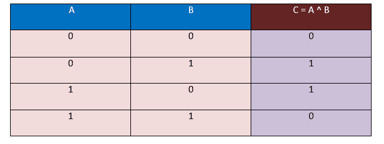
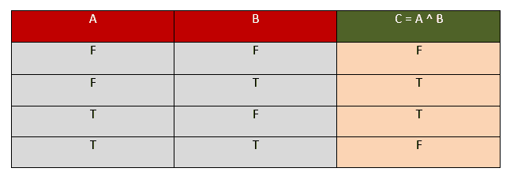
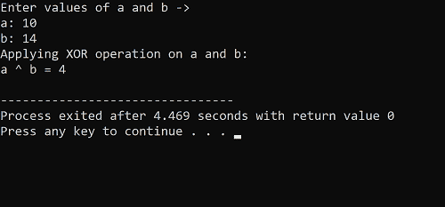
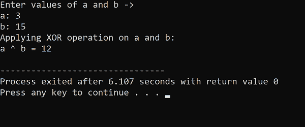

# C++ 按位异或运算符

> 原文：<https://www.javatpoint.com/cpp-bitwise-xor-operator>

*   按位异或运算符也称为**异或**
*   使用 **'^'** 表示
*   如名称所示，它在操作数的**位级**上工作。
*   按位异或运算符属于按位运算符的范畴。
*   在按位异或运算符(XOR)中，需要两个操作数，这两个操作数由 XOR 符号(即'^'.)分隔
*   为了确定对两个操作数应用异或运算符后的输出或结果，我们需要遵循异或运算符的逻辑真值表。
*   异或真值表是使用异或运算符的适当逻辑构建的数学表。
*   异或运算符后面使用的逻辑是；每当对两个操作数的两个不同的**位进行异或运算时，结果总是产生**‘1’，**，如果对两个操作数的两个相同的**位进行异或运算，则结果产生输出**‘0’。******

 ****## 异或运算符真值表

假设有两个操作数；第一个是 A，第二个是 B，这两个操作数形成的输入组合总数将是 4。通过使用下面的异或真值表，我们将确定相应的输出。结果将被捕获在 c 中，这里 **C = A ^ B.**

在这个真值表中，我们以位的形式输入，即 0 和 1，输出也将以位的形式生成，即 0 和 1。



这里，在上面的异或真值表中，我们观察到当操作数 A 和 B 的值不同时，即(0，1)，(1，0)，出来的结果总是 1。而当操作数 A 和 B 的值相同，即(0，0)，(1，1)时，出来的结果总是 0。

同样，这样我们可以为**布尔**值绘制真值表-

假设有两个操作数；第一个是 **A** ，第二个是 **B** 。这两个操作数形成的输入组合总数将为 4。通过使用下面的异或真值表，我们将确定相应的输出。结果将在 c 中捕获，这里 C = A ^ B。

在这个真值表中，我们以真值的形式接受输入，即真(T)和假(F)。输出也将以真值的形式生成，即 T 和 f



这里，在上面的 XOR 真值表中，我们观察到，当操作数 A 和 B 的值不同时，即(F，T)，(T，F)，结果出来的永远是 T，而当操作数 A 和 B 的值相同时，即(F，F)，(T，T)，结果出来的永远是 F。

从上表中，我们观察到 **T(真)用 1 表示，F(假)用 0 表示。**

### 解决任何特定问题的步骤-

1.  问题中给出的操作数总是十进制值。
2.  首先，我们需要将操作数的值转换成**二进制**
3.  将操作数的值转换为二进制数后，将两个操作数一个放在另一个上面。
4.  请记住，在对它们进行异或运算之前，请检查其中的**位数**。
5.  如果位数不匹配，小操作数左端的额外 0 会平衡位数。
6.  最后，借助上述真值表，对操作数逐个进行异或运算，每次取一位进行异或运算。
7.  最后，结果以输出的形式产生。
8.  输出将以二进制形式产生，现在将二进制形式转换为十进制形式，并记下结果值。

## C++ 中按位异或运算的执行

借助示例，让我们更详细地了解 C++ 中异或运算的执行

### 例 1:求整数值的异或；十号和十四号。还有，解释一下，用 C++ 写执行代码。

**解法:**我们考虑两个变量‘a’和‘b’，来存储上题给出的对应两个操作数，即 10 和 14。

这里，a = 10，b = 14。

我们将按照以下步骤找出给定两个操作数的异或。

1.  我们知道 10 和 14 是十进制形式，要应用按位异或运算，需要将其转换为二进制形式。
2.  二进制形式‘a’，即 10 是*‘1010’*，二进制形式‘b’，即 14 是*‘1110’。*
3.  这里我们观察到 a 中存在的二进制数字的计数是 4，b 中存在的二进制数字的计数也是 4；因此，两个变量中存在的二进制数字的数量是相同的，并且已经平衡，我们不需要添加更多的 0 来平衡它。
4.  现在，将出现在“b”中的二进制数字降低到出现在“a”中的二进制数字。
5.  最后，对相应的匹配位逐个应用异或运算，并记下输出。
6.  最后生成的输出会是二进制形式，就像上面的问题给出的十进制形式一样，所以我们需要把结果转换成十进制形式。

**说明:**

a = 10(十进制形式)

b = 14(十进制形式)

现在，对于异或 b，我们需要将 a 和 b 转换成二进制形式-

a = 1010(二进制形式)

b = 1110(二进制形式)

现在，对 a 和 b 进行异或运算

**a = 1010**

**b = 1110**

**-**

**a ^ b = 0100 *(二进制形式)***

^ b 的结果是 0100，它是二进制形式。

现在将结果转换为十进制形式，即 4。

**10 ^ 14 = 4**

#### 注:通过使用上述异或真值表，生成相应位的输出。

我们现在将在 C++ 语言中对 10 和 14 应用按位异或运算，并得到结果，即 4。

**以上示例的 C++ 代码:**

```

//************************ C++ Code ******************************
#include using namespace std;
int main ()
{
	int a, b, c ;                     // Initializing integer variables to store data values
	cout << "Enter values of a and b -> " << endl ;
	cout << "a: " ;
	cin >> a ;                       // taking a as input from user
	cout << "b: " ;
	cin >> b ;                         // taking b as input from user
	c = a ^ b ;                      // storing XOR result of a and b in c
	cout << "Applying XOR operation on a and b: "<< endl ;
	cout << "a ^ b = " << c << endl ;                    // Printing the output

} 
```

**输出**



### 例 2:求整数值的异或；三号和十五号。还有，解释一下，用 C++ 写执行代码。

**解法:**我们考虑两个变量‘a’和‘b’，来存储上题给出的对应两个操作数，即 3 和 15。

这里，a = 3，b = 15。

我们将按照以下步骤找出给定两个操作数的异或。

1.  我们知道 3 和 15 是十进制形式，要应用按位异或运算，需要将其转换为二进制形式。
2.  二进制形式‘a’，即 3 是*‘11’*，二进制形式‘b’，即 15 是*‘1111’。*
3.  这里我们将观察到 a 中存在的二进制数字的计数是 2，b 中存在的二进制数字的计数是 4；因此，两个变量中存在的二进制数并不相同。因此，不平衡，我们确实需要在较低的二进制数的左侧增加更多的 0，即 a，即“*11”*，以平衡它。
4.  平衡后，a 的值为 *' 0011 '* ，b 为 *' 1111 '。*
5.  现在，将出现在“b”中的二进制数字降低到出现在“a”中的二进制数字。
6.  最后，对相应的匹配位逐个应用异或运算，并记下输出。
7.  最后生成的输出会是二进制形式，就像上面的问题给出的十进制形式一样，所以我们需要把结果转换成十进制形式。

**说明:**

a = 3(十进制形式)

b = 15(十进制形式)

现在，对于异或 b，我们需要将 a 和 b 转换成二进制形式-

a = 0011(二进制形式)

b = 1111(二进制形式)

现在，对 a 和 b 进行异或运算

**a = 0011**

**b = 1111**

**-**

**a ^ b = 1100 *(二进制形式)***

^ b 的结果是 1100，是二进制形式。

现在将结果转换为十进制形式，即 12。

**3 ^ 15 = 12**

#### 注:通过使用上述异或真值表，生成相应位的输出。

我们现在将在 C++ 语言中对 3 和 15 应用按位异或运算，并得到结果，即 12。

**以上示例的 C++ 代码:**

```

//************************ C++ Code ******************************
#include using namespace std;
int main ()
{
	int a, b, c ;                     // Initializing integer variables to store data values
	cout << "Enter values of a and b -> " << endl ;
	cout << "a: " ;
	cin >> a ;                       // taking a as input from user
	cout << "b: " ;
	cin >> b ;                         // taking b as input from user
	c = a ^ b ;                      // storing XOR result of a and b in c
	cout << "Applying XOR operation on a and b: "<< endl ;
	cout << "a ^ b = " << c << endl ;                    // Printing the output

} 
```

**输出**



* * *****