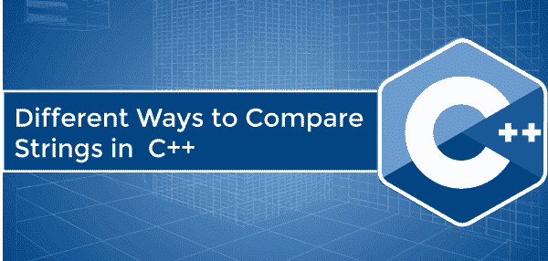

# C++ 中比较字符串的不同方法

> 原文：<https://www.javatpoint.com/different-ways-to-compare-strings-in-cpp>

本节将讨论在 C++ 编程语言中比较给定字符串的不同方法。字符串的比较决定了第一个字符串是否等于另一个字符串。例:Hello 和 HELLO 是两个不同的字符串。



在 C++ 编程语言中，有不同的方法来比较字符串，如下所示:

1.  使用 strcmp()函数
2.  使用 compare()函数
3.  使用关系运算符
4.  使用 For 循环和 If 语句
5.  使用用户定义的函数

### strcmp()函数

strcmp()是**字符串. h** 头文件的预定义库函数。strcmp()函数在词典编纂的基础上比较两个字符串。这意味着 strcmp()函数开始逐个字符地比较第一个字符串和第二个字符串，直到两个字符串中的所有字符都相同或遇到空字符。

**语法**

```

int strcmp ( const char *leftstr, const char *rightstr ); 

```

**参数:**

**左字符串:**定义左字符串的字符。

**右字符串:**定义右字符串的字符。

**返回:**

leftstr 字符串将每个字符与第二个字符串进行比较，从左侧一直到两个字符串的末尾。而且，如果两个字符串相等，strcmp()函数返回的字符串也相等。否则，字符串不相等。

让我们用 C++ 中的 strcmp()函数创建一个比较字符串的程序。

**Program1.cpp**

```

#include using namespace std;
#include <string.h>int main ()
{
	// declare strings
	const char *str1 = " Welcome to JavaTpoint";
	const char *str2 = " Welcome to JavaTpoint";

	const char *str3 = " JavaTpoint";
	const char *str4 = " Javatpoint";

	cout << " String 1: " << str1 << endl;
	cout << " String 2: " << str2 << endl;

	// use strcmp() function to validate the strings are equal
	if (strcmp (str1, str2) == 0)
	{
		cout << " \n Both strings are equal. " << endl;
	}
	else 
		{

		cout << " The strings are not equal. " << endl;
	}

	cout << " \n String 3: " << str3 << endl;
	cout << " String 4: " << str4 << endl;

	// use strcmp() function to validate the strings are equal
	if (strcmp (str3, str4) == 0)
	{
		cout << " \n Both strings are equal. " << endl;
	}	
	else 
		cout << " \n The strings are not equal. ";	

return 0;
}</string.h> 
```

**输出**

```
 String 1:  Welcome to JavaTpoint
 String 2:  Welcome to JavaTpoint

 Both strings are equal.

 String 3:  JavaTpoint
 String 4:  Javatpoint

 The strings are not equal.

```

### 比较()函数

compare()函数是 C++ 语言的预定义库函数。compare()函数比较两个给定的字符串，并根据匹配的情况返回以下结果:

1.  如果两个字符串相同，函数返回 0。
2.  如果第一个字符串的字符值小于第二个字符串，则函数返回< 0。
3.  如果第二个字符串大于第一个字符串，函数将返回大于 0 或> 0 的值。

**语法**

```

int compare (const string &str) const; 

```

让我们创建一个简单的程序，使用 C++ 中的 compare()函数来比较两个字符串。

**Program2.cpp**

```

#include using namespace std;
int main ()
{
	string str1, str2; // declare string variable

	cout << " Enter the string 1: ";
	cin >> str1; 

	cout << " Enter the string 2: ";
	cin >> str2; 

	// use compare() function to compare the second string with first string

	int i = str1.compare(str2);

	if ( i < 0)
	{
		cout << str1 << " is smaller than " << str2 << " string" << endl;
	}

	else if ( i > 0)
	{
		cout << str2 << " is greater than " << str1 << " string." << endl;
	}
	else // i == 0;
	{
		cout << " Both strings are equal.";
	}
return 0;
} 
```

**输出**

```
1st Run:
Enter the string 1: Program
 Enter the string 2: program
Program is smaller than program string

2nd Run:
Enter the string 1: APPLE
 Enter the string 2: APPLE
 Both strings are equal.

```

### 关系运算子

它是 C++ 中用来比较两个字符串或数值的运算符。C++ 有不同类型的关系运算符，如' == '，'！= '，>，

**语法**

```

String1 == string2  // here, we use double equal to operator	
Or 
String1 != string2 // here, we use not equal to operator

```

### 在 C++ 中使用等于(==)运算符比较两个字符串

**等于(==)运算符:**用于检查第一个字符串与第二个字符串是否相等。

让我们创建一个程序，使用 C++ 中的 double 等号(==)运算符来比较字符串。

**Program3.cpp**

```

#include using namespace std;

int main ()
{
	// declare string variables
	string str1;
	string str2;

	cout << " Enter the String 1: " << endl;
	cin >> str1;
	cout << " Enter the String 2: " << endl;
	cin >> str2;

	// use '==' equal to operator to check the equality of the string
	if ( str1 == str2)
	{
		cout << " String is equal." << endl;
	}
	else
	{
		cout << " String is not equal." << endl;
	}
	return 0;
} 
```

**输出**

```
Enter the String 1:
JavaTpoint
 Enter the String 2:
javatpoint
 String is not equal.

```

**2<sup>2</sup>执行:**

```
Enter the String 1:
Program
 Enter the String 2:
Program
 String is equal.

```

### 使用不等于(！idspnonenote)比较两个字符串。=)关系运算符

让我们创建一个程序来比较字符串是否相等。=)运算符。

**Program4.cpp**

```

#include using namespace std;

int main ()
{
	// declare string variables
	string str1;
	string str2;

	cout << " Enter the String 1: " << endl;
	cin >> str1;
	cout << " Enter the String 2: " << endl;
	cin >> str2;

	// use '!=' not equal to operator to check the equality of the string
	if ( str1 != str2)
	{
		cout << " String is not equal." << endl;
	}
	else
	{
		cout << " String is equal." << endl;
	}
	return 0;
} 
```

**输出**

```
Enter the String 1:
JAVATpoint
 Enter the String 2:
JavaTPOINT
 String is not equal.

```

**2<sup>2</sup>跑:**

```
Enter the String 1:
HELLO
 Enter the String 2:
HELLO
 String is equal.

```

### 在 C++ 中使用 for 循环和 if 语句比较两个字符串

**Program5.cpp**

```

#include using namespace std;
int main ()
{
	char s1[50], s2[50]; // declare character array
	int i, disp;

	cout << " Enter the String 1: " << endl;
	cin >> s1;

	cout << " Enter the String 2: " << endl;
	cin >> s2;

	for (i = 0; s1[i] == s2[i] && s1[i] == '\0'; i++);

	if (s1[i] < s2[i])
	{
		cout << " String 1 is less than String 2";
	}
	else if (s1[i] > s2[i])
	{
		cout << " String 2 is less than String 1";
	}
	else
	{
		cout << " String 1 is equal to String 2";
	}
	return 0;
 } 
```

**输出**

```
Enter the String 1:
WELCOME
 Enter the String 2:
WELCOME
 String 1 is equal to String 2

```

### 使用 C++ 中的用户定义函数比较两个字符串

让我们创建一个简单的程序，使用 C++ 中的用户定义函数将第一个字符串与另一个字符串进行比较。

**Program6.cpp**

```

#include using namespace std;

void RelationalCompare ( string str1, string str2)
{
	// use relational not equal operator
	if ( str1 != str2)
	{
		cout << str1 << " is not equal to " << str2 << " string. " << endl;
		if (str1 > str2)
		{
			cout << str1 << " is greater than " << str2 << " string." << endl;
		}
		else
		{
			cout << str2 << " is greater than " << str1 << " string." << endl;	
		}
	}
		else
			cout << str1 << " is equal to " << str2 << " string." << endl;
}

int main ()
{
	string str1 ( "JavaT");
	string str2 ( "Tpoint");

	// call function
	RelationalCompare (str1, str2);

	string str3 ("JavaTpoint");
	string str4 ("JavaTpoint");
	RelationalCompare (str3, str4);
	return 0;
} 
```

**输出**

```
JavaT is not equal to Tpoint string.
Tpoint is greater than JavaT string.
JavaTpoint is equal to JavaTpoint string.

```

* * *