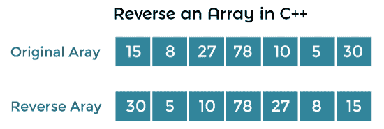

# 在 C++中反转数组

> 原文：<https://www.javatpoint.com/reverse-an-array-in-cpp>

本节将讨论在 C++编程语言中反转数组的不同方法。数组的逆序意味着改变给定数组元素的顺序。这种技术将数组的最后一个元素反转为第一个元素，第一个元素成为最后一个。然而，这个过程一直持续到数组中的所有字符或元素被完全反转。

例如，数组包含像‘H’、‘E’、‘L’、‘L’、‘O’这样的元素，当我们反转数组的所有元素时，它会将反转后的数组返回为‘O’、‘L’、‘L’、‘E’、‘H’。这样，数组中的所有字符都被反转。



## 反转数组的不同方法

以下是在 C++编程语言中获取反向数组的各种方法。

*   使用 for 循环反转数组
*   使用 Reverse()函数反转数组
*   使用用户定义的函数反转数组
*   使用指针反转数组
*   使用递归函数反转数组

### 使用 for 循环编程反转数组

让我们创建一个程序，用 C++中的 for 循环来反转数组的元素。

**Program1.cpp**

```

#include using namespace std;

int main ()
{
	int arr[50], num, temp, i, j;
	cout << " Please, enter the total no. you want to enter: ";
	cin >> num;

	// use for loop to enter the numbers 
	for (i = 0; i < num; i++)
	{
		cout << " Enter the element " << i+1 << ": ";
		cin >> arr[i];
	}

	for ( i = 0, j = num - 1; i < num/2; i++, j--)
	{	
		temp = arr[i];
		arr[i] = arr[j];
		arr[j] = temp;
	}
	cout << "\n Reverse all elements of the array: " << endl;
	// use for loop to print the reverse array
	for ( i = 0; i < num; i++)
	{
		cout << arr[i] << " ";
	}
	return 0;
} 
```

**输出**

```
Please, enter the total no. you want to enter: 6
 Enter the element 1: 78
 Enter the element 2: 12
 Enter the element 3: 54
 Enter the element 4: 24
 Enter the element 5: 7
 Enter the element 6: 90

 Reverse all elements of the array:
90 7 24 54 12 78

```

### 使用 reverse()函数对数组进行反向编程

让我们考虑一个例子，在 C++中使用 reverse()函数打印数组的逆序。

**Program2.cpp**

```

#include #include <algorithm>using namespace std;

// declare disp() function 
void disp(int arr1[], int num)
{
	int i;
	// use for loop to iterate the characters
	for ( i = 0; i < num; i++)
	{
		cout << arr1[i] << " ";
	}
}

// define reverse() function to reverse the array elements
void reverse(int arr1[], int num)
{
	reverse(arr1, arr1 + num); 
}

int main ()
{
	// declare and initialize an array
	int arr1[] = {34, 78, 21, 90, 5, 2};
	int num = sizeof(arr1)/sizeof(arr1[0]);

	// call reverse function and pass parameters
	reverse(arr1, num);
	disp(arr1, num); /* call disp() function to print the revrse array. */

	return 0; 
}</algorithm> 
```

**输出**

```
2 5 90 21 78 34

```

### 使用用户定义的函数反转数组的程序

让我们考虑一个使用 C++中用户定义的来显示数组元素反向的例子。

**Program3.cpp**

```

#include using namespace std;

void ArrRev ( int [], int);
int main ()
{
	int arr[50], num, i, j, temp;
	cout << " Number of elements to be entered: " << endl;
	cin >> num;

	cout << " Enter the array elements: " << endl;

	// use for loop to enter the elements
	for ( i = 0; i < num; i++)
	{
		cin >> arr[i];
	}
	cout << " Elements are: \n";
	// display entered elements in array
	for ( i = 0; i < num; i++)
	{
		cout << arr[i] << " ";
	}
	ArrRev (arr, num); // call function

	cout << " \n The reverse of the given array is: \n";
	// use for loop to print the reverse array elements
	for ( i = 0; i < num ; i++)
	{
		cout << arr[i] << " ";
	}
	cout << endl;
	return 0;
}

void ArrRev ( int ar[], int a2)
{
	int i, j, temp;
	j = a2 - 1;
	for ( i = 0; i < j; i++, j--)
	{
		temp = ar[i];
		ar[i] = ar[j];
		ar[j] = temp;
	}
} 
```

**输出**

```
Number of elements to be entered:
7
 Enter the array elements:
45
32
89
21
78
34
65
 Elements are:
45 32 89 21 78 34 65
 The reverse of the given array is:
65 34 78 21 89 32 45

```

### 使用指针反转数组的程序

让我们考虑一个用 C++中的指针演示数组元素反转的例子。

**Program4.cpp**

```

#include 
using namespace std;
int main ()
{
	// declare the size of array
	int arr[50], arr2[50];
	int *ptr, i, num;
	cout <> num;	

	cout <> arr[i];
	}
	ptr = &arr[0];
	cout <
```

**输出**

```
No. of array elements to be entered:
6
 Enter the elements: 45
32
89
63
4
6
 Entered elements of the array are:

        45      32      89      63      4       6
 The reversed array elements are:

         6
         4
         63
         89
         32
         45

```

### 使用递归函数反转数组

让我们创建一个程序，使用 C++中的递归函数来反转数组元素。

**Program5.cpp**

```

#include using namespace std;

// initialize array
int arr[] = { 20, 34, 5, 8, 1, 78};

// size of the array
int size = sizeof( arr) / sizeof (arr[0]);

void reverseArr ( int arr[] , int num)
{
	// check the size of array
	if ( num == size)
		return;

	// extract array elements
	int elem = arr [ num];

	// recursively calls the next element of the array
	reverseArr ( arr, num + 1);
	// assigning elements
	arr [ size - num - 1] = elem;
}

int main ()
{
	int i;
	// call recursive function (start from first elements
	cout << " Original elements of the arrays " << endl;
	for ( int i = 0; i < size; i++)
	{
		cout << arr[i] << " ";
	}

	reverseArr (arr, 0);
	cout << " \n Reverse elements of the array are: " << endl;
	// display the array elements
	for ( int i = 0; i < size; i++)
	{
		cout << arr[i] << " ";
	}
	return 0;
} 
```

**输出**

```
Original elements of the arrays
20 34 5 8 1 78
 Reverse elements of the array are:
78 1 8 5 34 20

```

* * *