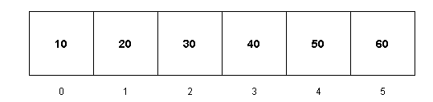
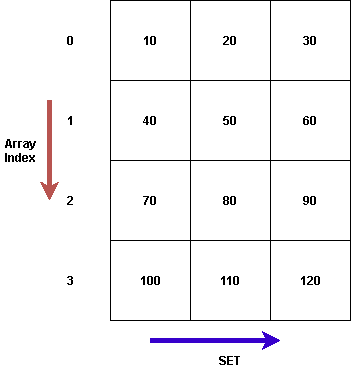

# C++ 中的集合数组

> 原文：<https://www.javatpoint.com/array-of-sets-in-cpp>

数组被定义为以连续方式存储的数据项的集合。数组存储相同类型的不同变量。由于变量存储在连续的位置，访问它们变得更加容易。

**例如**



这是一个包含六个元素的数组。假设数组名是 arr[]。现在，如果我们想访问元素，它们可以访问索引 0 到 n-1。这里，n 是数组的大小。

Arr[0] = 10

Arr[1] = 20

Arr[2] = 30

Arr[3] = 40

Arr[4] = 50

Arr[5] = 60

## 设置

集合是一个关联容器，其中的元素是唯一的。与数组不同，在集合中输入的值在添加后不能修改。但是，如果我们想更新集合中的值，我们可以先删除它，然后输入修改后的值。

**语法**

```

set<data_type> variable_name

```

**例**

设置 <int>s -一组整数值</int>

设置 <char>c -一组字符值</char>

## 集合数组

当我们说集合数组时，它是一个具有固定行数的二维数组。每行可以有不同的长度。

在集合数组中，每个数组索引存储一个集合。该集合可通过迭代器访问。\



**语法**

```

set<data_type> variable_name[size_of_array]

```

**例**

set <int>s[3] ->大小为 3 的 int 类型集合的数组</int>

### 集合数组中的插入操作

插入将使用 insert()函数进行，因为这里的每一行都是一个集合。所以，我们用集合的数组插入-

**set_variable[row_number]。插入(元素)**

**例**

s[0]。插入(10) ->在第 1 行插入 10

s[1]。插入(20) ->在第 2 行插入 20

**代码**

```

#include using namespace std;
#define ROW 3
#define COL 4

int main()
{

    set <int>s[ROW]; // Create an array of sets

    int num = 10; // Initial element to be inserted

    for (int i = 0; i < ROW; i++) { // iterate in row
        // Insert the column elements
        for (int j = 0; j < COL; j++) {
            s[i].insert(num);
            num += 10;
        }
    }

    // Display the array of sets
    for (int i = 0; i < ROW; i++) {
        cout << "Row " << i + 1 << " = "
             << "Elements at index " << i << ": ";

        // Print the array of sets
        for (auto x : s[i])
            cout << x << " ";

        cout << endl;
    }

    return 0;
}</int> 
```

**输出**

```
Row 1 = Elements at index 0: 10 20 30 40 
Row 2 = Elements at index 1: 50 60 70 80 
Row 3 = Elements at index 2: 90 100 110 120 

```

## 集合数组中的删除操作

当我们在这里说删除一个元素时，我们是从集合中移除该元素。从集合中移除元素的功能是**擦除()。**

**代码**

在这个例子中，我们从集合 3 中移除了一个元素，从集合 2 中移除了一个元素。请记住，集合索引是 i-1，因为数组索引从 0 开始。

```

#include using namespace std;

// Fixing rows and column
#define ROW 3
#define COL 4

int main()
{
    set <int>s[ROW]; // Create array of set
    int num = 10;

    // Put elements in the set at a increment of 10
    for (int i = 0; i < ROW; i++) {

        // insert the column elements
        for (int j = 0; j < COL; j++) {
            s[i].insert(num);
            num += 10;
        }
    }

    cout << "Before removal elements are:"
         << endl;

    // Print elements after insertion
    for (int i = 0; i < ROW; i++) {
        cout << "Elements at index "
             << i << ": ";
        for (auto x : s[i])
            cout << x << " ";
        cout << endl;
    }

    s[2].erase(100); // Erase 100 from row 3 which means set 3

    s[1].erase(50); // Erase 50 from row 2 which means set 2

    cout << endl
         << "After removal elements are:" << endl;

    for (int i = 0; i < ROW; i++) {
        cout << "Elements at index " << i << ": ";

        // Print the current set
        for (auto x : s[i])
            cout << x << " ";

        cout << endl;
    }

    return 0;
}</int> 
```

**输出**

```
Before removal elements are:
Elements at index 0: 10 20 30 40 
Elements at index 1: 50 60 70 80 
Elements at index 2: 90 100 110 120 

After removal elements are:
Elements at index 0: 10 20 30 40 
Elements at index 1: 60 70 80 
Elements at index 2: 90 110 120 

```

## 集合数组中的遍历操作

当我们遍历集合数组时，我们遍历每个集合并打印该集合中的所有元素。迭代器用于遍历集合元素。

**代码**

在下面的例子中，我们创建了一个有两行的集合数组。第一行在集合中有三个元素，第二行在集合中有两个元素。

为了遍历集合数组，我们对行运行一个外部循环。在内部循环中，我们使用迭代器来打印每个集合。

```

#include using namespace std;
#define ROW 2 // Making a set of 2 rows
int main()
{

    set <int>s[ROW]; // create an array of sets with 2 rows

    // Insertion in row 1
    s[0].insert(10); // insertion in column 1
    s[0].insert(15); // insertion in column 2
    s[0].insert(35); // insertion in column 3

    // Insertion in row 2
    s[1].insert(20); // insertion in column 1
    s[1].insert(30); // insertion in column 2

    // Traversal in array of sets
    for (int i = 0; i < ROW; i++) { // Iterate in the row
        cout << "Elements at index " << i << ": ";
        // Now we have to Iterate in the set of a particular row
        // So use an Iterate that runs from begin of set to end of that set
        for (auto it = s[i].begin(); it != s[i].end(); it++) {

            // Print the set value

            cout << *it << ' ';
        }

        cout << endl;
    }

    return 0;
}</int> 
```

**输出**

```
Elements at index 0: 10 15 35 
Elements at index 1: 20 30 

```

* * *