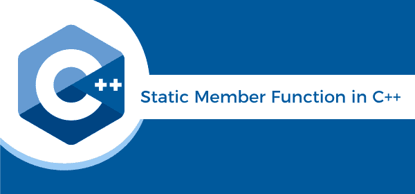

# C++ 中的静态成员函数

> 原文：<https://www.javatpoint.com/static-member-function-in-cpp>

静态是 C 和 C++ 编程语言中的一个关键词。我们使用 static 关键字来定义类内外的静态数据成员或静态成员函数。让我们使用程序来理解静态数据成员和静态成员函数。



## 静态数据成员

当我们使用 static 关键字定义类的数据成员时，这些数据成员被称为静态数据成员。静态数据成员类似于静态成员函数，因为静态数据只能使用静态数据成员或静态成员函数来访问。并且，该类的所有对象共享静态成员的相同副本来访问静态数据。

**语法**

```

static data_type data_member;

```

这里**静态**是预定义库的一个关键字。

**data_type** 是 C++ 中的变量类型，如 int、float、string 等。

**数据成员**是静态数据的名称。

**示例 1:** 让我们创建一个简单的程序来访问 C++ 编程语言中的静态数据成员。

```

#include 
#include <string.h>
using namespace std;
// create class of the Car
class Car
{
private:
int car_id;
char car_name[20];
int marks;

public:
// declare a static data member
static int static_member;

Car()
{
static_member++;
}

void inp()
{
cout << " \n\n Enter the Id of the Car: " << endl;
cin >> car_id; // input the id
cout << " Enter the name of the Car: " << endl;
cin  >> car_name;
cout << " Number of the Marks (1 - 10): " << endl;
cin >> marks;  
}

// display the entered details
void disp ()
{
cout << " \n Id of the Car: " << car_id;
cout << "\n Name of the Car: " << car_name;
cout << " \n Marks: " << marks;

} 
};

// initialized the static data member to 0
int Car::static_member = 0;

 int main ()
{
// create object for the class Car
Car c1;
// call inp() function to insert values
c1\. inp ();
c1\. disp();

//create another object
Car c2;
// call inp() function to insert values
c2\. inp ();
c2\. disp();

 cout << " \n No. of objects created in the class: " << Car :: static_member <</string.h>
```

**输出**

```
Enter the Id of the Car: 
101
Enter the name of the Car: 
Ferrari
Number of the Marks (1 - 10): 
10

Id of the Car: 101 
Name of the Car: Ferrari 
Marks: 10

Enter the Id of the Car: 
205
Enter the name of the Car: 
Mercedes
Number of the Marks (1 - 10): 
9

Id of the Car: 205 
Name of the Car: Mercedes 
Marks: 9
No. of objects created in the class: 2

```

### 静态成员函数

静态成员函数是用于访问静态数据成员或其他静态成员函数的特殊函数。使用 static 关键字定义成员函数。静态成员函数将成员函数的单一副本共享给任意数量的类对象。我们可以使用类名或类对象来访问静态成员函数。如果静态成员函数访问任何非静态数据成员或非静态成员函数，它将引发错误。

**语法**

```

class_name::function_name (parameter);

```

这里**类名**是类名。

**函数 _ 名称**:函数名是静态成员函数的名称。

**参数**:定义静态成员函数传递参数的名称。

**示例 2:** 让我们创建另一个程序，使用 C++ 编程语言中的类名来访问静态成员函数。

```

#include using namespace std;
class Note
{
// declare a static data member
static int num;

public:
// create static member function
static int func ()
{
return num;
}
};
// initialize the static data member using the class name and the scope resolution operator
int Note :: num = 5; 

int main ()
{
// access static member function using the class name and the scope resolution
cout << " The value of the num is: " << Note:: func () << endl;
return 0;
} 
```

**输出**

```
The value of the num is: 5

```

**示例 3:** 让我们用 C++ 编程语言中的 class’object 创建另一个程序来访问静态成员函数。

```

#include using namespace std;
class Note
{
// declare a static data member
static int num;

public:
// create static member function
static int func ()
{
cout << " The value of the num is: " << num << endl;	
}
};
// initialize the static data member using the class name and the scope resolution operator
int Note :: num = 15; 

int main ()
{
	// create an object of the class Note
	Note n;
// access static member function using the object
n.func();

return 0;
} 
```

**输出**

```
The value of the num is: 15

```

**示例 4:** 让我们考虑一个使用 C++ 编程语言中的对象和类访问静态成员函数的示例。

```

#include using namespace std;
class Member
{

private:
// declaration of the static data members
static int A;
static int B;
static int C;

// declare public access specifier
public:
// define the static member function
static void disp ()
{
cout << " The value of the A is: " << A << endl;
cout << " The value of the B is: " << B << endl;
cout << " The value of the C is: " << C << endl;
}
};
// initialization of the static data members
int Member :: A = 20;
int Member :: B = 30;
int Member :: C = 40;

int main ()
{
// create object of the class Member
Member mb;
// access the static member function using the class object name
cout << " Print the static member through object name: " << endl;
mb. disp();
// access the static member function using the class name
cout << " Print the static member through the class name: " << endl;
Member::disp();
return 0;
} 
```

**输出**

```
Print the static member through object name:
The value of the A is: 20
The value of the B is: 30
The value of the C is: 40   
Print the static member through the class name:
The value of the A is: 20
The value of the B is: 30
The value of the C is: 40  

```

* * *