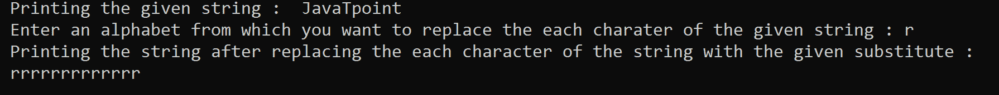
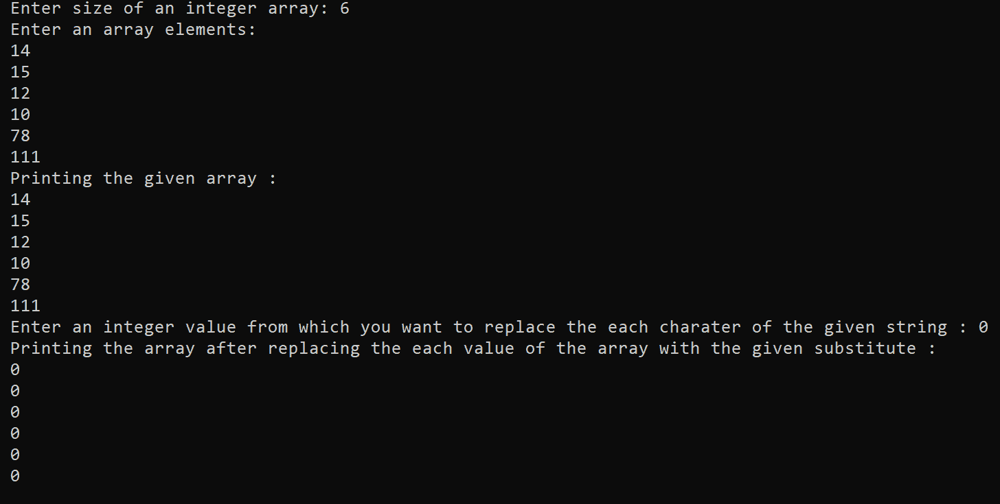

# C++中的 Memset

> 原文：<https://www.javatpoint.com/memset-in-cpp>

在 C++编程语言中，memset()是一个用于填充内存块的函数。

*   最初，它将“ **ch** 的值转换为无符号字符。这里的“ch”指的是用 memset()函数中传递的另一个值填充的字符。
*   然后，它将字符“ch”复制到 st [ ]指向的对象的前 n 个字符中。
*   这里的“n”指的是块的大小，在 memset()中提到，它必须等于或小于 st [ ]所指向的对象的大小。
*   如果 n 的值大于 st [ ]指向的对象的大小，它将产生错误，因此未定义。
*   如果有时出现对象不可复制的情况，那么也会产生错误，函数的行为与前一种情况相同，即**未定义**。
*   在 C++编程语言中，memset()函数存在于< cstring >头文件中；如果不提这个头文件，您将无法使用 memset()函数。
*   这里不可复制的对象如下:**数组、C 兼容结构、标量、**等等；因此在这种情况下，memset()函数的行为是未定义的。
*   memset()函数和 memcpy()函数的唯一区别是，在 memset()函数中，不仅复制值，而且用其他替代项替换它，例如，如果我们想用字母“f”替换特定字符串的每个字符，如“cool”，那么；因此，它会看着最终是；ffff。但是在 memcpy()函数中，它只将值从一个地方复制到另一个地方，或者将一个内容块从一个特定的地方复制并放在另一个内容块上。

### memset()函数的语法:

```

void* memset ( void* st , int ch , size_t n ) ;

```

现在，让我们讨论一下这里使用的术语。

1.  **st [ ]:** st [ ]，表示需要填充的内存的指针。它是一个指向对象的指针，其中字符“ch”已被复制。根据程序员的选择，他们可以根据自己的需要和工作把名字从 st 改成其他名字。
2.  **ch:** 这里的“ch”是指**字符**，需要填充。它也因程序员的选择而异，他们可以相应地重命名它。无论何时需要，它都会转换为无符号字符，并且还会转换为 int 格式，但是 int 可接受的值只有 0 和-1。
3.  **n:** 它表示块的**大小**，或者可以说它是指定字符“ch”需要被复制和转换成在 memset()函数中传递的值的次数的数值。

### c++ memset()函数的优点

*   **增加可读性:**c++中的 memset()函数主要用于将整个字符串的每个字符转换为特定的 int 值，作为输入传递给 memset()函数。是一个**一行代码**；因此非常短，最终增加了可读性。
*   **减少代码行:**而不是使用不必要的使用循环将字符串中存在的每个字符的值赋值并转换为 int 值，该值仅在此 memset()函数中作为输入传递，与冗长的方法相比，同样的任务已经很容易执行。
*   **更快:**使用 memset()函数可以更快地将给定字符串的每个字符转换为通过输入传递的值，可能是 int 类型或任何其他类型，具体取决于程序员。它的工作速度非常快，而不是应用循环和 while 语句来执行相同的任务。
*   **对解决错位问题有用:**c++中的 memset()函数帮助程序员解决错位问题。有时，会出现这样的情况，您发现您正在处理处理器中数据未对齐的问题，这将导致程序出错。在这种情况下，C++中的 memset()和 memcpy()函数就是它的最终解决方案。

### C++中 memset()的实现

由于我们已经看到了 C++的 memset()函数的概念及其工作原理，让我们借助一个例子来更详细地了解它。

### 例 1:

```

// Program to implement memset ( ) function in C++

#include #include <cstring>// header file that contains the memset ( ) function, without it            // we cannot able to access the use of memset ( ) function
using namespace std ;

int main()
{
	char st [ ] = " JavaTpoint " ;
	char ch ;
	cout << " Printing the given string : " << st << endl ;
	cout << " Enter an alphabet from which you want to replace the each charater of the given string : " ;
	cin >> ch ;
	memset ( st , ch , sizeof ( st ) ) ;
	cout << " Printing the string after replacing the each character of the string with the given substitute : " << endl ;
	cout << " " << st ;
	return 0 ;
}</cstring> 
```

**上述程序的输出:**



在上面的例子中，我们已经看到了字符串“**JavaPoint**”的每个字符是如何被转换成用户传递的单个字母表的。这里的空格也被认为是单个字符。

### 例 2:

```

// Program to implement memset ( ) function in C++

#include < iostream >
#include < cstring >             // header file that contains the memset ( ) function, without it //we cannot able to access the use of memset ( ) function 
using namespace std ;
int main()
{
	int arr [100] ;
	int n , i , p ;
	cout << " Enter size of an integer array: " ; 
	cin >> n ;
	cout << " Enter an array elements: " << endl ;
	for ( i = 0 ; i < n ; i++ )
	{
		cin >> arr [ i ] ;
	}
	cout << " Printing the given array : " << endl ;
	for ( i = 0 ; i < n ; i++ )
	{
		cout << " " << arr [ i ] << endl ;
	}
	cout << " Enter an integer value from which you want to replace the each charater of the given string : " ;
	cin >> p ;
	memset ( arr , p , sizeof( arr ) ) ;
	cout << " Printing the array after replacing the each value of the array with the given substitute : " << endl ;
	for ( i = 0 ; i < n ; i++ )
	{
		cout << " " << arr [ i ] << endl ;
	}

	return 0 ;
}

```

**上述程序的输出:**



在上面的例子中，我们已经看到了字符串“JavaTpoints”的每个字符是如何被转换成用户传递的整数值的。这里的空格也被认为是单个字符。这里的整数值只有 0 和-1 是相当可观的，这意味着字符串的每个字符都被转换为只有 0 和-1，而不是使用其他整数值，将会产生一个垃圾值，这意味着如果你已经输入了 2，那么字符串的所有字符都已经被垃圾值所取代。

* * *