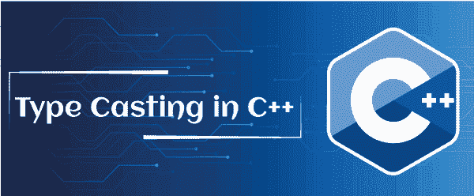

# C++中的类型转换

> 原文：<https://www.javatpoint.com/type-casting-in-cpp>

本节将讨论 C++编程语言中变量的类型转换。类型转换是指程序中一种数据类型到另一种数据类型的转换。类型转换可以通过两种方式完成:由编译器自动完成，由程序员或用户手动完成。类型转换也称为类型转换。



例如，假设给定的数据是整数类型，我们希望将其转换为浮点类型。因此，我们需要手动将 int 数据转换为 float 类型，这种类型的转换在 C++中称为类型转换。

```

int num = 5;
float x;
x = float(num);
x = 5.0

```

**2<sup>2</sup>例:**

```

float num = 5.25;
int x;
x = int(num);
Output: 5

```

类型转换分为两种类型:隐式转换或隐式类型转换和显式类型转换或显式类型转换。

**隐式类型转换或隐式类型转换**

*   它被称为自动铸造。
*   它自动从一种数据类型转换到另一种数据类型，无需任何外部干预，如程序员或用户。这意味着编译器会自动将一种数据类型转换为另一种。
*   所有数据类型都会自动升级到最大类型，不会丢失任何信息。
*   只有当两个变量相互兼容时，它才能在程序中应用。

```

char - sort int -> int -> unsigned int -> long int -> float -> double -> long double, etc.

```

#### 注意:隐式类型转换应该从低到高的数据类型进行。否则，它会影响基本数据类型，这可能会丢失精度或数据，编译器可能会对此发出警告。

**在 C++中使用隐式类型转换的程序**

让我们创建一个示例来演示在 C++中使用隐式类型转换将一个变量转换为另一个变量。

```

#include using namespace std;
int main ()
{
	short x = 200;
	int y;
	y = x;
	cout << " Implicit Type Casting " << endl;
	cout << " The value of x: " << x << endl;
	cout << " The value of y: " << y << endl;

	int num = 20;
	char ch = 'a';
	int res = 20 + 'a';
	cout << " Type casting char to int data type ('a' to 20): " << res << endl;

	float val = num + 'A';
	cout << " Type casting from int data to float type: " << val << endl; 
	return 0;																					
} 
```

**输出:**

```
Implicit Type Casting
The value of x: 200
The value of y: 200
Type casting char to int data type ('a' to 20): 117
Type casting from int data to float type: 85

```

在上面的程序中，我们声明了一个短数据类型变量 x 为 200，一个整数变量 y，之后我们给 y 赋值 x 值，然后编译器自动将短数据值 x 转换为 y，y 返回 y 为 200。

在接下来的表达式中，我们声明了一个 int 类型变量 num 为 20，字符类型变量 ch 为' a '，相当于一个整数值 97。然后，我们将这两个变量相加来执行隐式转换，返回表达式的结果是 117。

类似地，在第三个表达式中，我们添加整数变量 num 为 20，字符变量 ch 为 65，然后将结果赋给浮点变量 val。因此，编译器会自动将表达式的结果转换为浮点类型。

**显式类型转换或显式类型转换**

*   它也被称为程序中的手动类型铸造。
*   它由程序员或用户手动转换，以便在程序中从一种数据类型转换为另一种类型。这意味着用户可以根据程序中的要求轻松地将一个数据转换成另一个数据。
*   它不需要检查变量的兼容性。
*   在这种转换中，我们可以在程序中将一个变量的数据类型升级或降级到另一个变量。
*   它使用 cast()运算符来更改变量的类型。

**显式类型转换的语法**

```

(type) expression;

```

**类型:**表示转换给定表达式的用户定义数据。

**表达式:**表示常量值、变量或数据类型被转换的表达式。

例如，我们有一个浮点数字是 4.534，要转换一个整数值，该语句为:

```

int num;    
num = (int) 4.534; // cast into int data type
cout << num;

```

执行上述语句时，将使用 cast()运算符将浮点值转换为整数数据类型。并且将浮点值赋给一个整数，该整数会截断小数部分，并且只显示 4 作为整数值。

**演示在 C++中使用显式类型转换的程序**

让我们创建一个简单的程序，使用 C++编程语言中的显式类型转换将一个类型变量转换为另一个类型。

```

#include using namespace std;
int main ()
{
	// declaration of the variables
	int a, b;
	float res;
	a = 21;
	b = 5;
	cout << " Implicit Type Casting: " << endl;
	cout << " Result: " << a / b << endl; // it loses some information

	cout << " \n Explicit Type Casting: " << endl;
	// use cast () operator to convert int data to float
	res = (float) 21 / 5;
	cout << " The value of float variable (res): " << res << endl;

	return 0;																					
} 
```

**输出:**

```
Implicit Type Casting:
Result: 4

Explicit Type Casting:
The value of float variable (res): 4.2

```

在上面的程序中，我们取了两个整数变量 a 和 b，它们的值分别是 21 和 2。然后，将 a 除以 b (21/2)，得到一个 4 int 类型的值。

在第二个表达式中，我们使用显式类型转换方法中的转换运算符声明了一个存储 a 和 b 的结果而不会丢失任何数据的浮点类型变量 res。

**使用转换运算符**将双数据转换为整型和浮点型的程序

让我们考虑一个例子，在 C++编程中，通过将双数据转换为 float 和 int 类型来获得矩形的面积。

```

#include using namespace std;
int main ()
{
	// declaration of the variables
	double l, b;
	int area;

	// convert double data type to int type
	cout << " The length of the rectangle is: " << endl;
	cin >> l;
	cout << " The breadth of the rectangle is: " << endl;
	cin >> b;
	area = (int) l * b; // cast into int type
	cout << " The area of the rectangle is: " << area << endl;

	float res;
	// convert double data type to float type
	cout << " \n \n The length of the rectangle is: " << l << endl;
	cout << " The breadth of the rectangle is: " << b << endl;
	res = (float) l * b; // cast into float type
	cout << " The area of the rectangle is: " << res;
	return 0;																					
} 
```

**输出:**

```
The length of the rectangle is: 
57.3456
The breadth of the rectangle is:
12.9874
The area of the rectangle is: 740

The length of the rectangle is: 57.3456
The breadth of the rectangle is: 12.9874
The area of the rectangle is: 744.77

```

**一些不同类型的型式铸件**

在类型转换中，有一个转换操作符，根据程序的需要，强制将一种数据类型转换为另一种数据类型。C++有四种不同类型的强制转换运算符:

1.  静态强制转换
2.  动态强制转换
3.  const_cast
4.  重新解释 _cast

**静态施法:**

static_cast 是一种简单的编译时强制转换，它将一种数据类型转换或强制转换为另一种数据类型。这意味着它不会在运行时检查数据类型，无论执行的强制转换是否有效。因此，程序员或用户有责任确保转换是安全有效的。

static_cast 足够强大，可以执行隐式转换执行的所有转换。它还执行相互关联的类的指针之间的转换(向上转换->从派生类到基类或者向下转换->从基类到派生类)。

**静态转换的语法**

```

static_cast < new_data_type> (expression);

```

**演示静态造型使用的程序**

让我们创建一个简单的例子，在 C++编程中使用类型转换的静态转换。

```

 #include using namespace std;
int main ()
{
	// declare a variable
	double l;
	l = 2.5 * 3.5 * 4.5;
	int tot;

	cout << " Before using the static cast:" << endl;
	cout << " The value of l = " << l << endl;

	// use the static_cast to convert the data type
	tot = static_cast < int > (l);
	cout << " After using the static cast: " << endl;
	cout << " The value of tot = " << tot << endl;

	return 0;																					
} 
```

**输出:**

```
Before using the static cast:
The value of l = 39.375
After using the static cast:
The value of tot = 39

```

**动态铸造**

dynamic_cast 是一个运行时强制转换运算符，仅用于对类指针和引用执行一个类型变量到另一个类型变量的转换。这意味着它在运行时检查变量的有效转换，如果转换失败，它将返回空值。动态强制转换基于 RTTI(运行时类型识别)机制。

**演示在 C++中使用动态转换的程序**

让我们创建一个简单的程序来执行 C++编程语言中的动态强制转换。

```

#include using namespace std;

	class parent
	{
		public: virtual void print()
		{

		}
	};
	class derived: public parent
	{

	};

	int main ()
	{
           // create an object ptr
	parent *ptr = new derived;
	// use the dynamic cast to convert class data
	derived* d = dynamic_cast <derived>(ptr);

	// check whether the dynamic cast is performed or not
	if ( d != NULL)
	{
		cout << " Dynamic casting is done successfully";
	}
	else
	{
		cout << " Dynamic casting is not done successfully";
	}
	}</derived> 
```

**输出:**

```
Dynamic casting is done successfully.

```

**重新解释铸造类型**

reinterpret_cast 类型转换用于将指针转换为任何其他类型的指针，无论给定的指针是否属于彼此。这意味着它不检查指针或指针指向的数据是否相同。它还将指针转换为整数类型，反之亦然。

**重新解释 _ 转换类型的语法**

```

reinterpret_cast <type> expression;

```

**在 C++中使用重新解释转换的程序**

让我们用 C++语言编写一个程序来演示指针的转换。

```

#include <iostream>
using namespace std;

int main ()
{
	// declaration of the pointer variables
	int *pt = new int (65);

	// use reinterpre_cast operator to type cast the pointer variables
	char *ch = reinterpret_cast <char *> (pt);

	cout << " The value of pt: " << pt << endl;
	cout << " The value of ch: " << ch << endl;

	// get value of the defined variable using pointer
	cout << " The value of *ptr: " << *pt << endl;
	cout << " The value of *ch: " << *ch << endl;
	return 0;

}

```

**输出:**

```
The value of pt: 0x5cfed0
The value of ch: A
The value of *ptr: 65
The value of *ch: A

```

**Const Cast**

const_cast 用于更改或操作源指针的 const 行为。这意味着我们可以通过两种方式执行常量:将常量指针设置为非常量指针，或者从常量指针中删除或移除常量。

**常量转换类型的语法**

```

const_cast <type> exp;

```

**在 C++中使用常量转换的程序**

让我们编写一个程序，使用 C++中的 const_cast 将源指针转换为非转换指针。

```

#include using namespace std;

// define a function
int disp(int *pt)
{
	return (*pt * 10);
}

int main ()
{
	// declare a const variable
	const int num = 50;
	const int *pt = &num; // get the address of num

	// use const_cast to chnage the constness of the source pointer
	int *ptr = const_cast <int>(pt);
	cout << " The value of ptr cast: " << disp(ptr);
	return 0;

}</int> 
```

**输出:**

```
The value of ptr cast: 500

```

* * *