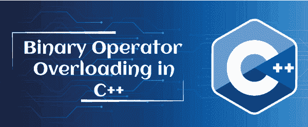

# C++中的二进制运算符重载

> 原文：<https://www.javatpoint.com/binary-operator-overloading-in-cpp>

本节将讨论 C++编程语言中的二进制运算符重载。包含两个操作数来执行数学运算的运算符称为二进制运算符重载。这是一种多态编译技术，其中单个操作符可以通过从程序员或用户处获取两个操作数来执行各种功能。有多个二元运算符，如+、-、*、/等。，它可以直接操作或重载类的对象。



例如，假设我们有两个数字，5 和 6；并重载二进制(+)运算符。因此，二进制(+)运算符将数字 5 和 6 相加，并返回 11。此外，我们还可以执行减法、乘法和除法运算，以使用二进制运算符进行各种计算。

### 二进制运算符重载的语法

下面是 C++编程语言中的二进制运算符重载语法。

```

return_type :: operator binary_operator_symbol (arg)
{
// function definition
}

```

在这里，

**return_type:** 定义函数的返回类型。

**运算符:**是函数重载的一个关键字。

**binary_operator_symbol:** 表示重载函数执行计算的二进制运算符符号。

**arg:** 它定义了传递给函数的参数。

### 重载二元运算符以获得两个复数之和的步骤

**第一步:**启动程序。

**第二步:**申报班级。

**第三步:**声明变量及其成员函数。

**步骤 4:** 使用用户定义的 inp()函数取两个数字。

**第 6 步:**同样，定义二进制(-)运算符来减去两个数字。

**第 7 步:**调用 print()函数显示输入的数字。

**步骤 8:** 声明类对象 x1、y1、sum 和 sub。

**步骤 9:** 现在使用 x1 和 y1 对象调用 print()函数。

**第 10 步:**之后，用“+”和“-”运算符加减对象，得到对象和子结果。

**步骤 11:** 最后，使用 x1、y1、sum 和 sub 调用 print()和 print2()函数。

**第 12 步:**显示复数的加减。

**步骤 13:** 停止或终止程序。

**示例 1:使用二进制(+)和(-)运算符执行两个复数的加法和减法的程序**

让我们创建一个程序，通过在 C++编程语言中重载“+”和“-”二进制运算符来计算两个复数的加法和减法。

```

/* use binary (+) operator to add two complex numbers. */
#include <iostream>
using namespace std;
class Complex_num
{
	// declare data member or variables
	int x, y;
	public:
		// create a member function to take input
		void inp()
		{
			cout << " Input two complex number: " << endl;
			cin >> x >> y;
		}		
		// use binary '+' operator to overload
		Complex_num operator + (Complex_num obj)
		{
			// create an object
			Complex_num A;
			// assign values to object
			A.x = x + obj.x;
			A.y = y + obj.y;
			return (A);
		}		
		// overload the binary (-) operator
		Complex_num operator - (Complex_num obj)
		{
			// create an object
			Complex_num A;
			// assign values to object
			A.x = x - obj.x;
			A.y = y - obj.y;
			return (A);
		}		
		// display the result of addition
		void print()
		{
			cout << x << " + " << y << "i" << "\n";
		}

		// display the result of subtraction
		void print2()
		{
			cout << x << " - " << y << "i" << "\n";
		}
};
int main ()
{
Complex_num x1, y1, sum, sub; // here we created object of class Addition i.e x1 and y1	
	// accepting the values
	x1.inp();
	y1.inp();	
	// add the objects
	sum = x1 + y1;
	sub = x1 - y1; // subtract the complex number	
	// display user entered values
	cout << "\n Entered values are: \n";
	cout << " \t";
	x1.print();
	cout << " \t";
	y1.print();	
	cout << "\n The addition of two complex (real and imaginary) numbers: ";
	sum.print(); // call print function to display the result of addition	
	cout << "\n The subtraction of two complex (real and imaginary) numbers: ";
	sub.print2(); // call print2 function to display the result of subtraction
	return 0;
}

```

**输出**

```
Input two complex numbers:
5
7
Input two complex numbers:
3
5
Entered values are:
	5 + 7i
	3 + 5i
The addition of two complex (real and imaginary) numbers: 8 + 12i
The subtraction of two complex (real and imaginary) numbers: 2 - 2i   

```

在上面的程序中，我们从用户那里取两个数字，然后用二进制运算符重载'+'和'-'运算符，在一个类中加减两个复数。

**示例 2:使用二进制运算符重载**将两个数字相加的程序

让我们创建一个程序，通过在 C++编程语言中重载二进制加号(+)运算符来计算一个类中两个数字的和。

```

/* use binary (+) operator to perform the addition of two numbers. */
#include <iostream>
using namespace std;
class Arith_num
{
	// declare data member or variable
	int x, y;
	public:
		// create a member function to take input
		void input()
		{
			cout << " Enter the first number: ";
			cin >> x;
		}		
		void input2()
		{
			cout << " Enter the second number: ";
			cin >> y;
		}	
		// overloading the binary '+' operator to add number
		Arith_num operator + (Arith_num &ob)
		{
			// create an object
			Arith_num A;
			// assign values to object
			A.x = x + ob.x;
			return (A);
		}		
		// display the result of binary + operator
		void print()
		{
			cout << "The sum of two numbers is: " <<x;
		}		
};
int main ()
{
   Arith_num x1, y1, res; // here we create object of the class Arith_num i.e x1 and y1	
	// accepting the values
	x1.input();
	y1.input();	
	// assign result of x1 and x2 to res
	res = x1 + y1;	
	// call the print() function to display the results
	res.print();	
	return 0;	
}

```

**输出**

```
Enter the first number: 5
Enter the second number: 6
The sum of two numbers is: 11   

```

在上面的程序中，我们从用户那里得到两个数字，5 和 6，然后重载二进制加号(+)运算符来执行加法，返回两个数字之和为 11。

**示例 3:通过重载多个二进制运算符来执行算术运算的程序**

让我们创建一个程序来重载一个类中的多个二进制运算符来执行算术运算。

```

/* use binary operator to perform the arithmetic operations in C++. */
#include <iostream>
using namespace std;
class Arith_num
{
	// declare data member or variable
	int num;
	public:
		// create a member function to take input
		void input()
		{
			num = 20; //define value to num variable
		}
		// use binary '+' operator to add number
		Arith_num operator + (Arith_num &ob)
		{
			// create an object
			Arith_num A;
			// assign values to object
			A.num = num + ob.num;
			return (A);
		}
		// overload the binary (-) operator
		Arith_num operator - (Arith_num &ob)
		{
			// create an object
			Arith_num A;
			// assign values to object
			A.num = num - ob.num;
			return (A);
		}	
		// overload the binary (*) operator
		Arith_num operator * (Arith_num &ob)
		{
			// create an object
			Arith_num A;
			// assign values to object
			A.num = num * ob.num;
			return (A);
		}		
		// overload the binary (/) operator
		Arith_num operator / (Arith_num &ob)
		{
			// create an object
			Arith_num A;
			// assign values to object
			A.num = num / ob.num;
			return (A);
		}		
		// display the result of arithmetic operators
		void print()
		{
			cout << num;
		}		
};
int main ()
{
	Arith_num x1, y1, res; // here we created object of class Addition i.e x1 and y1	
	// accepting the values
	x1.input();
	y1.input();	
	// assign result of x1 and x2 to res
	res = x1 + y1;
	cout << " Addition : " ;
	res.print();	
	// assign the results of subtraction to res
	res = x1 - y1; // subtract the complex number
	cout << " \n \n Subtraction : " ;
	res.print();	
	// assign the multiplication result to res
	res = x1 * y1;
	cout << " \n \n Multiplication : " ;
	res.print();	
	// assign the division results to res
	res = x1 / y1;
	cout << " \n \n Division : " ;
	res.print();
	return 0;	
}

```

**输出**

```
Addition : 40
Subtraction : 0
Multiplication : 400
Division : 1    

```

在上面的程序中，我们声明变量 num 的值为 20，然后重载二进制的加号(+)、减号(-)、乘法(*)、除法(/)运算符来执行 Arith_num 类中的各种算术运算。

* * *