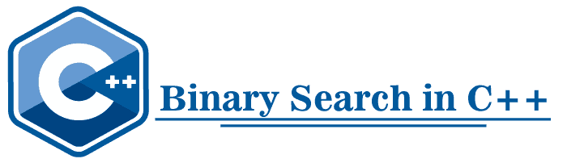

# C++中的二分搜索法

> 原文：<https://www.javatpoint.com/binary-search-in-cpp>

我们将讨论 C++编程语言中的二分搜索法。二分搜索法是一种机制，用于从排序的数组中找到给定的元素，方法是连续地将数组减半，然后从半个数组中搜索指定的元素。这个过程一直持续到找到匹配。它只适用于已排序的数据结构。二分搜索法算法的时间复杂度为 0(对数 n)。



#### 注意:要在 C++中执行二分搜索法技术，程序员或用户应该确保给定的数组必须按升序或降序排序。

### C++中的二分搜索法算法

下面是用 C++执行二分搜索法的算法

```

beg = 0;
end = size - 1;
while ( beg <= end)
{
// calculate mid value
mid = (beg + end) / 2;
/* if the specified element is found at mid index, terminate the process and return the index. */
// Check middle element is equal to the defined element.
If (aarr[mid] == num)
{
return mid + 1;
}
else if (arr[mid] > num)
{
	End = mid - 1;
}
Else if (arr [mid] < num)
{
	Beg = mid + 1;
}
}
// If the element does not exist in the array, return -1.
Return -1; 

```

### 用 C++执行二分搜索法的步骤

**第一步:**声明变量，按排序顺序(升序或降序)输入数组的所有元素。

**步骤 2:** 将数组元素列表分成两半。

**步骤 3:** 现在将目标元素与数组的中间元素进行比较。如果目标元素的值与中间元素匹配，则返回中间元素的位置并结束搜索过程。

**第四步:**如果目标元素小于中间元素，我们将元素搜索到数组的下半部分。

**第五步:**如果目标元素大于中间元素，我们需要将元素搜索到数组的大半部分。

**第 6 步:**我们将连续重复第 4、5、6 步，直到在排序后的数组中找不到指定的元素。

**示例 1:使用二分搜索法**从排序的数组中找到指定数字的程序

让我们编写一个程序，使用 C++编程语言中的二分搜索法从排序数组中找到指定的数字。

```

#include <iostream>
#include <conio.h>
using namespace std;
int main ()
{
	// declaration of the variables and array
	int arr[100], st, mid, end, i, num, tgt;

	cout << " Define the size of the array: " << endl;
	cin >> num; // get size

	// enter only sorted array
        cout << " Enter the values in sorted array either ascending or descending order: " << endl;
	// use for loop to iterate values
	for (i = 0; i < num; i++)
	{
		cout << " arr [" << i << "] = ";
		cin >> arr[i];
	}

	// initialize the starting and ending variable's values
	st = 0;
	end = num - 1; // size of array (num) - 1

	// define the item or value to be search
	cout << " Define a value to be searched from sorted array: " << endl;
	cin >> tgt;

	// use while loop to check 'st', should be less than equal to 'end'.
	while ( st <= end)
	{
		// get middle value by splitting into half
		mid = ( st + end ) / 2;
		/* if we get the target value at mid index, print the position and exit from the program. */
		if (arr[mid] == tgt)
		{
			cout << " Element is found at index " << (mid + 1);
			exit (0); // use for exit program the program
		}
		// check the value of target element is greater than the mid element' value
		else if ( tgt > arr[mid])
		{
			st = mid + 1; // set the new value for st variable
		}

		// check the value of target element is less than the mid element' value
		else if ( tgt < arr[mid])
		{
			end = mid - 1; // set the new value for end variable
		}
	}
	cout << " Number is not found. " << endl;
	return 0;
} 

```

**输出**

```
Define the size of the array: 
10
Enter the values in sorted array either ascending or descending order:
Arr [0]  = 12
Arr [1]  = 24
Arr [2]  = 36
Arr [3]  = 48
Arr [4]  = 50
Arr [5]  = 54
Arr [6]  = 58
Arr [7]  = 60
Arr [8]  = 72
Arr [9]  = 84
Define a value to be searched from sorted array:
50
Element is found at index 5   

```

**示例 2:使用用户定义的功能执行二分搜索法的程序**

```

/* program to find the specified element from the sorted array using the binary search in C++. */
#include <iostream>
using namespace std;
/* create user-defined function and pass different parameters:
arr[] - it represents the sorted array;
num variable represents the size of an array;
tgt variable represents the target or specified variable to be searched in the sorted array. */
int bin_search (int arr[], int num, int tgt)
{
	int beg = 0, end = num - 1;
	// use loop to check all sorted elements
	while (beg <= end)
	{
		/* get the mid value of sorted array and then compares with target element. */
		int mid = (beg + end) /2;		
		if (tgt == arr[mid])
		{
			return mid; // when mid is equal to tgt value
		}		
		// check tgt is less than mid value, discard left element
		else if (tgt < arr[mid])
		{
			end = mid - 1;
		}		
		// if the target is greater than the mid value, discard all elements
		else {
			beg = mid + 1;
		}
	}
	// return -1 when target is not exists in the array
	return -1;
}
int main ()
{
	// declaration of the arrays
	int arr[] = { 5, 10, 15, 20, 25, 30, 37, 40};
	int tgt = 25; // specified the target element	
	int num = sizeof (arr) / sizeof (arr[0]);
	// declare pos variable to get the position of the specified element
	int pos = bin_search (arr, num, tgt);	
	if (pos != 1)
	{
		cout << " Element is found at position " << (pos + 1)<< endl;
	}
	else
	{
		cout << " Element is not found in the array" << endl;
	}
	return 0;
}

```

**输出**

```
Element is found at position 5    

```

在上面的程序中，我们声明了一个数组 arr[] = {5，10，15，20，25，30，35，40)；然后我们使用二分搜索法方法从排序的数组中指定要搜索的数字“25”。因此，我们创建了一个用户定义的函数 bin_search()，它搜索给定的数字并返回语句“在位置 5 找到了元素”。如果数组中没有定义数字，bin_search()函数会显示“数组中找不到元素。”

**示例 3:使用递归函数**查找指定元素的程序

让我们创建一个示例，使用递归函数中的二分搜索法检查在排序数组中是否找到指定的元素。

```

/* find the specified number using the binary search technique inside the recursion method. */
#include <iostream>
using namespace std;
// define a function
int binary_search (int [], int, int, int);
int main ()
{
	// declaration of the variables
	int i, arr[100], tgt, num, ind, st, end;
	cout << " Define the size of an array: ";
	cin >> num;	
	cout << " Enter " << num << " elements in ascending order: " << endl;
	// use for loop to ieterate the number
	for ( i = 0; i < num; i++)
	{
		cout << " arr [" << i << "] = ";
		cin >> arr[i];
	}
	// define the element to be search
	cout << " \n Enter an element to be searched in ascending array: ";
	cin >> tgt;	
	// ind define the index number
	ind = binary_search (arr, 0, num - 1, tgt);	
	// check for existemce of the specified element
	if (ind == 0)
		cout << tgt << " is not available in the array-list";	
	else
		cout << tgt << " is available at position " << ind << endl;
	return 0;
}
// function defnition
int binary_search (int arr[], int st, int end, int tgt)
{
	int mid;
	// check st is greater than end
	if (st > end)
	{
		return 0;
	}
	mid = (st + end) / 2; // get middle value of the sorted array

	// check middle value is equal to target number
	if (arr[mid] == tgt)
	{
		return (mid + 1);
	}
	// check mid is greater than target number
	else if (arr[mid] > tgt)
	{
		binary_search (arr, st, mid - 1, tgt);
	}
	// check mid is less than target number
	else if (arr [mid] < tgt)
	{
		binary_search (arr, mid + 1, end, tgt);
	}
}

```

**输出**

```
Define the size of an array: 10
Arr [0] = 2
Arr [1] = 4
Arr [2] = 5
Arr [3] = 8
Arr [4] = 12
Arr [5] = 13
Arr [6] = 27
Arr [7] = 36
Arr [8] = 49
Arr [9] = 51

Enter an element to be searched in ascending array: 12
12 is available at position 6\.   

```

在上面的程序中，我们以升序输入数组的所有元素，然后定义一个数字，因为目标元素是“12”，这是使用二分搜索法方法从排序的数组中搜索的。因此，我们创建了一个用户定义的函数 binary_search()，它从数组中搜索已定义元素的位置，并返回在该位置可用的特定元素。如果该元素在排序数组中不可用，则返回 0。

* * *